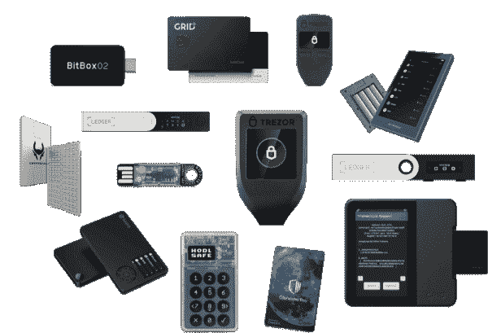
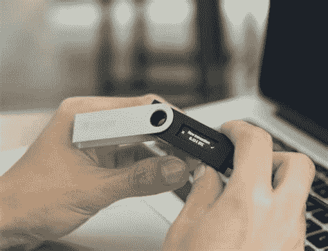
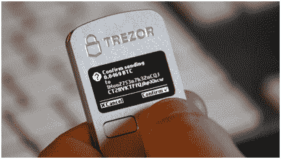

# 硬件钱包的良好实践

> 原文：<https://medium.com/coinmonks/good-practices-for-hardware-wallets-e24303918e54?source=collection_archive---------14----------------------->

如果您没有正确使用硬件钱包的安全设备来保护您非保管钱包中的资金，则硬件钱包所增加的第二层保护的有效性会降低。

我邀请你遵循这些好的使用方法来保持它的全部潜力。

大多数用户认为硬件钱包是用来存储私钥的，但它不仅仅是这样。

硬件钱包的主要功能是让用户与区块链的交互更加安全，增加了第二层保护，即没有硬件钱包的授权，你钱包里的资金是不能被移动的。与传统钱包的任何交互都更容易受到攻击，因为它没有第二次授权。

在用户与区块链的交互中，有三个主要的弱点:新钱包的创建、恢复和交易。让我们来看看如何用硬件钱包保护自己。

# 创建新钱包

当我们创建新的钱包时，我们会根据您选择的软件类型生成 12、16 或 24 个单词的种子。一般来说，字数越多，安全性越高。在这个种子中，随机私钥及其对应的公钥被存储，与区块链协议兼容，是唯一的所有者，没有第三方保管。

浏览器钱包或应用程序(移动或桌面)是由第三方编程的图形界面。通过使用它们，我们相信它们只是把我们的私钥给了我们，而它们并不知道。我们应该有所保留，除了它们是开源的，并且有过公开的审计，效果很好。在任何情况下，这个漏洞都可以被纠正，通过添加硬件钱包提供的第二层保护，资金将无法被发送(或窃取)，因为攻击者(那个钱包的开发者)没有硬件钱包。

还有一个关键的漏洞是移动或桌面设备，我们在那里管理钱包，最大的风险是当屏幕显示我们的种子时。你应该检查你的设备是否健康，没有恶意软件，你的连接是私人的还是公共的。比如有一个软件，把屏幕截图。

从您的 PC 或移动设备在硬件钱包中输入钱包的种子短语是不安全的。大多数硬件钱包隔离这个过程，让用户将这个种子键入硬件钱包，在硬件钱包的屏幕上显示它。这意味着整个创建过程不允许与任何其他设备直接通信，因此私钥生成更安全，因为它是隔离的。

Trezor One 没有这个功能，你必须把种子上传到你设备上安装的钱包里，正如我解释的那样，这是一个漏洞。

# 钱包的复原

所有关于创建钱包的漏洞的描述，对于修复都是有效的。

当你想用你的电脑或手机找回钱包时，你必须在键盘上输入你的种子短语，这就是所说的漏洞之一。有键盘记录器，恶意程序读取你在键盘上输入的内容，保存并发送给攻击者。

# 处理

当我们想要转移加密货币或代币时，会出现另一个漏洞，因为出于某种原因，这不是你的错，你可能会转移到另一个地址，支付另一笔金额或费用，而不是你想要的。导致这种情况的一个非常常见的攻击是恶意软件，它由攻击者远程或亲自安装在您的设备上。每次复制地址时，剪贴板上的内容都会将其更改为攻击者钱包的地址。

硬件钱包总是确保在屏幕上显示你要发送的地址，这样你就可以将它与钱包屏幕在设备上显示的地址进行比较。

在确认货件之前，一定要检查一下。

# 基本指南

─在官方商店或授权销售商处购买您的硬件钱包。如果从经销商那里买，可能会被黑。用过的更危险。

─确保盒子没有被打开，也没有被打开或初始化。一切都必须是全新的。

─在物理位置写下您的私钥(种子)，无需连接任何电子设备。你必须确保字迹不会随着时间而褪色。您可以在您信任的另一个地方保存种子的副本。

──当你写下你的种子时，确保你没有被监视或拍摄。

─如果您的硬件钱包让您选择使用密码，请使用它。它是一个用于“加密”特定地址的密码。这是额外的安全措施。像你的种子一样小心地写下这个密码，如果你丢失了它，钱包里的资金将无法使用。

─仅从官方网站更新固件。不要从电子邮件中获取更新。

─使用连接到制造商官方软件的硬件钱包。尽量不要用浏览器和她互动。

─硬件钱包的功能与您的设备越隔离，它就越安全。选择的时候要考虑到这一点。

──如果配合几个硬件钱包使用 multisig 钱包，会有更大的保障。

这里有一篇相关的文章:[安全地储存你的 ADAs】](https://liberlion.medium.com/store-your-adas-safely-d3f8febb006c)

liberlion.com

> 交易新手？试试[密码交易机器人](/coinmonks/crypto-trading-bot-c2ffce8acb2a)或[复制交易](/coinmonks/top-10-crypto-copy-trading-platforms-for-beginners-d0c37c7d698c)