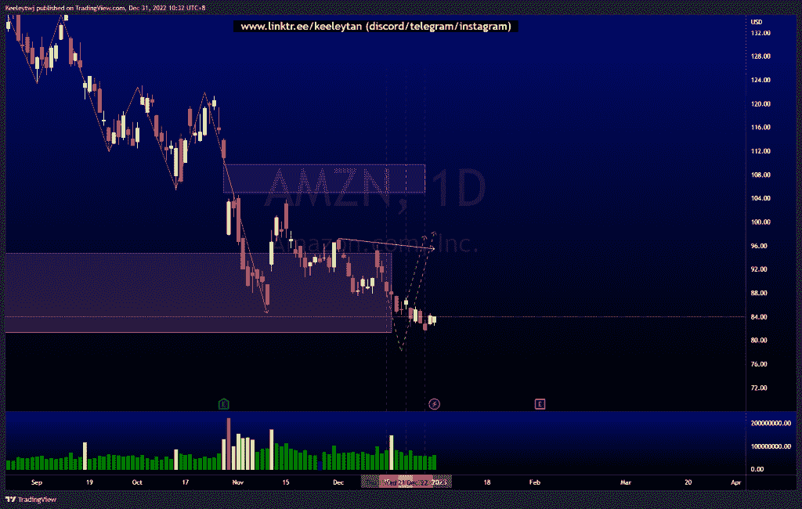

# 本周良好的技术分析#AAPL #AMZN #NIO

> 原文：<https://medium.com/coinmonks/good-technical-analysis-this-week-aapl-amzn-nio-ef04d728d8d5?source=collection_archive---------18----------------------->

在这里找到更多关于我的信息(YouTube/Discord/Telegram):[https://www.linktr.ee/keeleytan](https://www.linktr.ee/keeleytan)

如果你觉得我的帖子有帮助，如果你能在这个帖子上给我一个赞，并关注我以后的类似帖子，我将不胜感激。

不和谐的免费信号服务正式启动。如果你感兴趣的话，去我的不和谐看看吧！

#NIO

根据我上次的分析，下跌了 11.12%。

以前

在...之后

#AMZN

自我上次分析以来，价格变化了 2.89%。

> 交易新手？在[最佳加密交易](/coinmonks/crypto-exchange-dd2f9d6f3769)上尝试[加密交易机器人](/coinmonks/crypto-trading-bot-c2ffce8acb2a)或[复制交易](/coinmonks/top-10-crypto-copy-trading-platforms-for-beginners-d0c37c7d698c)

以前

在...之后

#AAPL

正如所分析的那样，价格表现良好，消除了卖方流动性，并为上行带来了小幅反弹。

以前

在...之后

希望你已经利用了我这周的分析。喜欢，分享，评论如果你是盈利的！我在考虑尝试在 discord 上提供免费信号服务。

让我知道，如果你有任何你想让我分析的行情。

一定要在其他社交平台上看看我，我在交易、分析和心理学上发布内容。看看我这里:[https://www.linktr.ee/keeleytan](https://www.linktr.ee/keeleytan)

*原载于 2022 年 12 月 31 日 http://2minutesliteracy.wordpress.com***。**