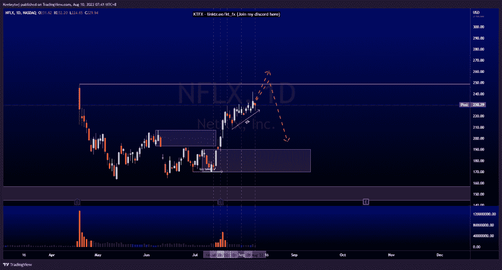
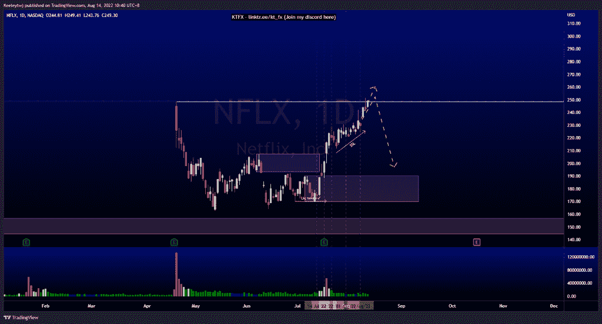
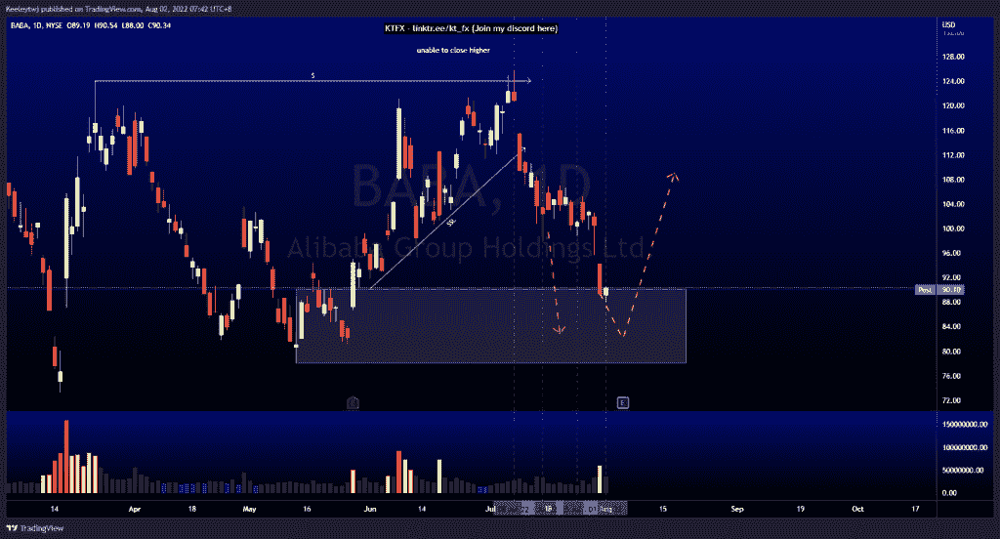
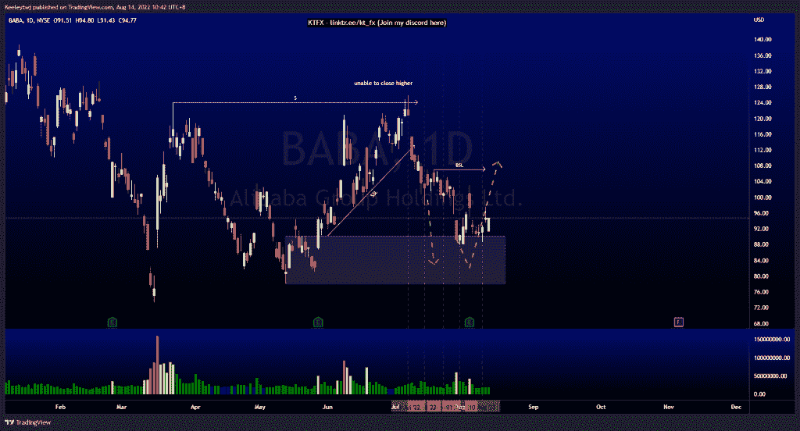
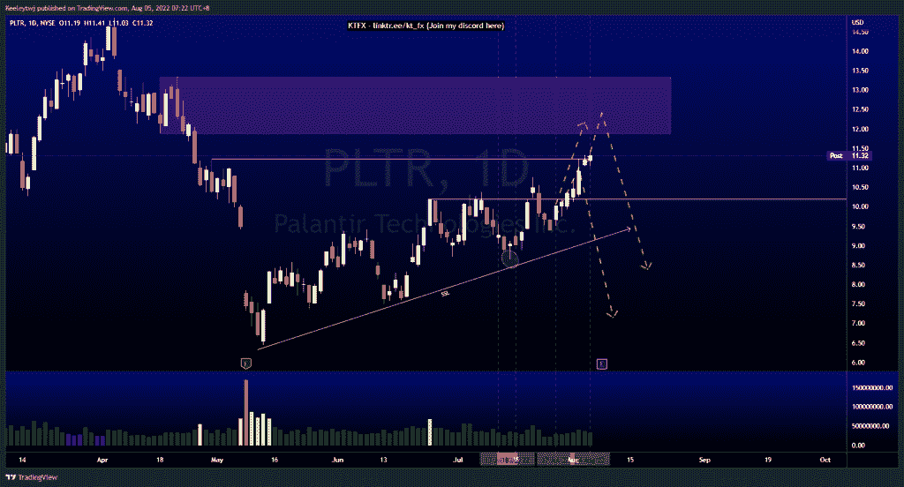
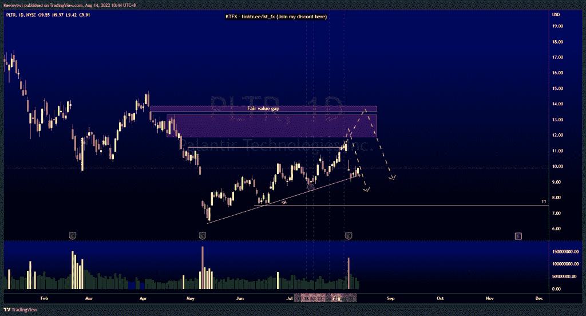

# 本周技术分析不错#NFLX 巴巴#PLTR

> 原文：<https://medium.com/coinmonks/good-technical-analysis-this-week-nflx-baba-pltr-47e5661c36e5?source=collection_archive---------5----------------------->

在这里找到更多关于我的信息(Youtube/discord):[https://www.linktr.ee/kt_fx](https://www.linktr.ee/kt_fx)

如果你觉得我的帖子有帮助，如果你能在这个帖子上给我一个赞，并关注我以后的类似帖子，我将不胜感激。

#NFLX

价格上涨并在 248.70 获得流动性，填补了公允价值缺口。

Before

After

#巴巴

价格从 90.17 的看涨点反弹，目标是 107.16 的买方流动性。

Before

After

#PLTR

收益后价格在 11.88 附近下跌。

Before

After

希望你已经利用了我这周的分析。喜欢，分享，评论如果你是盈利的！让我知道，如果你有任何你想让我分析的行情。一定要在其他社交平台上看看我！

种类

贴在[技术分析](https://2minutesliteracy.wordpress.com/category/technical-analysis/)

*原载于 2022 年 8 月 14 日 http://2minutesliteracy.wordpress.com***。**

> *交易新手？尝试[加密交易机器人](/coinmonks/crypto-trading-bot-c2ffce8acb2a)或[复制交易](/coinmonks/top-10-crypto-copy-trading-platforms-for-beginners-d0c37c7d698c)*