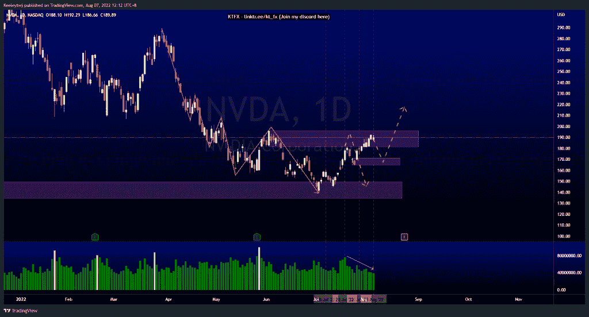
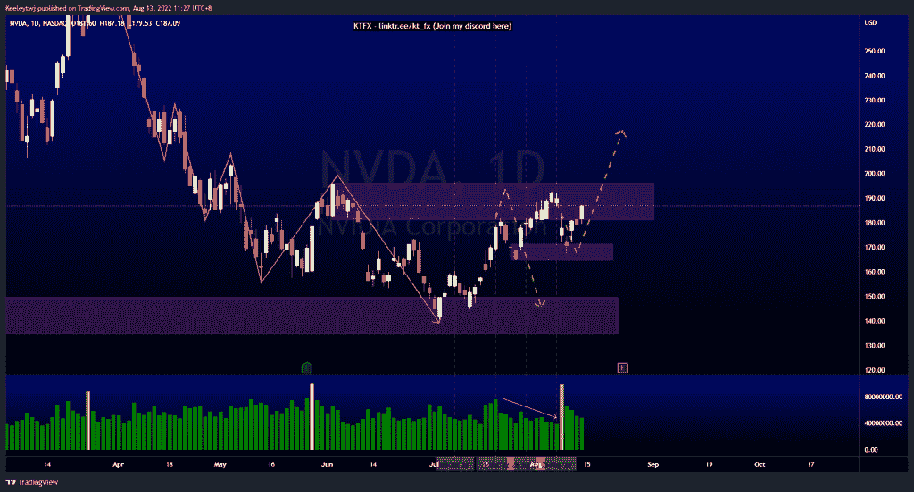
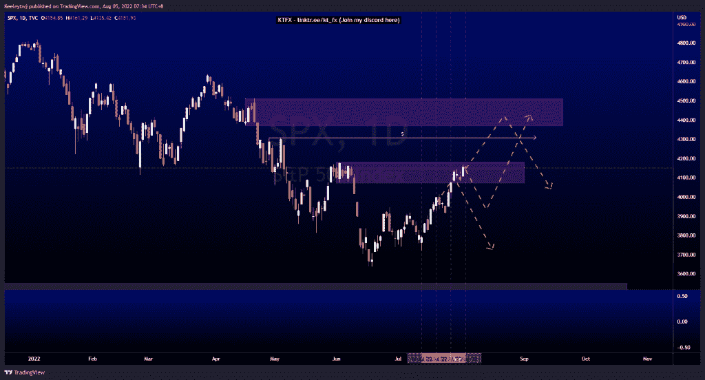
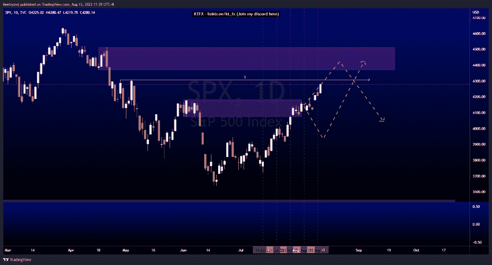
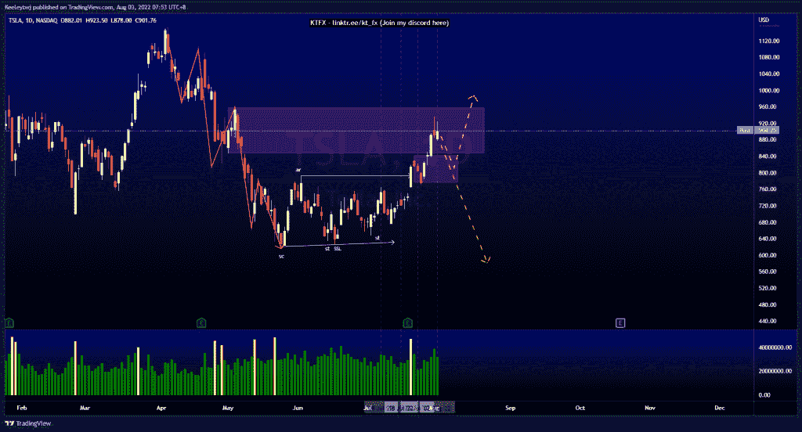
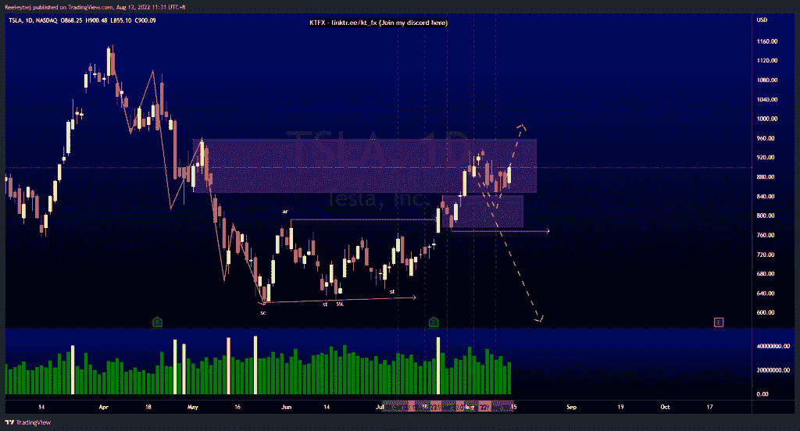

# 本周技术分析不错#NVDA #SPX #TSLA

> 原文：<https://medium.com/coinmonks/good-technical-analysis-this-week-nvda-spx-tsla-ea3c20091184?source=collection_archive---------32----------------------->

在这里找到更多关于我的信息(Youtube/discord):[https://www.linktr.ee/kt_fx](https://www.linktr.ee/kt_fx)

#NVDA

价格从看涨点反弹至 171.24。

Before

After

#SPX500

价格在 4073.85 使看跌点无效，并向 4308.45 的流动性方向前进。

Before

After

#TSLA

价格从看跌点 848.03 反弹至看涨点 842.36。现在价格正在上涨

Before

After

希望你已经利用了我这周的分析。喜欢，分享，评论如果你是盈利的！让我知道，如果你有任何你想让我分析的行情。一定要在其他社交平台上看看我！

种类

贴在[技术分析](https://2minutesliteracy.wordpress.com/category/technical-analysis/)

*原载于 2022 年 8 月 13 日 http://2minutesliteracy.wordpress.com***。**

> *交易新手？尝试[加密交易机器人](/coinmonks/crypto-trading-bot-c2ffce8acb2a)或[复制交易](/coinmonks/top-10-crypto-copy-trading-platforms-for-beginners-d0c37c7d698c)*