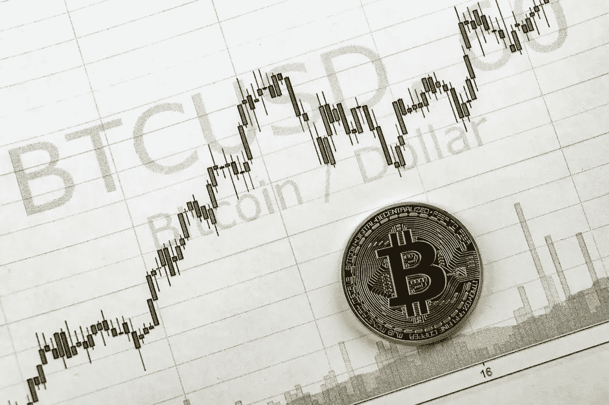
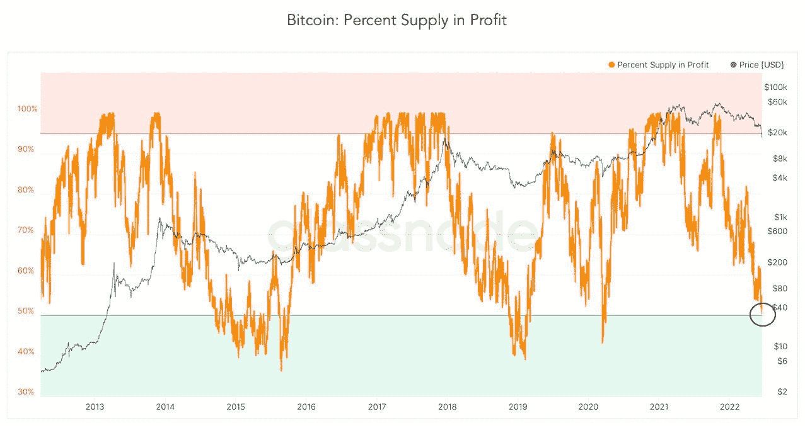
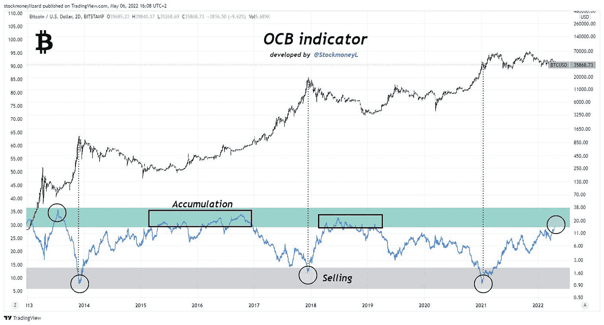
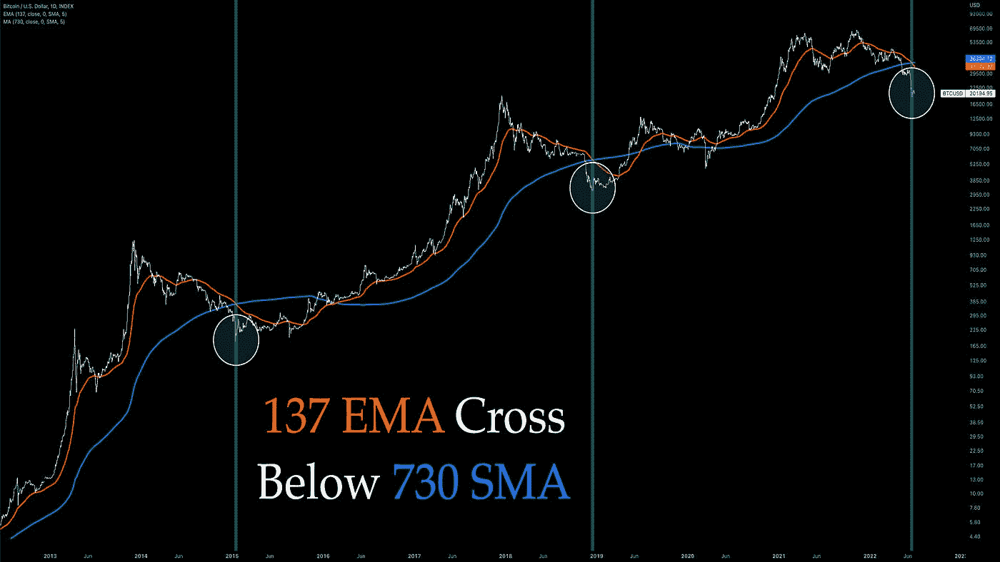
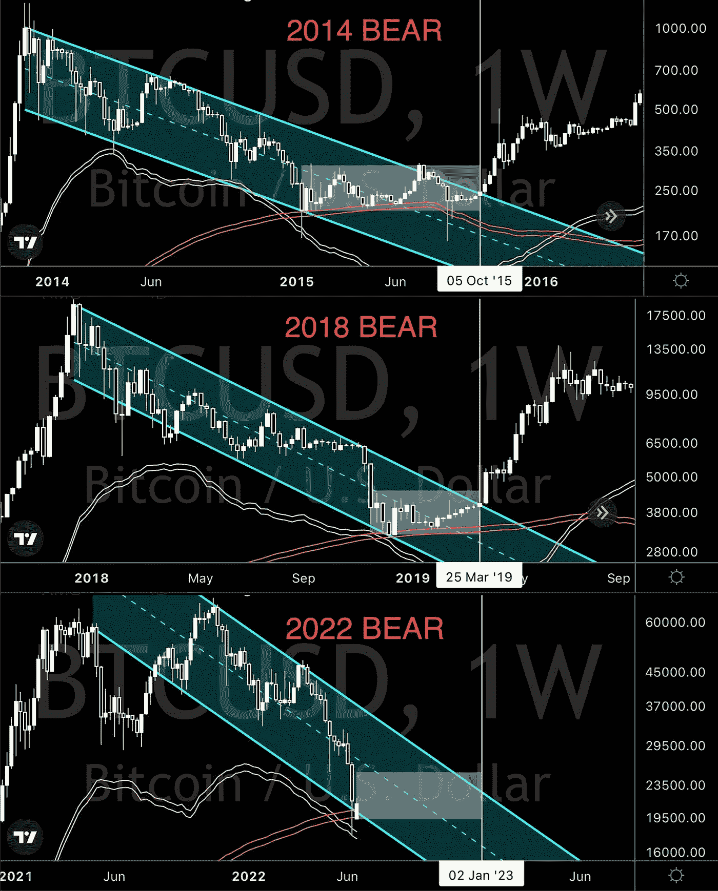
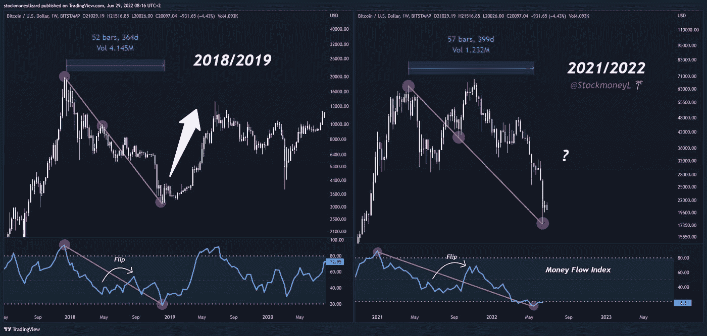
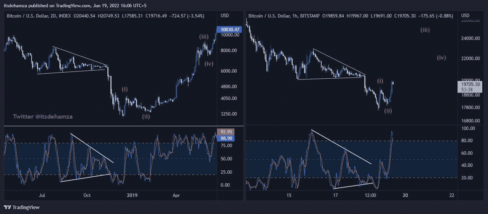
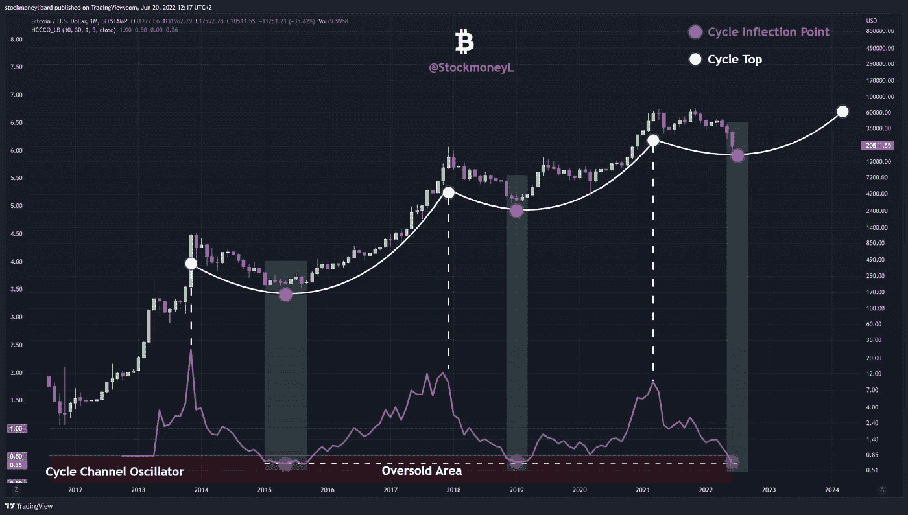

# 买蘸酱的好时机？—发现比特币市场底部的 5 个主要历史指标

> 原文：<https://medium.com/coinmonks/good-time-to-buy-the-dip-5-major-historical-indicators-to-find-bitcoin-market-bottom-ed67e35a91fe?source=collection_archive---------21----------------------->

## 了解比特币底部指标

# 1.利润中的供应百分比

**利润百分比**是**投降**的指标。当利润百分比下降到**绿色区域**时，我们通常会经历**最大的痛苦，市场会投降**。这些数字现在刚刚触及绿色区域，所以我们可能会有更多的下跌，但我们已经接近底部。

Bitcoin Percentage Supply in Profit 2022

# 2.OCB 指标

OCB 指标让你知道自己在市场周期中的位置。随着 OCB 指标下降到灰色区域，表明我们正在进入基本面被高估的区域。在指标跌至该区域后，接下来是一个修正阶段，在 OCB 曲线在高位变平(**绿色区域**)并表明我们再次被**从根本上低估**之前。

# 3.移动平均交叉

**马交叉**表示比特币在过去一个周期的底部。但是请注意，过去的市场周期是在美联储 QE(量化宽松)的环境下。

# 4.巧合吗？

在过去的熊市周期中，许多巧合预示着底部或反弹。历史会重演吗？

Breaks through the downward channel

Bitcoin Money Flow Index chart 2022

# 5.循环通道振荡器

这通常表明比特币的**超卖区**和市场底部。从历史上看，这是一个买入机会。

# 结论

以上指标帮助你确定一个比特币的价值是多少。从图表中，我们可以看到，基于这些指标，比特币目前确实超卖。19，000 美元的支撑位在过去几天保持得相当好，这可能是短期救市的一个指标。但在这个流动性和交易量逐渐枯竭的动荡市场中，要保持谨慎。

> 交易新手？尝试[加密交易机器人](/coinmonks/crypto-trading-bot-c2ffce8acb2a)或[复制交易](/coinmonks/top-10-crypto-copy-trading-platforms-for-beginners-d0c37c7d698c)

#

#

#

**在推特上关注**我:[https://twitter.com/tvstsang](https://twitter.com/tvstsang)

**在媒体上跟随**我:[https://medium.com/@tvstsang](/@tvstsang)

去看我的[最新故事](/@tvstsang/celsius-network-crash-what-happened-to-celsius-network-adc363387c21)关于**其他** **比特币底部指标**:[https://medium . com/coin monks/is-this-the-crypto-market-bottom-5-important-bottom-indicators-for-bit coin-the-crypto-market-70 BC 5 f 20 f1 a 4](/coinmonks/is-this-the-crypto-market-bottom-5-important-bottom-indicators-for-bitcoin-the-crypto-market-70bc5f20f1a4)

去看看我的故事吧，关于**摄氏度**发生了什么，以及**阿拉米达研究如何在其中发挥**作用。:[https://medium . com/@ TVs tsang/celsius-network-crash-what-happed-to-celsius-network-ADC 363387 c 21](/@tvstsang/celsius-network-crash-what-happened-to-celsius-network-adc363387c21)

> 加入 Coinmonks [电报频道](https://t.me/coincodecap)和 [Youtube 频道](https://www.youtube.com/c/coinmonks/videos)了解加密交易和投资

# 另外，阅读

*   [Botsfolio vs nap bots vs Mudrex](/coinmonks/botsfolio-vs-napbots-vs-mudrex-c81344970c02)|[gate . io 交流回顾](/coinmonks/gate-io-exchange-review-61bf87b7078f)
*   [CoinFLEX 评论](https://coincodecap.com/coinflex-review) | [AEX 交易所评论](https://coincodecap.com/aex-exchange-review) | [UPbit 评论](https://coincodecap.com/upbit-review)
*   [AscendEx 保证金交易](https://coincodecap.com/ascendex-margin-trading) | [Bitfinex 赌注](https://coincodecap.com/bitfinex-staking) | [bitFlyer 审核](https://coincodecap.com/bitflyer-review)
*   [Bitget 评论](https://coincodecap.com/bitget-review)|[Gemini vs block fi](https://coincodecap.com/gemini-vs-blockfi)cmd |[OKEx 期货交易](https://coincodecap.com/okex-futures-trading)
*   [AscendEx Staking](https://coincodecap.com/ascendex-staking)|[Bot Ocean Review](https://coincodecap.com/bot-ocean-review)|[最佳比特币钱包](https://coincodecap.com/bitcoin-wallets-india)
*   [霍比审核](https://coincodecap.com/huobi-review) | [OKEx 保证金交易](https://coincodecap.com/okex-margin-trading) | [期货交易](https://coincodecap.com/futures-trading)