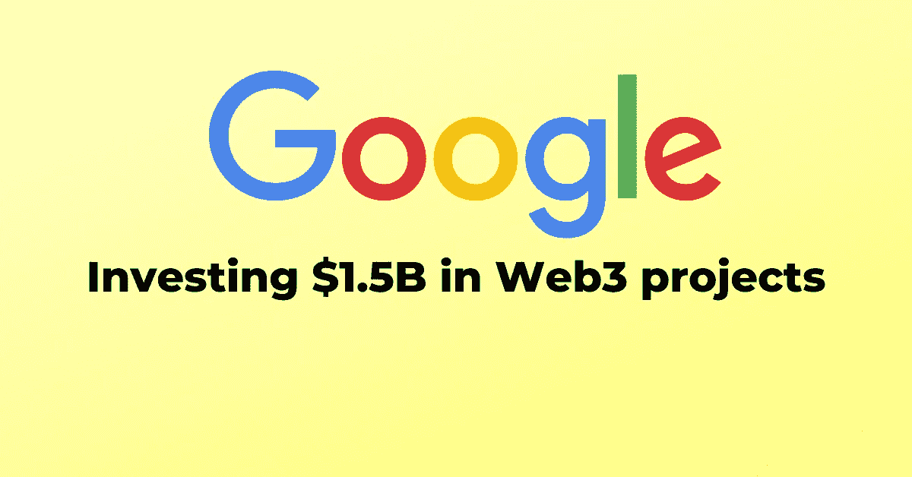

# 谷歌在熊市中向区块链公司投资 15 亿美元

> 原文：<https://medium.com/coinmonks/google-invests-1-5b-in-blockchain-companies-amidst-the-bear-market-decentreviews-blog-56cc7e506c7d?source=collection_archive---------10----------------------->

## 快录功能

*   谷歌在 2021 年 9 月至 2022 年 6 月期间对区块链公司的投资超过了任何其他上市公司。
*   科技巨头谷歌投资的惊人金额接近 15 亿美元，而整个市场正经历一个熊市阶段。