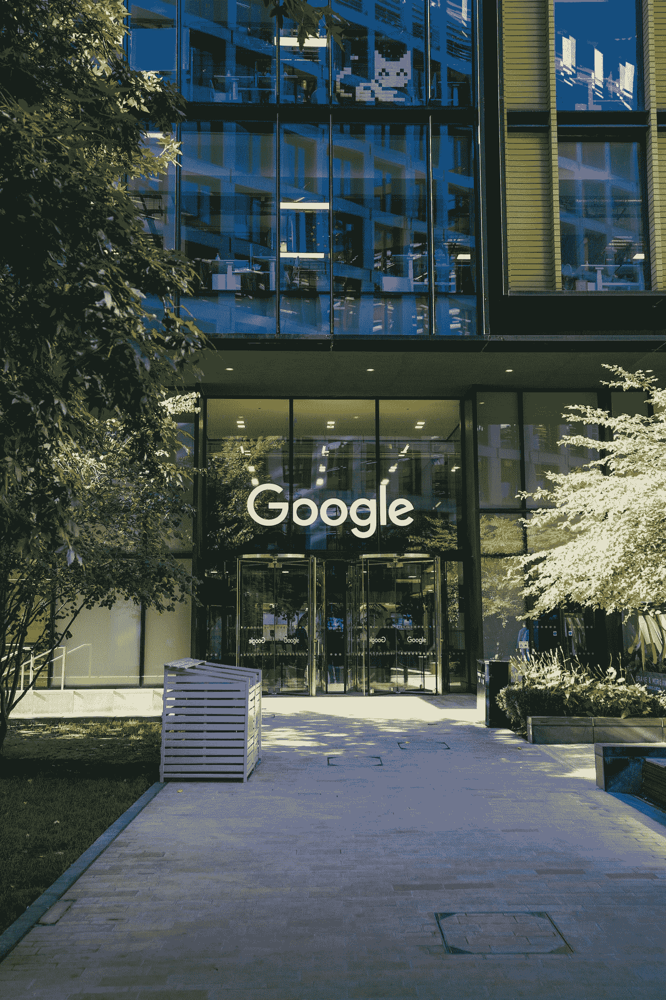

# 谷歌正与比特币基地合作，让客户用加密货币支付其云服务

> 原文：<https://medium.com/coinmonks/google-is-partnering-with-coinbase-to-let-customers-pay-for-its-cloud-services-in-cryptocurrencies-39b3f3a2536?source=collection_archive---------41----------------------->

> 从明年年初开始，基于加密的支付将向 Web3 领域的客户开放。

Photo by [Jonny Gios](https://unsplash.com/@supergios?utm_source=medium&utm_medium=referral) on [Unsplash](https://unsplash.com?utm_source=medium&utm_medium=referral)

由于与比特币基地商业服务的整合，谷歌云平台基础设施服务最初将接受 Web3 世界中少数希望用加密货币支付的客户的加密货币支付。

Google Cloud 首席执行官 Thomas Kurian 表示:“我们希望更快、更容易地构建 Web3，与比特币基地的合作有助于开发人员向这一目标迈进一步。”。

**在盘前交易期间，比特币基地的股票上涨了 5%以上，达到 70.76 美元。**

比特币基地商业支持 10 种货币，包括比特币、比特币现金、Dogecoin、以太币和莱特币。过去一年，比特币、Dogecoin 和以太坊的价格都下跌了 60%以上。

区块链技术，如不可伪造的令牌，或 NFT，已经成为谷歌云部门的一个更大的焦点。

此外，Crypto.Com**——推出了新的应用内 Google Pay 购买功能。这将允许用户通过 Google Pay 更快地通过他们的 Android 设备购买加密货币。**

> **交易新手？尝试[加密交易机器人](/coinmonks/crypto-trading-bot-c2ffce8acb2a)或[复制交易](/coinmonks/top-10-crypto-copy-trading-platforms-for-beginners-d0c37c7d698c)**