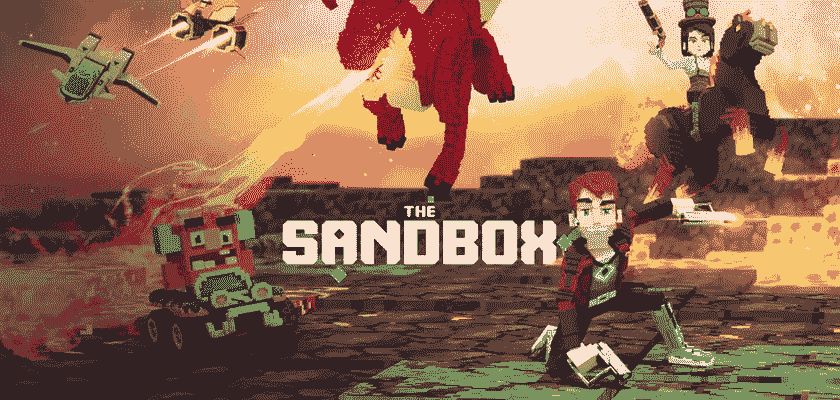

# 戈登·拉姆齐宣布地狱厨房 NFT 游戏

> 原文：<https://medium.com/coinmonks/gordon-ramsay-announces-hells-kitchen-nft-game-2d809b1a46a?source=collection_archive---------15----------------------->

令人欣喜的是，名厨戈登·拉姆齐现在有了自己的 NFT 游戏。显然，赌注很高，因为令人困惑的元宇宙比赛就像电视节目一样。就像这个节目一样，获胜者可以成为元宇宙餐厅的主厨。有了它，戈登和他的团队可以一次解决一个白痴三明治的世界饥饿问题。至于为什么有人会想在视频游戏中提供假食物，答案是为什么不呢？所以，如果你一直喜欢在充满敌意的环境中工作，而满嘴脏话的英国老板会叫你蠢驴，那么这场 NFT 的比赛是你不想错过的。是的，你可以加入寻找羊肉酱的任务，当然也可以和 [Raj](https://www.youtube.com/watch?v=rBJVk4q7RUE) 组队。

另一方面，这个游戏给你带来了千载难逢的机会。你实际上可以用你的钱，你工作的钱，去买一个 NFT 寿司或者别的什么。你会一天工作 8 小时，上夜班，浪费你的年轻岁月。但最终，在地狱厨房买一份 NFT 杂烩还是值得的。毕竟，我们都很幸运生活在 21 世纪，后现代主义时代。与我们的前辈不同，我们非常幸运地不在乎意义，因为后现代主义意味着寻求真理是一场荒谬的争论。今天，生活的全部就是喝 NFT 红牛，而世界却在垃圾大火中燃烧。

**在沙盒上烹饪 NFT 游戏**

戈登·拉姆齐，这位以极度侮辱和充满创意的脏话而闻名的名厨，现在已经被全部藏起来了。毫无疑问，他是为了技术，而不是为了技术。

8 月 16 日，拉姆齐在推特上宣布了他在 NFT 的新游戏。从本质上来说，这个游戏是一个虚拟版本的非常受欢迎的烹饪真人秀《地狱厨房》。游戏将以数字版的戈登和虚拟版的地狱厨房为特色。

[https://twitter.com/GordonRamsay/status/1559544725081772032](https://twitter.com/GordonRamsay/status/1559544725081772032)

基本上，这个五次获得艾美奖提名的节目有两个参赛队参加烹饪比赛。获胜者将成为拉姆齐一家餐厅的主厨。的确，它过去是，现在仍然是一个非常有趣的节目。这就是为什么沙盒与该节目的发行商 ITV studios 合作，以取得成功。显然，重复旧的格式比创新要便宜得多。

谢天谢地，NFT 游戏在沙盒元宇宙中有了自己的地盘。去年，随着元宇宙的房地产泡沫破裂，这款基于以太坊的元宇宙游戏成功吸引了大量资金。在这一点上，沙盒需要一个 NFT 版的迈克尔·伯里来指出 NFT 的房地产泡沫，并预测下一次虚拟市场的崩溃。

这是第一个以烹饪为主题的沙盒游戏。游戏允许玩家收集食谱，制作菜肴，并参加比赛，成为厨师长。自然，有许多 NFT，包括限量版的戈登·拉姆齐头像需要付费。

“对我来说，没有什么比开辟新领域更令人兴奋的了，无论是创造招牌菜、新的餐厅概念、新的节目，还是现在在沙盒中的虚拟体验。

我被元宇宙的沙盒和沙盒所吸引。我想不到更好的平台来带来我的地狱厨房餐厅和品牌的高能量。”[拉姆齐说](https://sandboxgame.medium.com/hells-kitchen-is-spicing-up-the-metaverse-4c653e0aba68)。

[这篇文章](https://blog.hi.exchange/gordon-ramsay-nft-game/)最初由同一作者[尼玛·阿斯加里](https://blog.hi.exchange/author/nimaasgari/)发表在 [HiExchange 博客](https://blog.hi.exchange/)上。

> 交易新手？尝试[加密交易机器人](/coinmonks/crypto-trading-bot-c2ffce8acb2a)或[复制交易](/coinmonks/top-10-crypto-copy-trading-platforms-for-beginners-d0c37c7d698c)