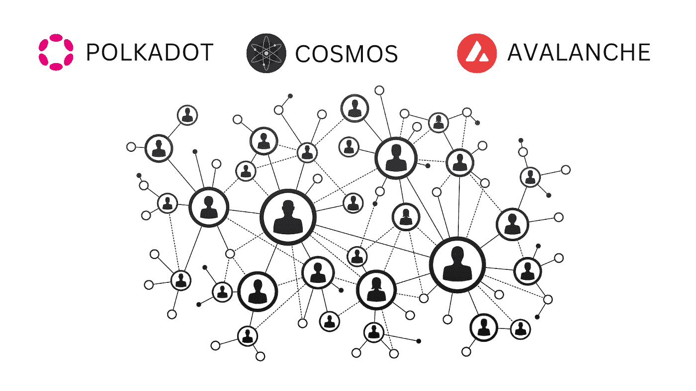
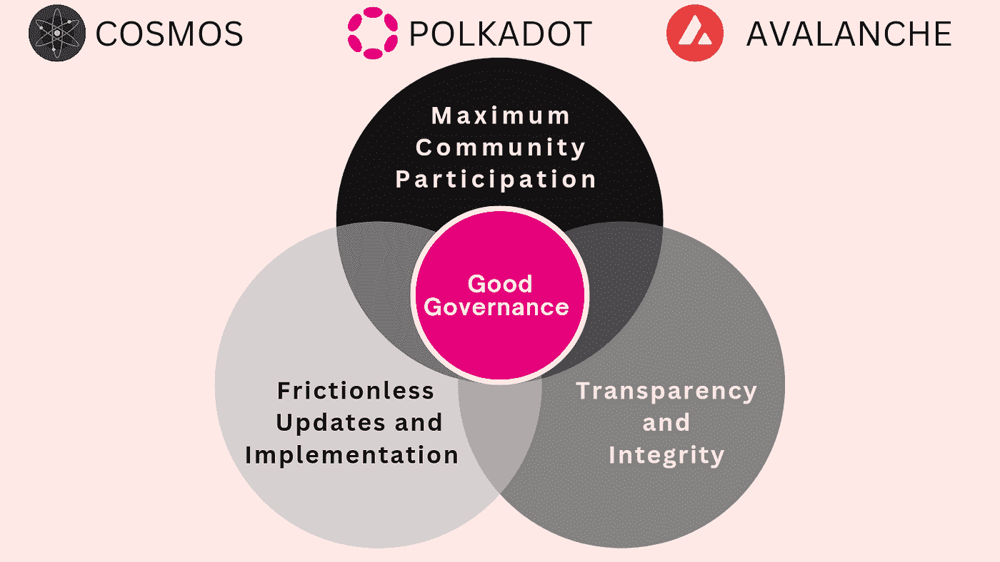
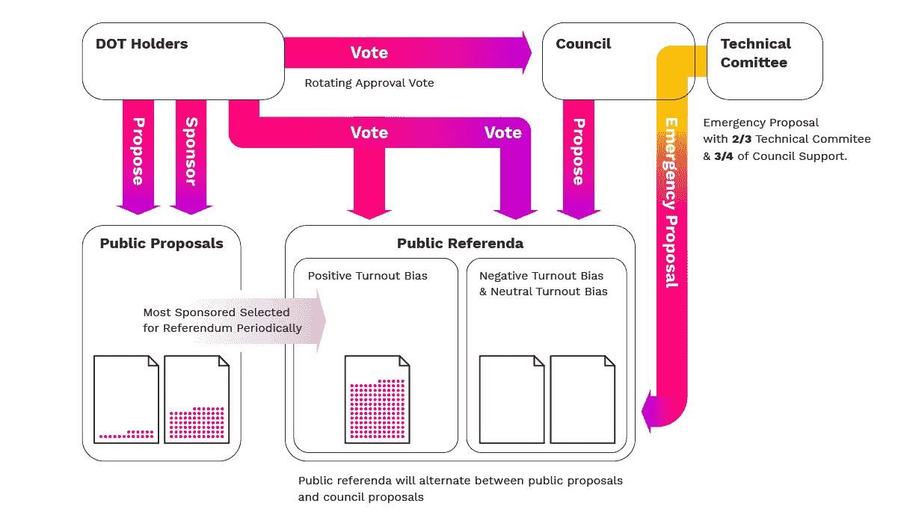
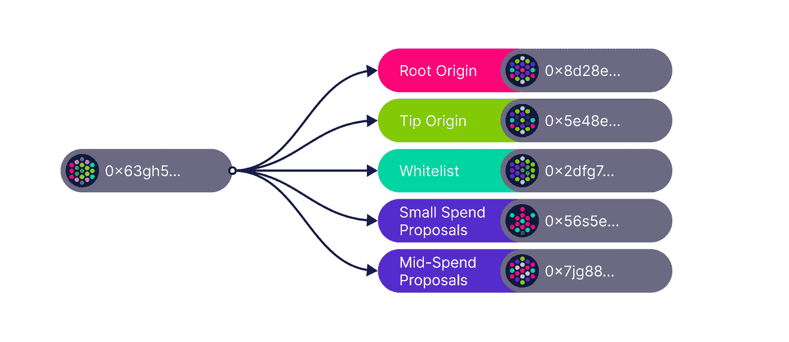
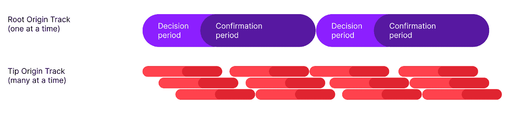

# 雪崩、宇宙和波尔卡多特权力游戏的治理

> 原文：<https://medium.com/coinmonks/governance-on-avalanche-cosmos-polkadots-power-play-opengov-d8d5dfe0d2c5?source=collection_archive---------10----------------------->

治理是就如何做出决策形成共识的过程。对于 Dao 和公共区块链来说，分散治理很重要，但也很有挑战性。

区块链幅员辽阔，因此有必要对整个社区进行管理和协调，以实现统一的目标。此外，有效的区块链治理对于区块链适应、变革和互动是必不可少的。利益攸关方参与有关区块链发展和未来方向的事务对现有和潜在用户有着重大影响。

区块链的治理过程被认为对系统的去中心化、可持续性和网络协议的改变至关重要，对其成功至关重要。

在本文中，我们将研究支持有效治理的特性，以及三个可互操作的区块链(Polkadot、Cosmos 和 Avalanche)部署的不同机制。要了解这些区块链的技术架构，请随意浏览链接的[文章](https://polkaverse.com/4473/advancing-blockchain-interoperability-polkadot-cosmos-and-36488)。

# 区块链治理— Polkadot、Cosmos 和 Avalanche

良好的治理过程是允许最大限度的社区参与、无摩擦的更新和实现的过程。

让我们深入 Cosmos、Avalanche 和 Polkadot 的治理框架，重点放在 Polkadot 的 Gov2 上。这不会是这些区块链之间的直接比较，主要是因为 Avalanche 没有链上治理& Cosmos 仍在实现过程中。

# 宇宙

Cosmos 上的区域部署不同的治理风格，以适应它们的价值主张。然而，就 Cosmos Hub 而言，它使用的是混合治理模型。

*   用于讨论的链外治理平台
*   决策和执行的在线投票

链上机制用于传递文本提议、更改共识参数以及从社区池中支出资金。治理决策的制定是通过分叉机制(协议分叉)来执行的，这与大多数其他区块链类似。

Cosmos 鼓励所有相关利益方的参与。因此，所有代币持有者都可以在 Cosmos 上投票。网络期望每个验证者对每个提议进行投票。此外，如果委托人放弃投票，他们委托的验证者将代替他们行使投票权。

*委托人——是那些不能或者由于某种原因不希望操作验证器节点的人。但是，这些人仍然可以作为委托人参与到赌注过程中。Comos 上的验证者是根据他们的总股份来选择的，总股份是他们自我委托的股份和委托给他们的股份的总和。这被证明是有效的，因为它使委托者成为防范表现不良行为的验证者的保障。

# 雪崩

一个链上治理机制正在为雪崩而工作。目前，它为关键网络参数部署了链上投票，包括(根据其白皮书)

*   参与所需的最低赌注金额
*   下注所需的时间最少
*   一个节点可以参与的最长时间
*   铸造率
*   交易费用金额

因此，Avalanche 只允许通过治理改变预定数量的参数，从而提高网络的可预测性和安全性。此外，列出的所有参数都受到特定时间范围内的限制。

任何拥有 AVAX(网络的原生令牌)的人都可以参与治理，任何参与网络的节点都可以发布治理建议。

像 Cosmos 上的区域一样，Avalanche 上的其他子网也有自己独特的经济和管理结构。

# 波尔卡多特

Polkadot 的新治理模式 [Gov2](https://polkadot.network/blog/gov2-polkadots-next-generation-of-decentralised-governance/) 旨在更具包容性和分散化，因为它允许任何人在任何时候发起公投。它通过去除诸如委员会和技术委员会等“一等公民”来解决集权的缺陷。它还消除了交替的提案时间表和公共提案队列。

波尔卡多特现有的三院治理体系包括

1.  一个管理升级时间表的技术委员会，使得关键缺陷修复的治理速度比平常更快。
2.  代表被动利益相关者并管理参数、管理和支出提案的选举委员会。
3.  所有其他事项的一般表决制度。

值得注意的是，尽管存在这些代表机构，但所有变革都必须通过全民公决。不幸的是，在目前的机制下，一次只能进行一次全民投票，而且投票过程极其缓慢，只有 28 天的投票期。这一点，加上安理会的带宽有限，意味着该系统倾向于深入审议很少的提案，而不是广泛审议很多提案。但是，技术委员会可以与理事会合作，快速跟踪关键的技术升级。

此外，由令牌持有者预先批准和选举的理事会可以否决令牌持有者本身。这种设置是在没有外部治理参与者干预的情况下维护检查和平衡的极好工具。

虽然该机制有其优点，但也有某些缺点；委员会和技术委员会基本上是集中的，将协议和个人置于一些风险之中。

# Gov2 — Polkadot 的下一代治理系统

加文的文章对 [Gov2](https://polkadot.network/blog/gov2-polkadots-next-generation-of-decentralised-governance/) 的细节提供了深刻的见解。本文概述了 Gov2 如何寻求解决系统中存在的问题。

让我们从新机制中保持不变的内容开始。

*   最初的波尔卡多治理原则仍然有效。总股份的 50%，有足够的信念，仍将决定系统的未来。
*   定罪投票有效。信念投票给予那些愿意更长时间锁定代币的人更大的权重。
*   正如技术官僚集体在重要性、规模、组成和成员机制上的变化一样。

当前治理中的一等公民将被一等决策机制——全民公决——所取代。现有治理和新治理的主要区别在于，Gov2 允许大量公投，增加了一次可以通过的动议数量。

通过 Gov2，提案人可以指定他们希望他们的提案在哪个起点执行。起源意味着一个提议的重要性。例如，根源有最高的门槛和保障。那些传递相对较小功率的源(例如，尖端源)具有较短的考虑周期和较低的批准阈值。

原点决定分配给建议的轨迹。所有轨道都有自己的公投数量限制，可以一次决定。例如，Root Origin 有一个提案的限制。

为了规避中央集权的风险，同时优化决策过程，Gov2 拥有一个自治的专家机构(The Fellowship)。该伙伴关系的主要目标是代表体现和包含 Polkadot 网络和协议的技术知识库的人。该伙伴关系没有权力颠覆利益相关者的整体决策。然而，他们可以缩短公投的时间。

该伙伴关系的设计具有更广泛的成员标准(它将与数千名成员一起工作)和更低的准入门槛(在行政流程和专业知识的期望方面)。交少量押金就可以很容易成为会员。

该协会的成员被给予等级“以指定系统期望他们的意见在何种程度上是消息灵通的、有良好的技术基础的和符合波尔卡多特的利益的。”此外，还存在一个章程来管理业务，并规定了对不同级别的要求。

继续进行升级的制定，使用 WASM 元协议，Polkadot 可以在没有硬分叉的情况下实现升级和成功的提议。" STF、事务队列或链外工作线程中的任何内容都可以在不分叉链的情况下升级."

# 结论

治理是任何分权系统不可或缺的组成部分。没有完美的治理体系，只有改进的迭代。虽然治理系统需要灵活，但也需要与长期愿景、价值观和信念保持一致。我们需要这样一种治理，它不断发展，面向未来，支持广泛的价值观，同时提供透明度和信任最小化。波尔卡多特现在似乎正走在正确的道路上。

如果您觉得这很有帮助，请通过订阅和关注来支持。

**万物区块链**🧐——自由思想家、作家✍、区块链探险家🔭
为了简化元宇宙链条的不同环节

**社交**

[Twitter](https://twitter.com/EverythingB0x) ， [Medium](/@everythingblockchain) ， [Youtube](https://www.youtube.com/channel/UCkcc6EceEAu1sMoi2dKczCQ) ， [Reddit](https://www.reddit.com/user/cyekmyster) ， [Substack](https://everythingblockchain.substack.com/account?utm%5Fsource=menu-dropdown)

**下线**

[智囊团](https://app.usebraintrust.com/r/everything1/)，[预研](https://www.presearch.org/signup?rid=2491437)，[币安](https://accounts.binance.com/en/register?ref=12626399)，[库科恩](https://www.kucoin.com/ucenter/signup?rcode=rJCLFS2)

本文提供的信息仅用于教育目的，不得视为投资建议。在正确呈现任何信息方面的任何失误都是我们的责任。我们否认与使用此内容相关的任何责任。

> 交易新手？尝试[加密交易机器人](/coinmonks/crypto-trading-bot-c2ffce8acb2a)或[复制交易](/coinmonks/top-10-crypto-copy-trading-platforms-for-beginners-d0c37c7d698c)