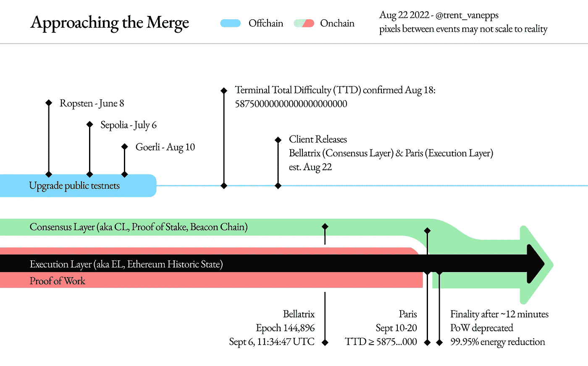

# 以太坊本月将举行盛大活动，合并很快将转变为 POS 链！！

> 原文：<https://medium.com/coinmonks/grand-event-this-month-for-ethereum-with-the-merge-happening-soon-transitioning-it-into-a-pos-chain-9683d86ad89b?source=collection_archive---------31----------------------->

# 以太坊合并的特殊日子即将到来

哇……以太坊网络，正如我们所知的那样，正在发生变化，它从工作共识机制的证明转变为在九月的这个月内真正发生的利害关系的证明！！

是的，关于[合并](https://blog.ethereum.org/2022/08/24/mainnet-merge-announcement)的消息已经在加密新闻媒体中闪现了一段时间，但现在几乎肯定会发生，不会有重大延迟，所以在加密社区的眼中，这感觉像是一个重要的里程碑。

# 还记得 DEFI 在以太坊区块链做婴儿建筑的旧时光吗

哦，是的，我觉得自己在加密领域相当老了，自从 2018 年以来我就知道了，因为我已经看到以太坊从 44 美元飙升到 2000 美元！！那时 DEFI 还是个婴儿，Uniswap 和 Compound 即将诞生。

然后很长一段时间，以太坊社区都在等待第二层扩展解决方案，因为在 2020 年，以太坊的费用难以承受，小零售商无法实际使用以太坊区块链。

现在是 2022 年，9 月份，以太坊正在演变成一个更具可扩展性的区块链，因为它过渡到了 POS 链。

# 以太坊幸存了下来，并和那些没有成功杀死以太坊的所谓以太坊杀手呆在一起

我听说过以太坊将被以太坊杀手区块链杀死的观点，但是早期的 POS 区块链像 EOS 和 Tron 都没能打败以太坊。

在像 Polkadot 和 Cosmos 这样的现代 POS 区块链的当前时代，以太坊杀手标签是不存在的，因为重点是移动性，以太坊将继续与其他新的蓬勃发展的 POS 区块链共存。

这是因为尽管以太坊花了这么长时间才过渡到 POS，但没有其他区块链在 dapp 数量上超过以太坊，它们太晚了，无法成熟到足以与自 2015 年以来一直存在的以太坊竞争，而 Uniswap 等早期 DEFI dapps 自 2018 年以来一直在那里发挥作用！！

所以最终，以太坊继续在区块链领域保持相关性，没有以太坊杀手区块链设法杀死它。此外，以太坊通过合并转变为 [POS 区块链，这绝对是一件大事，应该庆祝，因为这是加密社区区块链领域的一件大事！！](https://blog.ethereum.org/2022/08/24/mainnet-merge-announcement)

[Image Source](https://blog.ethereum.org/2022/08/24/mainnet-merge-announcement)

# 将以太坊转换为 POS 状态链的合并的详细信息

## 以太坊网络的升级解释了最终的合并现象

以太坊的合并计划在 9 月份进行，它包括两个阶段，节点运营商需要升级以太坊的执行层(EL ),即以太坊的历史状态链，以及以太坊的共识层(CL ),即以太坊的信标链。

**贝拉特里克斯定于 9 月 6 日升级以太坊的执行层！！**

当纪元高度 144896 年到来时，第一阶段将唤起以太坊共识层上的贝拉特里克斯升级，这预计发生在世界协调时 9 月 6 日上午 11:34:47。

**巴黎升级将以太坊转变为 POS 状态链**

然后，将以太坊网络从 POW 迁移到 POS 状态链的最终升级将发生在以太坊的执行层。当总难度阈值或终端总难度(TTD)达到 587500000000000000000000 范围时，将在 EL 上触发巴黎升级。

当 TTD 达到或超过以太坊执行层中的范围 58750000000000000000 时，将触发 Paris 升级，信标链验证器将生成以下块。当信标链中产生的第一个后 TTD 块在信标链中被最终确定(也就是被验证)时，这个合并转换被认为完成了！！

巴黎升级的日期取决于 TTD 达到所需的航程

巴黎升级日期将取决于 TTD 何时达到 5875000000000000000000 的要求范围。至于 TTD 何时会触及这个范围取决于哈希速率，更多的哈希速率保护以太坊网络将引发更多的网络难度增加，最终触发这个大难度炸弹，将开始以太坊从 POW 到 POS 状态链的合并过渡。

这一最终的巴黎升级预计将在 9 月 10 日至 20 日之间的任何时间进行。将在 [bordel.wtf](https://bordel.wtf/) 和[797.io/themerge](https://797.io/themerge/)触发 Paris 升级的该 TTD 的估计计时器链接显示，该 TTD 范围将在 9 月 14 日和 9 月 15 日之间的时间段到达。

因此，以太坊进入了一个新的阶段，在接下来的日子里，加密社区对合并感到兴奋。希望这个过渡能够顺利进行，没有任何重大问题和合并后的问题，希望在此之后出现一个更具可扩展性的以太坊。

> 交易新手？尝试[加密交易机器人](/coinmonks/crypto-trading-bot-c2ffce8acb2a)或[复制交易](/coinmonks/top-10-crypto-copy-trading-platforms-for-beginners-d0c37c7d698c)