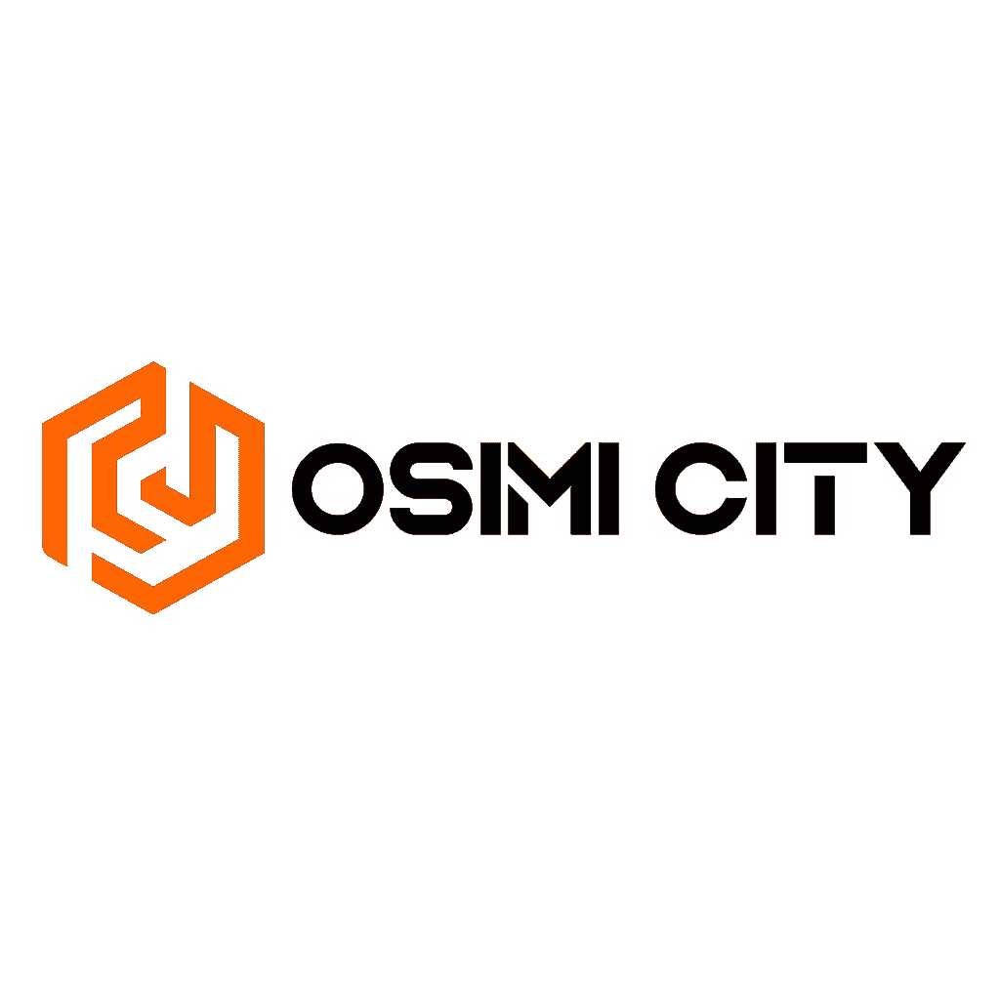

# 侠盗猎车手:奥西米城来了

> 原文：<https://medium.com/coinmonks/grand-theft-auto-with-play-to-earn-here-comes-osimi-city-83dc7a2bdb98?source=collection_archive---------3----------------------->

最初的游戏刚刚开始，我们已经为那些设法从成群的僵尸中幸存下来并清理城市的玩家设立了高达 100 美元的奖励！

Play2Earn (P2E)游戏的生态系统正在不断发展壮大，根据最近的一项统计，在过去的几个月里，它吸引了更多来自机构的投资。

根据梅萨里的说法，仅在 2022 年第一季度，GameFi field 就吸引了 12 亿美元。

Source: [https://venturebeat.com/games/blockchain-game-pitches-are-flooding-into-game-vcs/](https://venturebeat.com/games/blockchain-game-pitches-are-flooding-into-game-vcs/)

# 奥西米城背后的理念是什么？

这个世界遭遇了一次疫情，只有一次城市留下了成群结队的丧尸。但僵尸开始攻击城市，玩家可以执行几个任务，以实现越来越大的目标。

这款游戏已经可以在[公司的网站](http://osimicity.com/)上以简化的游戏模式获得。
嗯，如果你看一下网站，你可能会在团队中找到你可能认识的人！:D:是的，我作为副总裁参与了这个项目，管理一些流程。
桌面版是我们几个月前发布的第一个版本，现在移动版也可以下载，所以你可以尝试游戏体验和尝试第一个任务。

Source: Osimi City

OSI 将成为游戏的本地代币，它将与一种内部货币配对，这种货币将充当稳定硬币，但不可提取。所以不要担心:我们不会创造其他稳定的硬币潜在的违约。我们决定采用这种稳定的货币(只有游戏内的有效性)来稳定 NFTs 的价格，并及时让玩家买得起游戏，即使 OSI 令牌可能会暴涨。

游戏中将会有几个功能，并且 NFTs 的图形已经准备好了！看看他们！

Source: Osimi City

Source: Osimi City

这里一个轿跑的*基础武器*。在这个[链接](https://osimicity.gitbook.io/osimi-city-gitbook/items/nft-firearms)你可以找到所有的产品，包括技术说明书、价格等等！

如果你想开始检查*土地*，一定要看一看！

Source: Osimi City

Source: Osimi City

不同用途的土地会有不同的价格，你可以在这里找到**。**

**游戏将以免费模式开始，每个人都可以玩这个游戏，但是没有潜在的收入，空投除外。这个想法是为了在侠盗猎车手游戏-concept 的持久王朝下创建一个巨大的社区。**

**Free-to-play 旨在增加社区，让玩家了解他们是否真的想购买 NFT 来开始玩游戏，并获得游戏**“赚取”部分**的机会，以及之后进入锦标赛的机会。**

**游戏的游戏赚取版本再次从街机任务开始，即所谓的 **PvE** ，在这里射手和赛车手将在难度越来越大的比赛中受到挑战。**

**当玩家对游戏感到满意时，他们可以通过**玩家对玩家锦标赛**来提高比赛的水平和赌注。这些锦标赛将有不同的玩家级别和报名费。报名费将以 OSI 代币支付，构成锦标赛的累积奖金。**

**感谢*元宇宙登陆*，虚拟房地产投资者将有机会成为锦标赛的赞助商，给予他们对游戏玩家和特定利基市场的巨大可见性。这一愿景将虚拟房地产的机会扩大到更多的公司，而不是普通的房地产经纪人，使 it 公司、游戏公会和更多的公司也有可能获得大规模曝光。**

**该游戏的桌面版已于今年 1 月准备就绪。
我们已经推迟了更多的 IDO，以开始吸引真正的用户群玩游戏，我们昨天刚刚开放了我们的第一个初始游戏！从 23 日到 24 日参加我们的比赛。**只有 50 个座位！****

**请务必加入我们的 [Discord](https://discord.gg/VgyH4zNnp4) 以跟踪所有正在进行的促销活动，我们几天前刚刚发布了最新的游戏，用虚幻引擎构建！**

**我们将在下一篇文章中继续讨论，了解我们正在开发的这个令人惊叹的项目的更多信息！**

> **加入 Coinmonks [电报频道](https://t.me/coincodecap)和 [Youtube 频道](https://www.youtube.com/c/coinmonks/videos)了解加密交易和投资**

# **另外，阅读**

*   **[加密复制交易平台](/coinmonks/top-10-crypto-copy-trading-platforms-for-beginners-d0c37c7d698c) | [五大 BlockFi 替代品](https://coincodecap.com/blockfi-alternatives)**
*   **[CoinLoan 点评](https://coincodecap.com/coinloan-review)|[Crypto.com 点评](/coinmonks/crypto-com-review-f143dca1f74c) | [火币保证金交易](/coinmonks/huobi-margin-trading-b3b06cdc1519)**
*   **[拜比特 vs 币安](https://coincodecap.com/bybit-binance-moonxbt)|[stealthexreview](/coinmonks/stealthex-review-396c67309988)|[Probit Review](https://coincodecap.com/probit-review)**
*   **[顶级付费加密货币和区块链课程](https://coincodecap.com/blockchain-courses)**
*   **[加密交易机器人](/coinmonks/crypto-trading-bot-c2ffce8acb2a)|[P2E NFT 15 大游戏](https://coincodecap.com/p2e-nft-games)**