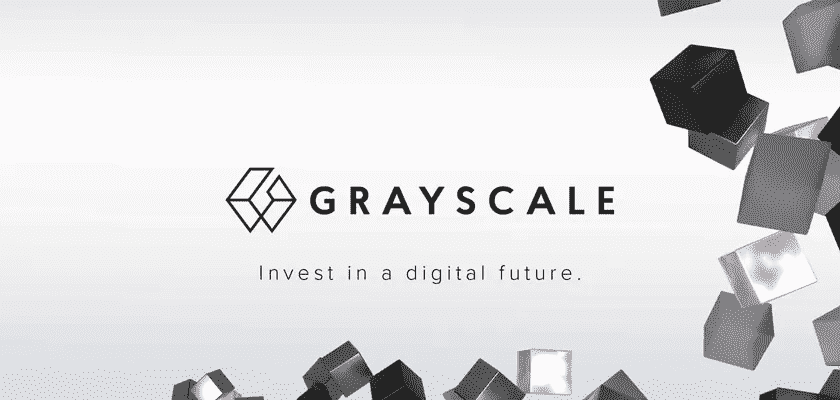
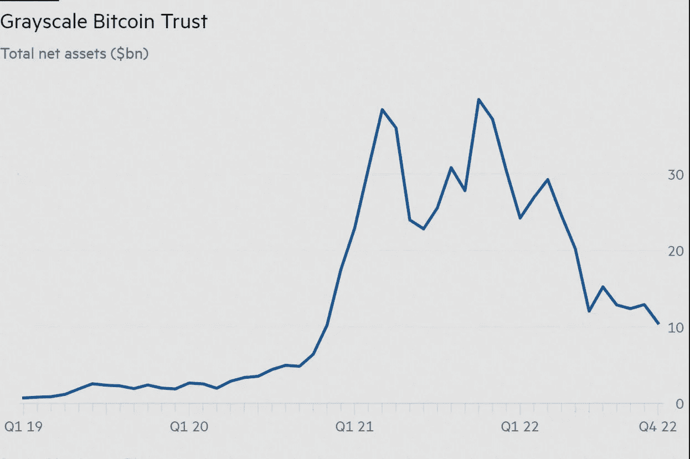
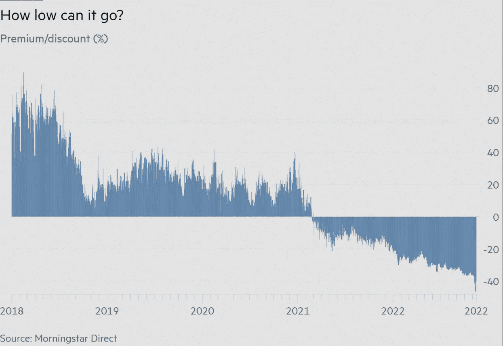

# 多亏了 FTX，灰度比特币信任陷入困境

> 原文：<https://medium.com/coinmonks/grayscale-bitcoin-trust-in-trouble-thanks-to-ftx-47ac1c47a9cb?source=collection_archive---------9----------------------->

灰度比特币信托正以巨大的折价交易，资金流出也是一致的。但在我们进入细节之前，让我们先来谈谈查尔斯·庞兹，一个臭名昭著的用他的姓氏为所有骗局火上浇油的人。有趣的是，最初的庞氏骗局在 20 年代初花费了投资者 2000 万美元，持续了一年多。从那以后，魔鬼有了大量的时间去学习，而且它真的表现出来了。虽然 FTX 的崩溃已经过去，但混乱的局面将在今年剩下的时间里伴随我们。在混乱中，人们可能会发现以前认为不可能的最意想不到的结果。这种不太可能的现象是什么？嗯，超级富豪在灰度比特币信托上赔钱。

对于那些不知道的人来说，灰度是世界上最大的加密货币基金。在很大程度上，他们的金融服务是专为拥有巨额投资的超级富豪客户提供的。目前，gray 持有全球约 3.5%的比特币，其份额正在下降。他们最大的数字资产是曾经风靡一时的灰度比特币信托(GBTC)。不幸的是，随着投资者急于退出，价值 105 亿美元的 GBTC 股价暴跌 40%。具有讽刺意味的是，这家投资巨头的首席执行官 Michael Sonnenshein 曾表示，投资者将[加密崩溃](https://blog.hi.exchange/investors-see-crypto-crash-as-opportunity-grayscale/)视为一个机会！

## **灰度比特币信托(GBTC)倒下了！**

自比特币在 2021 年 11 月达到峰值以来，GBTC 投资者总共减少了 83%。现在，比特币本身在同一时间段下跌了 74%。总而言之，灰度级比特币信托投资者因为信任灰度级的比特币信托而承受了巨大的损失。

至少可以说，2021 年对加密货币投资者并不友好。然而，熊市暴露了加密初创公司和投资公司的阴暗面。最近的 FTX 内爆发生在地球坍缩后不久。与此同时，即将出台的法规带来了太多的不确定性。现在，在市场损失的基础上，我们已经没有希望了，至少在短期内。

除此之外，加密经纪商 Genesis Trading 周三也进行了 vibe 检查。去年，Genesis Trading 发放了超过 500 亿美元的贷款。几天前，他们暂停了其贷款部门的贷款赎回和发放。这是由于三箭之都的崩溃所带来的影响。

gray 和 Genesis 都是 Digital Currency Group 的子公司，Digital Currency Group 是一家位于康涅狄格州的风险投资公司。

## **GBTC 问题**

灰度比特币信托于 2013 年作为私募发行推出。那时候，买卖比特币并不那么容易。请注意，当时许多可靠的密码交换机并不存在。考虑到这一点，GBTC 是持有比特币的绝佳载体。

然而，随着比特币 ETF 的推出和流行的交易所应用程序的兴起，灰度在剩下的竞争中没有任何优势。请记住，灰度基金每年收取 2%的溢价，而 ETF 往往收取不到一半的溢价。

结合创世纪交易问题广告，我们现在可以看到为什么 GBTC 比比特币本身跌得更多。此外，灰度实际上没有回购计划。随后，投资者不能用 BTC 或现金赎回 GBTC，只能在场外市场将其出售给另一个买家。

现在，美国证券交易委员会已经阻止了所有将 GBTC 兑换成现货比特币交易所交易基金的计划。格雷现在起诉证券交易委员会，要求获得皈依 GBTC 教的权利。

在这一点上，灰度被法规逼得走投无路，GBTC 的命运取决于转化 GBTC 的能力。一旦我们有了更多的信息，我们将会发布最新的消息。

> 交易新手？试试[密码交易机器人](/coinmonks/crypto-trading-bot-c2ffce8acb2a)或者[复制交易](/coinmonks/top-10-crypto-copy-trading-platforms-for-beginners-d0c37c7d698c)