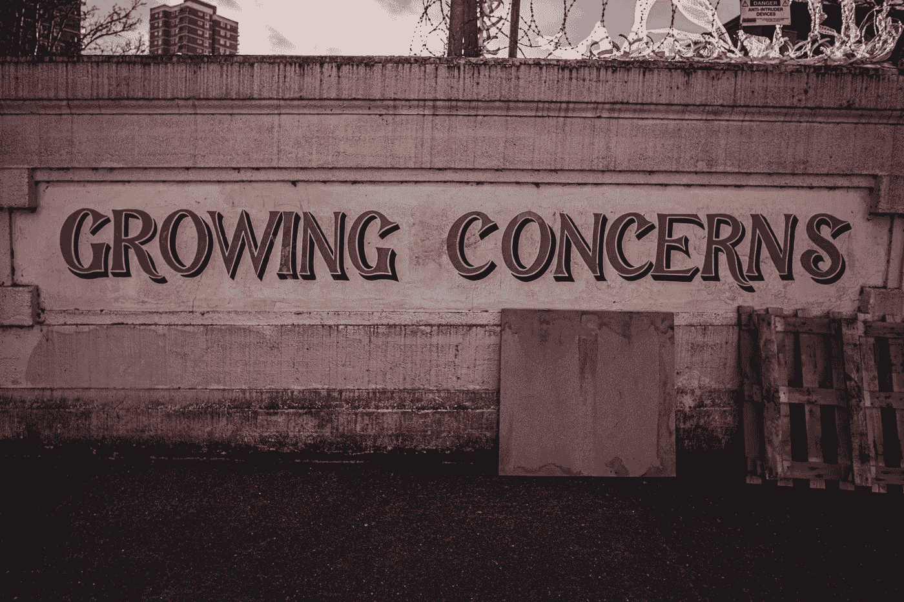

# 灰度问题

> 原文：<https://medium.com/coinmonks/grayscale-concerns-cdb254f6c164?source=collection_archive---------13----------------------->

Photo by [Samuel Regan-Asante](https://unsplash.com/@fkaregan?utm_source=medium&utm_medium=referral) on [Unsplash](https://unsplash.com?utm_source=medium&utm_medium=referral)

灰度现在处于一个非常值得怀疑的位置…

大家担心灰度和 FTX 差不多，自己发行代币，通过袋子伪造估值…