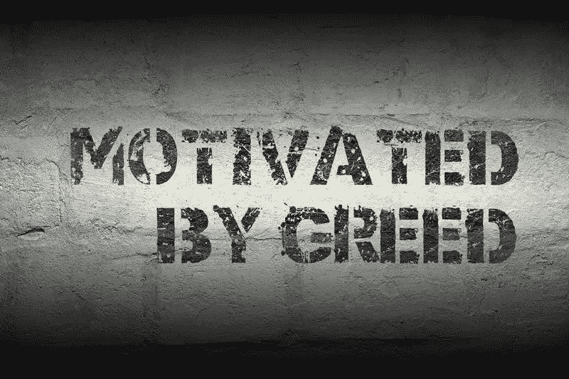

# 无论在哪里发现贪婪，贪婪就是贪婪

> 原文：<https://medium.com/coinmonks/greed-is-greed-no-matter-where-it-is-found-1fa936f2495a?source=collection_archive---------50----------------------->

dreamstime

打开一封电子邮件，它就在那里；打开电视，它跃入你的眼帘。很猖狂。无论你往哪里看，你都能看到它丑陋的面孔，感受到它锋利的爪子伸向你的电子钱包。你知道那些食品制造商雇人使他们的食物上瘾，这样你就会买更多吗？

这是贪婪，它在以你为代价无情地追求财务自由。人类的当心！

最近披露的众议院议长佩洛西的丈夫从(所谓的)内幕交易中获利一事，只是凸显了政治系统中猖獗的贪婪。在 2008 年至 2018 年的 10 年间，佩洛西家族带来了约 1 亿美元的收入。不幸的是，他们是从“秘密投资”中获利的当选官员中的一员。

cryptoverse 也不能幸免(尽管我希望 DeFi 比这更好)，因为一名前比特币基地雇员和另外两人被指控参与 crypto 的首次内幕交易。这三人获得了超过 100 万美元。

一个前 OpenSea——一个受欢迎的 NFT 市场——也感受到了联邦检察官的长臂，因为他被指控在 NFTs 推出前进行内幕交易。

**底线**

贪婪无处不在。它以他人的情感为食，所以它能够繁荣。然而，就像一列失控的火车，只有碰撞才能让它停下来。帮你自己(和隐密体)一个忙，不要陷入其中。确定什么是足够的，远离任何超出这个范围的事情。到处都是，贪婪不需要在隐语中提及。

计划工作，并执行你的计划；然后，你将能够看到隐密体的许多奇迹。

跟着我学；也许你会学到。或许，我们可以一起探索隐密体。

*免责声明:我是一名狂热的加密学生。当新冠肺炎占领世界并锁定全球经济时，隐密体引起了我的注意。从那以后，我花了一部分时间来了解这种货币——未来的货币——以及国际商业。作为一名作家，我决定记录我的发现。我选择把它们写成短小精悍的文章，以帮助任何有兴趣了解这个领域的人。这些文章不是用密码或投资写的，而是通俗易懂的文章。我不是在提供建议，仅仅是我在意外进入隐密体的旅程中发现的信息。经验丰富的投资者可能会从阅读中获得一些东西，但我的重点是对密码的好奇。*

> 交易新手？试试[密码交易机器人](/coinmonks/crypto-trading-bot-c2ffce8acb2a)或[复制交易](/coinmonks/top-10-crypto-copy-trading-platforms-for-beginners-d0c37c7d698c)