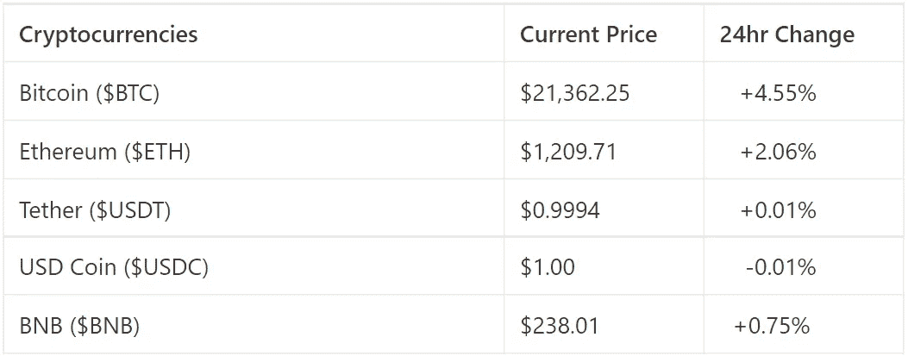
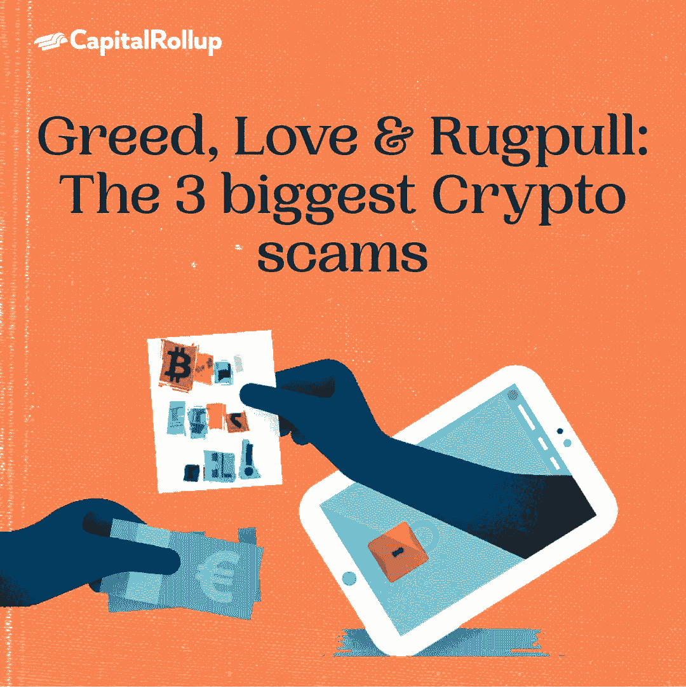

# 贪婪、爱情和欺诈:三个最大的秘密骗局

> 原文：<https://medium.com/coinmonks/greed-love-and-rugpull-the-3-biggest-crypto-scams-2e03743365bb?source=collection_archive---------31----------------------->

欢迎来到最新一期的 CapitalRollup Digest！今天的文摘是 7 月 8 日的，大约需要 5 分钟。我们马上开始。

*   今天的市场看起来怎么样？(前 5/10 大流行加密货币)

Market Price Update

# 贪婪、爱情和欺诈:三个最大的秘密骗局

随着数字货币在投资者中变得越来越受欢迎，加密货币骗局也在增加。那些进入 Crypto 的人认为这是一个“快速致富”的计划，你可以投资并赚很多钱。事实上，这不是真的，这导致加密投资者做出决定，使他们成为骗局的受害者。

在加密行业，诈骗司空见惯，有报告显示这些骗子已经窃取了超过 10 亿美元。

尽管这些骗局很流行，但人们仍然很难避免它们，因为他们不知道它们是如何工作的。今天，我们将讨论它们以及如何轻松识别它们。

> 交易新手？试试[密码交易机器人](/coinmonks/crypto-trading-bot-c2ffce8acb2a)或者[复制交易](/coinmonks/top-10-crypto-copy-trading-platforms-for-beginners-d0c37c7d698c)

# 最常见的加密骗局类型

以下是三种常见的加密货币骗局:

*   **投资骗局(贪婪)**
*   **浪漫骗局(爱情)**
*   **拉拽**

# 投资骗局

一个投资骗局包括承诺一大笔支出，快钱，或保证你会赚钱，如果你投资你的钱。

它们是如此的有说服力，甚至专业投资者都会被它们套牢。

骗子可能会承诺你 1000%的利润使用像克里斯蒂亚诺罗纳尔多名人的图像！让你投资。广告可能会出现在你的社交媒体上，声称人们通过比特币投资平台赚了大钱。

如果你点击了假网站，你将被联系。骗子会鼓励你通过交易所进行投资或购买加密货币。然后他们会声称一路指导你。你可以在模拟账户面板上查看你的利润。

最终，你无法取出你的钱。实际上，仪表板只是由数字组成的。

利用 Discord 和 Telegram 这样的平台，加密货币骗子自称是金融顾问和联系人。

投资计划一直是最大的骗局，加密货币正在将它们推向新的高度。你可能会惊讶地知道，今年投资计划损失了近 2 亿美元。

# 浪漫骗局

美国美国联邦贸易委员会(FTC)报告称，过去五年消费者损失总计 13 亿美元，仅 2021 年就达到 5.47 亿美元，估计这个数字还要更高。

浪漫骗局通常始于骗子在约会网站和社交媒体网站如 Instagram、脸书和谷歌 Hangouts 上建立虚假的个人资料。为了实施他们的骗局，他们会分别与你交谈或聊天，以建立信任。一旦完成，他们会编造一个故事，向你要钱或者告诉你一个投资机会。

为了证明投资有多容易，他们会鼓励你转一小笔钱。可能很快就有回报了。然后你会被鼓励投资更多。

为了增加利润，骗子会要求你给账户充值。如果你没钱转账，或者希望提取所有资金，骗子会停止与你联系。如果发生这种情况，您将无法从平台上取回您的投资，或者您将被告知投资失败。

在网飞的纪录片《火绒骗子》中，三名美国妇女在火绒上被骗走了数百万美元。最后，他们都承认，在他们的浪漫骗局之后，他们再也不会像以前一样了。

# 拉拽

如果你是观看网飞电视节目“乌贼游戏”的数百万观众之一。2021 年，大约有 30 亿美元损失在拉地毯上，鱿鱼标志是一个高调的拉地毯，利用了网飞系列“鱿鱼游戏”的炒作

根据币安学院的说法，当一个开发团队突然放弃一个项目并出售或移除其所有资产时，加密行业就会出现混乱。这个名字来源于短语“把地毯从(某人)下面拉出来”，意思是出人意料地撤回支持。

在加密世界中，拉地毯意味着加密货币的创造者套现，硬币的价值降至接近零。

在 DeFi 生态系统中，在 Uniswap 和 Sushiswap 等分散式交易所(dex)中，Rug pulls 是最常见的，因为欺诈性令牌创建者可以免费创建和列出令牌。

开发商碰巧铸造了一个没有价值的代币，在市场上以低价购买。投资的承诺让投资者购买无价值的代币，价格上涨，开发商就该套现了。他可以一次完成，也可以一段时间完成，这样地毯的拉力就不会那么明显了。在这两种情况下，投资者都持有毫无价值的代币，他们的投资资本已经没有了。

# 你如何保护自己免受这些骗局？

加密投资者需要在投资前了解风险:

*   **总是 DYOR**
*   **只投资你了解的东西**
*   **宣读文件发布**
*   **关注最新科技新闻**

你想知道如何保护你的钱免受密码诈骗？你可能会发现[这个](/coinmonks/how-to-protect-your-money-from-crypto-scams-5b6674011e51)很有帮助。

# 琐事🤔

**当记录在区块链上时，谁可以访问它？**

A.一次多个人。

B.一次一个人。

C.参与交易的人。

在下一期的 CapitalRollup Digest 中找到答案。😉

**最后一个琐事的答案是 d)以上全部。**

# 每日一词！

💡**网络钓鱼**

使用看似真实的电子邮件，通常声称来自银行或政府机构，诱骗您回复敏感的个人数据。

**句子中使用的** **术语:**
*—需要改变浏览习惯来防止* ***钓鱼*** *。*

*   **社区更新📢**

我们与 3 位行业领袖组织了一次 Twitter 空间会议，我们在会上讨论了“分享您的熊市经验& CeDeFi 内爆”，您可以在这里[收听](https://twitter.com/i/spaces/1YpKkZzakbNxj?s=20)

# 我们今天在读什么📰

**2022 年最大的密码骗局。** [***阅读更多***](https://mashable.com/article/biggest-crypto-scams-2022)

要避免的 8 种加密货币骗局。 [***阅读更多***](https://smallbiztrends.com/2022/06/cryptocurrency-scams.html)

与朋友一起学习和投资加密💰

当您邀请您的朋友开始使用 CapitalRollup 进行有利可图的投资时，您将获得独特的奖励。

💬对 CapitalRollup Digest 有什么反馈吗？ [**告诉我们！**](mailto:hi@capitalrollup.com)