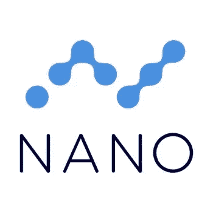
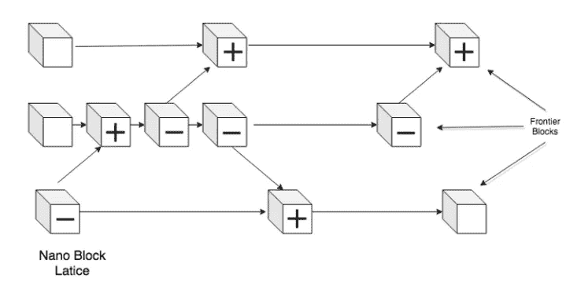
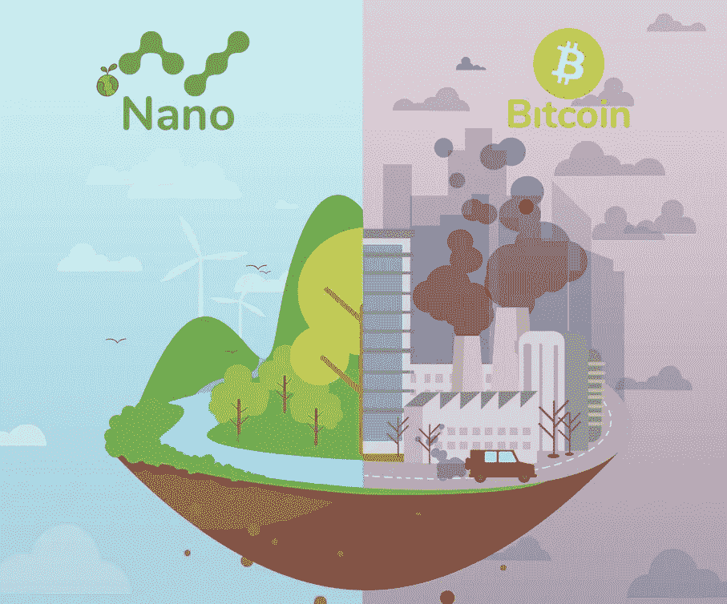

# 面向环境的绿色加密货币:纳米(XNO)

> 原文：<https://medium.com/coinmonks/green-cryptocurrencies-for-the-environment-nano-xno-d276b2225ea5?source=collection_archive---------19----------------------->

对于绿色加密货币，今天我向大家展示一种将可持续性作为其优势之一的加密技术:Nano，专注于消除现有加密货币中存在的低效率。Nano 将自己定义为“每个人的数字货币，没有任何费用。”(要查看与本专栏相关的所有文章，请点击[此处](https://www.newcoinpost.com/blog/categories/Green%20Cryptocurrencies%20for%20the%20environment)。)

Nano (XNO)

Nano 的座右铭是“*不忙乱，不收费，不等待*”，其独特设计旨在提供简单的点对点价值转移，为个人提供最高效、最便捷的数字货币，以最小的影响将他们与全球经济联系起来。Nano 利用了*开放式代表投票(ORV)* 共识机制，该机制通过使用委托的、基于权重的投票以极高的效率提供安全性，从而扩展了其他设计，允许以最少的资源使用实现共识。得益于*，Nano 能够提供快速且免佣金的交易，这是一种数据结构，所有账户都有自己的区块链，而不是在中央区块链上与其他账户竞争。*

**

*Block Lattice*

*共识是通过投票代表产生的，帐户可以随时自由选择他们的代表，从而为用户提供更多的控制来决定谁来验证交易。与其他分散货币相比，Nano 速度快且节能有三个主要原因:*

*   *分配方法*
*   *缺少交易费用*
*   *用于保护交易的分类帐设计和共识机制。*

*据计算，单个 Nano 交易的能耗低至 0.111 瓦时。2 秒的比特币交易比 6500 万次 Nano 交易消耗的能量还要多。*

**

*Nano VS Bitcoin*

*2018 年 11 月，纳米基金会宣布，纳米已被币安信息中心选为官方[*金标项目*](https://blog.nano.org/nano-selected-as-an-official-gold-label-project-by-binance-info-3bbb406c0215)。币安金标项目已经启动，以提供各种加密项目的完整更新信息。通过币安信息，纳米支持者和币安用户可以了解更多关于该项目的最新消息，更新和发布。2018 年 12 月，Nano 宣布与[支付网关](https://coingate.com/blog/post/coingate-integrates-nano-payments-merchants)整合。任何拥有 Nano 的人都可以使用 Coingate 在 4000 多家商家购物。Nano 主要针对以下领域:汇款、微交易、在线和店内支付、外汇和交易、银行基础设施。*

*总供应量为 133，248，297 纳米，已经通过一个[龙头](https://blog.nano.org/the-nano-faucet-c99e18ae1202)平均分配，每个人都可以通过填写谷歌验证码来使用。*

*纳米是由纳米基金会开发的，该基金会是一个成立于英国伦敦的非营利组织。最著名的团队成员是创始人科林·莱马休。*

**

*Colin LeMahieu*

*他是一名软件工程师和开发人员，曾在技术行业的大型公司工作，如 eLoyalty、戴尔、AMD、国家仪器和高通。*

*Nano 在 [Coinmarketcap](https://coinmarketcap.com/currencies/nano/) 上的排名在最大写硬币的第 150 位和第 200 位之间波动。*

*你知道其他著名的绿色密码吗？在下面留下评论，让我现在。把这个空间当成一个没有审查的谈话场所。*

*胜利者是永不放弃的梦想家。*

****免责声明*** *:我不知道所使用的图片有任何第三方权利。如有任何资料来源，我保证予以引用，如有要求，我将调整立场。**

****免责声明*** *:交易加密货币具有较高的风险，并不一定适合所有投资者。在决定交易加密货币之前，你应该仔细考虑你的投资目标和你的经验水平。自己做研究。此处表达的所有观点归各自作者所有，不应被视为任何形式的财务建议。**

**关于作者**

**

*[*CRYPTO _ ALBERT*](https://twitter.com/albertovischio?t=C3Xj9pTm9Q7EZqwjrGHQdA&s=09)*

**主编* [*新币帖*](https://www.newcoinpost.com/) *。我帮助人们更好地理解加密货币领域及其目的。**

> *交易新手？尝试[加密交易机器人](/coinmonks/crypto-trading-bot-c2ffce8acb2a)或[复制交易](/coinmonks/top-10-crypto-copy-trading-platforms-for-beginners-d0c37c7d698c)*