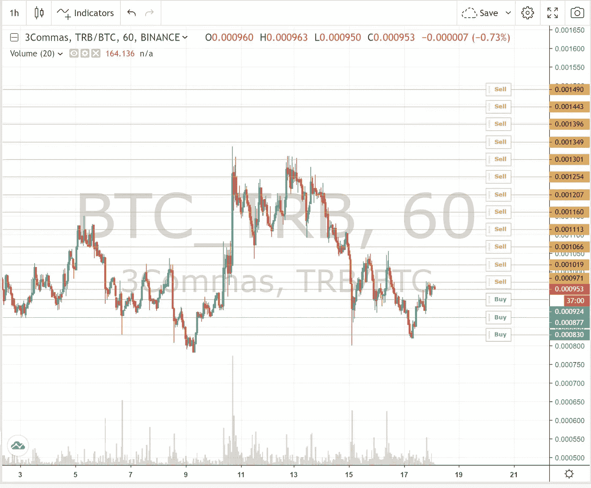
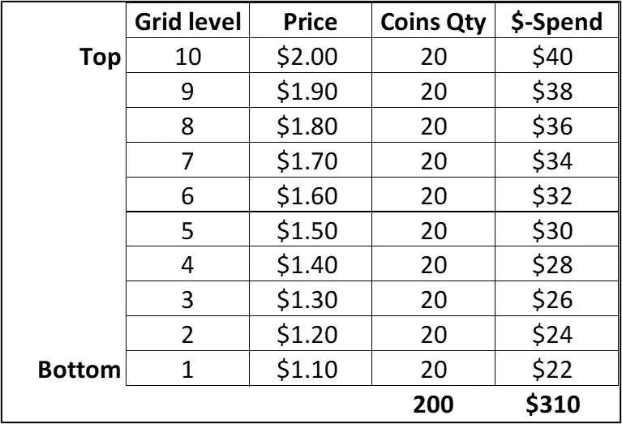
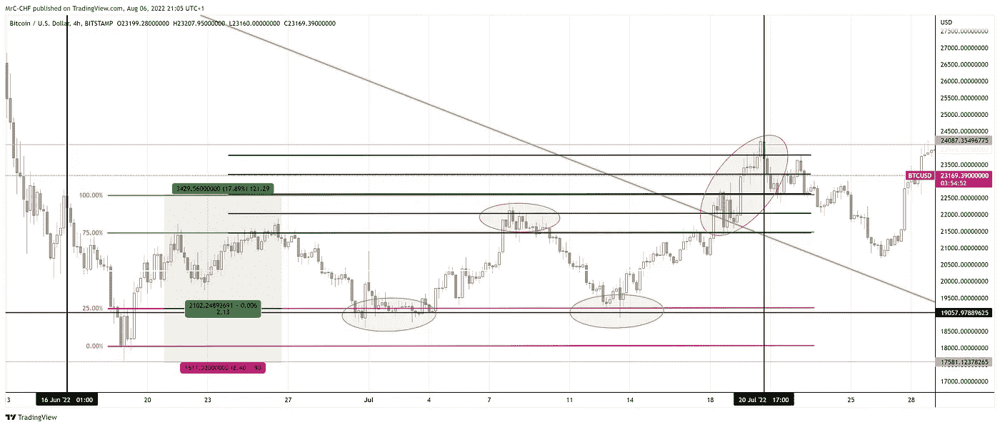
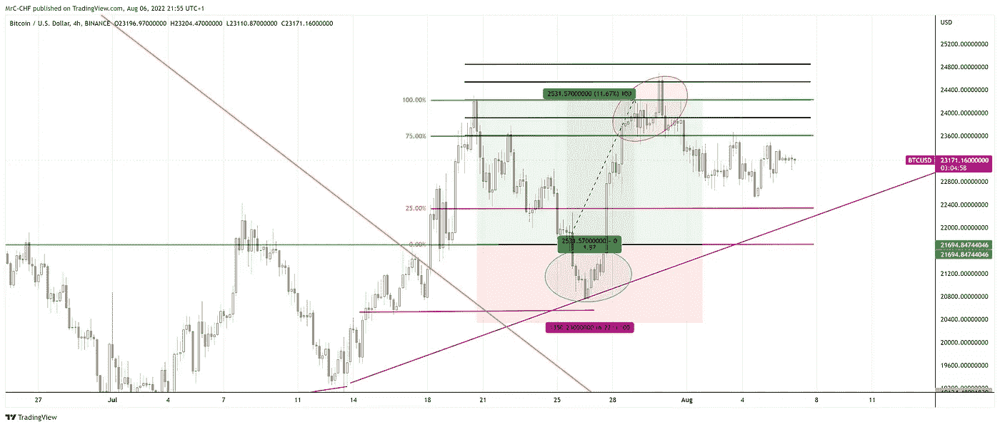

# 网格机器人:它们是如何工作的&如何利用它们赚钱

> 原文：<https://medium.com/coinmonks/grid-bots-how-they-really-work-how-to-make-money-with-them-948b4439fa5f?source=collection_archive---------0----------------------->

网格机器人交易是我几年前听说的，但直到 2021 年中期才真正测试过。我见过很多人声称网格机器人以最小的努力提供了稳定的收益。我的本能反应是打电话给 BS，但我决定无论如何也要试试，并想通过这个帖子分享我的学习。

我将试着快速解释什么是网格机器人，谈谈我自己使用它们的经历，解释我观察到的一些网格机器人的问题，并提供我对如何最好地使用网格机器人进行半自动化交易的看法。一如既往，这些只是我的看法，而不是财务建议。

# 什么是网格交易/什么是网格机器人？

网格交易是你在一个价格范围内设定一系列的买/卖订单，网格机器人是一个帮助你管理这个过程的编程工具。当价格上升(或下降)到一定水平时，它会买入(或卖出)一定数量的硬币。逻辑是，随着价格上升(或下降)，你会慢慢地以更高(或更低)的价格卖出(或买入)更多的硬币。显然，手动完成这项工作非常繁琐，因此网格机器人会为您完成所有的订单设置/执行和利润跟踪。在大多数平台上启动网格机器人，你需要选择硬币对，价格范围，选择你的范围内的网格级别数，以及每级买卖的硬币数量。网格机器人从那里处理一切，除了停止进程。

Sample image of a grid-bot, from 3commas.io

网格交易方法有一些优势——自动执行大量交易，较少关注进场/出场，交易平台的利润跟踪和资金管理等。网格机器人也倾向于使用限价订单，可以增加你的总交易量，所以你可能会得到较低的费用。

相当多的交易平台和交易所提供网格机器人。不经意间我想起了几个…(我的最爱)[皮奥克斯](https://www.pionex.com/)、 [3commas](https://3commas.io/) 、 [Bitsgap](https://bitsgap.com/) 和(其他) [BingX](https://bingx.com/en-us/strategy/) 、 [Altrady](https://www.altrady.com/) 、 [Kucoin](https://www.kucoin.com/) 、 [Huobi](https://www.huobi.com/en-us/)

# 我测试网格机器人的经验

2021 年中期，我开始尝试网格机器人。我选择了 3commas 而不是 Pionex，因为我认为 3commas 有更多的硬币可供选择，因为它链接到一些不同的交易所。我还可以将其他 3commas 功能与网格机器人结合使用，以规避我的网格机器人风险。最后，从技术上讲，Pionex 的功能就像它自己的交易所，我不想再开一个交易所账户。

我在 6-8 周的时间里，使用一些备用的币安和 FTX 子账户，安装了 30-40 个网格机器人。当我让这些机器人运行时，它们每天的收益为 0.5%到 2%。这让我很兴奋。我非常喜欢交易自动化，并且一直在寻找一种在横盘中赚钱的方法。事情进行得如此顺利，我决定用币安期货的 2-4 倍杠杆来尝试一下。我们都知道接下来发生了什么。我开始一天赚 3-5 %!我破解了密码！！

当然，我在账户中增加了几个杠杆化的网格机器人，为什么不呢？嗯…事情几乎在一夜之间从好变坏。我失去了子账户里的所有东西，不知道到底发生了什么。原来，3commas 在当时对他们的未来网格机器人有意见。不知何故，当价格超过我的网格范围时，我仍然处于杠杆化的空头头寸，这导致我的账户被清算。3Commas 技术支持基本上告诉我，在使用杠杆/期货时，我应该始终小心谨慎，就好像我做错了什么，而这并不是他们 100%的错。感谢一切和损失。

价格上涨了。我做多了，但还是被清算了。如果价格高于你的网格，机器人应该卖掉你所有的硬币，你应该只持有报价货币(例如:如果交易 ETH-USD，你将卖掉你所有的 ETH，持有 100%的 USD)。我希望登录我的 3commas 账户，看到一些丰厚的收益，也许会为错过的利润而哭泣，但不是一个失败的账户。SMH。那次经历真的让我对 3commas，他们的网格机器人和网格交易产生了疑问。我开始仔细查看数字，看看是否还有其他隐藏的问题。以下是更多相关信息…

*注意:3commas 已经对他们的网格机器人门户进行了重大改进(例如，向你显示已实现和未实现的利润，在网格范围的两边添加止损，向你显示在创建机器人时你有多少可用资金，等等。一个 YouTuber 在几个月前做了一个视频，详细介绍了其中的一些改进——*[*链接*](https://youtu.be/mszYcpizPbY?t=285) *。*

# 我对网格机器人的主要问题

基于数学，我的印象是**电网机器人在横向市场中不赚钱**。你在任何地方都能听到这种说法，但我还没有看到在横向市场运行网格机器人时查看账户价值的详细评论。通常人们会在牛市中讨论这些机器人。机器人往往只显示在交易平台上实现的收益，而不是随着时间的推移完全未实现的收益/损失(注意:这个 vid/平台是一个令人耳目一新的例外— [链接](https://youtu.be/9je590xJEEo?t=284)

当你退后一步看数学时，事情变得非常有意义。如果你在一个价格范围内的固定价位买入相同数量的硬币，那么你的平均买入价格就是这个价格范围的中点。如果价格下跌，你开始以相同的价格卖出相同数量的硬币，那么你的平均卖价是多少？是的，范围的中点。**你不可能在 Y 点买入 X，然后在 Y 点卖出同样的 X 来赚钱。你必须低买高卖才能获利。**

这里有一个更详细的例子…假设你有一个 10 级的网格机器人(价格从 1.10 美元到 2.00 美元不等)，每级的买卖数量为 20 个硬币。你将在上涨时花 310 美元买入，在下跌时花同样的 310 美元卖出。

场景 1 :如果你在你的网格范围以下启动网格机器人，比如说 1 美元，价格上涨到 2.05 美元，你只赚了 110 美元，而不是你以 1 美元(200 美元)买 200 个硬币，然后以 2 美元(400 美元)卖出的 200 美元。如果价格回落到 1 美元，你的网格机器人将卖掉所有的硬币，你将在下跌过程中损失 110 美元(即，下跌过程中花费的 310 美元减去 1 美元时的 200 美元)。110 美元减去 110 美元，总利润为 0 美元。

场景 2 :如果你从顶部开始启动网格机器人，比方说 2.05 美元，价格下跌到 1 美元，你会得到和上面一样的结果——下跌时损失 110 美元。如果价格回升，你也会在上涨过程中获得 110 美元的收益。在这种情况下，您的总利润仍为 0 美元。

**要点——你唯一赚钱的时候是价格上涨的时候，即便如此，你赚的钱也比你拿着硬币赚的少。这就像你在上涨时退出时的反向美元成本平均法。**

*注:下面是我的分析(*[*Google sheet*](https://docs.google.com/spreadsheets/d/1F6D2SZuWZ0bTAVjABA-c-X7JFQyFGvwU/edit?usp=sharing&ouid=116038754091241615920&rtpof=true&sd=true)*)。如果我的计算有任何错误，请告诉我。*

通过我的测试机器人，我意识到我只是从价格上涨中赚钱，交易平台在任何时候都没有向我显示我的头寸价值。报告的收益总是正的，这造成了持续盈利的假象。我明白，平台在显示未实现损益方面可能正在变得越来越好，这是负责任的做法。

额外:我发现了一个 YouTuber，它比较了买入持有方法和使用为 Tradingview 开发的定制策略的网格机器人的收益。这确实突出了我上面的观点。这些链接将引导您进入每个视频的特定部分— [*Vid1*](https://youtu.be/eV947alnJFw?t=441) *，* [*Vid2*](https://youtu.be/UFxpFjuMx-0?t=310)

# 网格机器人到底有什么用处

网格机器人只是一种工具。你可以用它们做两件事。要么你在设定的时间间隔平仓，要么你在设定的时间间隔平仓。向外扩展是为了上升趋势的市场和退出。放大是为了下跌趋势的市场和积累。

## 向外扩展(退出)

在一个相对较低的点建立你的网格机器人，然后在远高于你的入口的水平退出。你的最低价位应该远远高于你的平均进场价格。你的目标出场水平将是你的网格水平的底部/顶部。这里的关键是把这当成一个实际的交易，而不是一个“设置它，然后忘记它”的幻想。理想的情况是，你在支撑位附近启动你的机器人(水平>对角线或动态),在交易区间的高点(或阻力位附近)设置你的网格/出场点。这种方法在横盘和上涨行情中都有效。如果价格移动到一个重要的支撑位，或者如果你正在交易一枚随着价格下跌而升值的硬币(例如:FTX 的熊-美元),在下跌趋势的市场中，一些机会是可能的。

## 缩放(累积)

如果你想长期持有一枚硬币，而它的价格正在下跌，你可以建立一个网格机器人，它有很宽的网格级别，可以在价格下跌时买入。这可能是自动积累硬币最简单的方法。唯一的缺点是，如果价格随机波动，机器人将出售你积累的一些硬币。鉴于当前的熊市和潜在的全球衰退，我正在为几个高潜力项目采用这一策略。

# 我对网格机器人的首选策略

**A .横盘行情**:避免全区间买卖的常见错误。如果范围从 0%(底部)到 100%(顶部)，您希望在价格处于该范围的低端(例如:0–25%)时启动 bot，并希望将网格设置为在该范围的高端(例如:70–120%)退出。我也建议根据技术分析，在网格下方设置止损。这种方法的好处是更好的投资回报率，但坏处是更积极的管理。你必须在正确的时间启动/停止机器人，如果你的止损点被击中，你可能必须重启，但你不需要整天坐在电脑前。这里有一个利用比特币最近价格波动的横向市场交易的例子。

[https://www.tradingview.com/x/zIpod17V/](https://www.tradingview.com/x/zIpod17V/)

*解释*:六月初/中旬，BTC 正在大举倾销。6 月 16 日至 18 日期间，BTC 试图寻找支持，但在 22.5 万美元被拒绝，然后跌至约 18，000 美元，在那里找到了一些支持。依姆霍，这是一个发挥潜力的机会。BTC 已经这样做了几个月，所以在再次下跌或爆发之前，它会波动一段时间是有道理的。20k 美元在过去也是一个重要的支撑/阻力区域。

你可以假设一个从 18k 美元到 22.5k 美元的 0-100%的范围，如果价格下降到这个交易范围的 0-25%，你就可以启动一个网格机器人。你应该将你的网格水平设置在交易范围的 70-120%之间，将网格水平的中点对准 22.5 美元的高点，然后将网格水平的底部设置在交易范围的 70-75%左右。你也可以在交易区间以下设置止损，最好是基于最近的价格变动。对于 BTC 的这一举动，8.5%的止损在交易区间的 25%水平或以下就可以了，因为它给出了 1.5-2 倍的回报风险比。在这种情况下，你应该在 7 月的第一周(第一个绿色圆圈)进入，并在 7 月 8 日至 9 日(第一个红色圆圈)关闭机器人，获得可观的利润。如果你没有，那么价格会再次下跌，在涨到 24k 美元(第二个红圈)之前，跌到 19k 美元左右(第二个绿圈)。在这一点上，你应该停止网格机器人，因为你所有的硬币都会被卖掉。

**B .上升趋势市场(短期/中期交易)**:类似于上面的横盘例子，当价格处于趋势的低点时，你开始你的 bot。也许价格会回落到之前的阻力位，或者接近动态支撑位，比如有效的移动平均线。你可以根据阻力位或上升通道的高端设置止损线。这里有一个例子，使用相同的 BTC 价格行动后，横盘市场的例子。

[https://www.tradingview.com/x/qOz1OSv2/](https://www.tradingview.com/x/qOz1OSv2/)

*解释*:在价格上涨到 24k 美元后，它打破了一个多月的下降趋势(橙色线)，所以人们可以预期更多的看涨运动，并开始寻找上升趋势的机会。21.6 美元至 22k 美元是最后一个阻力区，因此这条(绿线)可能会成为未来的支撑位。你可以用这个水平(21.6 千美元)作为你新交易区间的 0%点，区间的最高点(100%标志)在最近的最高点(24 千美元)。你应该在 2.2 万美元左右买入硬币并启动网格机器人，同时设置 2.0 万美元左右的止损，这是之前的支撑位(红线)，仍然允许 1.5-2 倍的回报/风险比。进场后，价格下跌到 20.8 美元左右，所以没有达到止损。然后价格回升到 23.6-24.5 千美元，这时你应该停止机器人。在这一点上，价格似乎再次波动，所以人们可能会试图设定一个新的交易区间，可能是 22.8-25，000 美元。

相反，你可以不停止机器人，而是将你的网格级别进一步提高到 22.8-25k 美元的范围，并将你的止损调整到更高的位置。

**C .上涨趋势市场(长期交易)**:你可以长期 HODL 一枚硬币，但使用栅格以更高的价格进行一些机会主义销售，而不是以近期高点为目标退出。例如，BTC 目前的交易价格约为 2 万至 2.3 万美元。你可以建立一个网格机器人，网格价格从 38- 68k 不等，而不是简单地购买&持有一些 BTC。机器人将以当前价格买下所有的 BTC，并准备以你的目标价格出售。

**D .下跌趋势市场(向外扩展):**大多数网格机器人天生就是多头的，但你可以使用与上面相同的方法(选项 B)来应对上涨趋势市场。然而，你必须购买本质上做空的代币，比如 FTX 的熊美元代币，它模拟了 BTC 的 3 倍做空。在下跌趋势的市场中(对 BTC 来说),这个标志会有一个看涨的图表。

**E .下降趋势市场(扩大):**如果你有一个硬币，你想通过平均成本慢慢进入，网格机器人是一个完美的工具。你用低于当前价格的等级开始一个网格机器人。举个例子，假设你短期看跌，但长期看好比特币。你可以建立一个网格机器人，等级从 2 万美元到 1 万美元不等，如果 BTC 进一步下跌，希望可以累积。如果 BTC 跌至 1 万美元，你可以停止 bot，甚至将电网水平提高到你的长期看涨目标。这种策略的一个主要好处是，一旦 grid-bot 启动，你的资金就会被限价单套牢。

# 网格机器人最佳实践

**1。从小处着手:只使用一个机器人在你喜欢的平台上进行测试。看看从 bot 中获得的收益如何与帐户实际价值的变化相关联。这样你就知道网格机器人是否/如何真正产生利润。**

**2。手动设置网格等级:**一些平台提供算法来设置你的网格等级。以我的经验来看，大多数人都认为钱是在横盘中简单地买卖赚来的，这是错误的。您也应该忽略拥有许多紧密的网格级别的建议。只需自己设置网格，并保持简单。

**3。关注图表&你的账户价值:**如果你的交易平台没有显示已实现和未实现的利润，那么你可能应该忽略他们提供的统计数据，只需使用 Tradingview 和你的总体账户价值来跟踪你的头寸。记住，关键是在正确的时间/水平启动/停止你的机器人，就像正常的交易一样，所以要看图表。

**4。分散你的赌注:**你不希望你所有的钱都放在一个硬币上，或者你所有的机器人/交易都是相关的。例如，如果你有几个网格机器人，都用 Defi 代币交易硬币/美元，那么你基本上是在用几种不同的方式下同样的赌注。通过这种方法，你可以获得一点多样化，但更好的方法是持有不同类型的硬币(Defi，Gaming，Layer 1/2)，不同质量的硬币(大型，中型和狗屎硬币)，甚至不同的报价对(硬币/BTC，硬币/美元，硬币/ETH)。

**5。关注高价值的硬币:**记住，如果价格低于你的网格级别，网格机器人将持有 100%的硬币头寸。如果你不使用止损，那么你肯定会是一个袋持有人，所以要确保这是你愿意持有的东西。这是我喜欢交易 ETH/BTC 的一个原因，因为我很高兴两者兼得。

**6。学会使用止损:**交易是风险管理，所以我学会了使用止损。学习如何阅读价格图表中的市场结构，以及如何在宽缺口处设置保守止损。

7 .**。考虑一个动态止损:**静态止损会在你的网格机器人被击中时关闭它。如果价格回升，而你又在安装同一个网格机器人，这可能会很烦人。或者更糟，你错过了重新开始/进入的机会。我过去使用的另一种方法是用有条件的短期交易来“对冲”我的网格机器人风险。我使用 3commas 平台，你可以链接到一个期货/保证金账户来做空。你也可以使用他们的智能交易功能来设置一个有条件的进入，价格需要下降到一定水平才能触发，这将打开一个与你的网格机器人的多头敞口相同大小的空头交易(例如:如果你的机器人最多持有 100 个硬币，那么你设置了 100 个硬币的空头)。100 个硬币空头+ 100 个硬币多头=净现金头寸。你可以手动平仓做空交易，重新做多，或者你可以选择一个止损位来平仓做空，让你做多。显然，如果短线交易止损被击中，你就必须手动创建另一个有条件的做空，但这是在你忙碌或外出时的一种保障。

另一种方法是使用 3commas DCA-bot 链接到 Tradingview 上的水平线+警报。有了这个，每次价格下跌，收盘低于该线时，就可以进行短线交易。你仍然可以为那笔交易设置止损，但你不必重置做空交易。警报& DCA-bot 已经准备好反复对冲你的头寸。我现在不打算介绍完整的设置，但这是一个非常有用的方法。

好吧，这是一个很长的帖子，所以我会在这里结束。以下是我在网格机器人上发现的一些额外资源。

祝你交易顺利！

**有用链接**

(Pionex 附属)【https://youtu.be/9je590xJEEo 

(来自 Bitsgap)[https://youtu.be/3RtHtyeH1AU](https://youtu.be/3RtHtyeH1AU)

(来自 3 commas)[https://3 commas . io/blog/step-by-step-by-step-instruction-to-grid-bot](https://3commas.io/blog/step-by-step-instruction-to-grid-bot)

[https://www.youtube.com/watch?v=eV947alnJFw](https://www.youtube.com/watch?v=eV947alnJFw)

08:45——谈论在下降趋势的市场中利润如何变化

13:00 —讨论 grid-bot 与简单的买入并持有策略的收益

**其他链接**

[https://coincodecap.com/grid-trading](https://coincodecap.com/grid-trading)

[https://phemex.com/academy/what-is-grid-trading](https://phemex.com/academy/what-is-grid-trading)

> 交易新手？试试[加密交易机器人](/coinmonks/crypto-trading-bot-c2ffce8acb2a)或者[复制交易](/coinmonks/top-10-crypto-copy-trading-platforms-for-beginners-d0c37c7d698c)