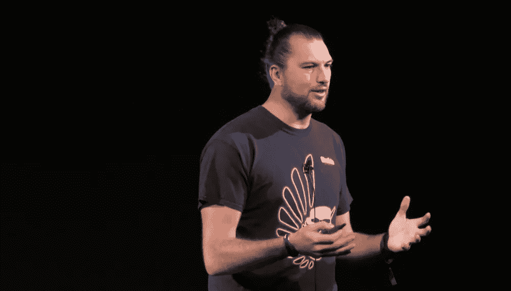
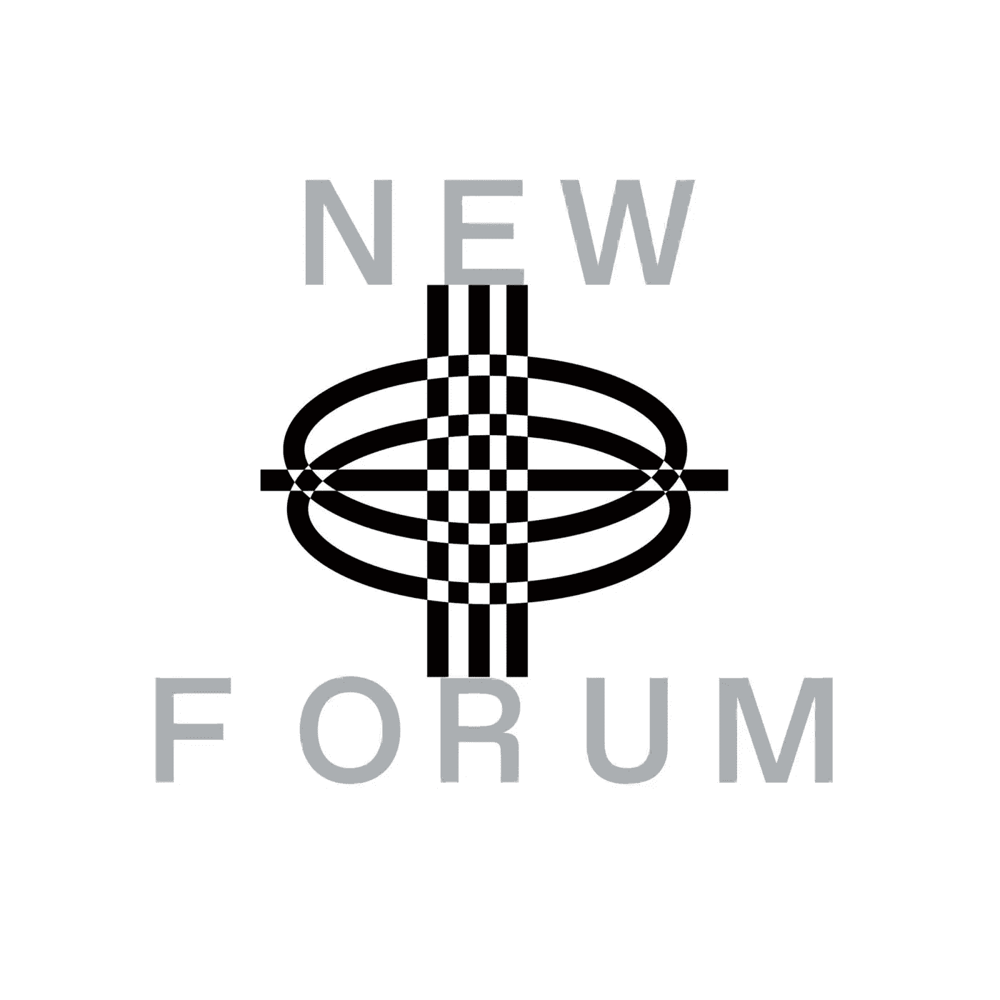

# 格里夫·格林解释了道的背景故事以及道的破解是如何展开的

> 原文：<https://medium.com/coinmonks/griff-green-explains-the-backstory-of-daos-and-how-the-dao-hack-unfolded-d7039a73a071?source=collection_archive---------24----------------------->

Griff Green | Co-Founder at Giveth, Commons Stack & DAppNode

格里夫·格林是新月加速器的导师，他带领我们深入了解道斯的背景故事。

[Newmoon Accelerator](https://www.newmoon.ac/) 通过向我们快速发展的社区提供技术援助、指导和联系，为创建者、开发者和创始人提供构建开放元宇宙堆栈文化层的动力。

在 Newmoon 的这次会议中，Griff Green，前 DAO 的社区经理，在 DAO 黑客攻击展开时处于事件的中心，向我们介绍了 DAO 黑客攻击的关键时刻、决策和后果，反映了加密世界中最深刻的事件之一。

Griff 在 Dao 和管理社区方面有着丰富的经验，我们很荣幸能够得到他关于构建 Dao 的建议。在会议的大部分时间里，我们讨论了运行分散自治组织的用例、最佳实践和机制。

我们还讲了刀和斧的故事；社区建设策略；DAOs 中的最佳做法；2022 年道空间发展趋势:如何在 DAOs 中创建令牌需求；声誉机制；Dao 中的结构；Dao 的激励和奖励制度；刀的寿命；公益道与善道；DAOs 中的管理和团队反馈。

# 谁是格里夫·格林？

格里夫·格林是数字货币“专家”、布道者和公共演说家。他在这个主题上有丰富的经验，是分享他的见解的最佳人选。

Griff 在以太坊生态系统中人脉很广，也很受欢迎。他创建了 Giveth 来建设给予的未来，并创建了 Commons Stack 来使 Giveth 更上一层楼，进行建立支持公共产品生产的新兴经济体所需的应用研究。

他的愿景是建立一个世界，让那些为社会创造价值的人因他们所带来的价值而得到公平的回报。目前的做法是为社区创造一条简易的道路，让它们拥有自己的创业经济。如果这行得通，那么，从长远来看，他们将能够把自由市场空间的所有好的部分应用到公共部门，这样我们就有无数的微观经济体竞相提供人们想要的公共服务。

# **刀的愿景是什么，怎么被黑的？**

**DAO**是一个数字分散自治组织，于 2016 年 4 月成立，通过代币销售筹集了 1.5 亿美元。它成为历史上最大规模的众筹活动之一。

“一体行动”的目标是为组织商业和非营利企业提供一种新的分散经营模式。它是在以太坊区块链建立的，没有传统的管理结构或董事会。

2016 年 6 月，一些用户利用 DAO 代码中的一个漏洞，使他们能够黑掉 DAO 三分之一的资金。以太坊社区有争议地决定硬分叉以太坊区块链，以将大约所有资金恢复到原始合同。

这一事件将以太坊区块链分裂为两个分支，每个分支都有其加密货币，其中最初的未加密区块链继续作为以太坊经典。

迄今为止，**DAO Hack**可以说是以太坊历史上最具影响力的时刻。15%的流通以太网易受攻击，数百万以太网被黑客攻击，以太坊选择的前进道路导致区块链意识形态冲突，分裂了以太坊和比特币社区。

✨Enjoy 和格里夫·格林一起看道斯和阿玛的背景故事！

[加入社区](https://twitter.com/newforum_nco)了解[@ the Griff](https://twitter.com/thegrifft)并在 web3 社区中发现其他创始人！

✨follow·格里夫·格林！Twitter:[@ the Griff](https://twitter.com/thegrifft)LinkedIn:[Griff Green](https://www.linkedin.com/in/griffgreen/)

# new forum # web 3 # Dao # community # crypto #加密货币

爱 x 新论坛

# Twitter @newforum_nco

不和谐[@加入](https://discord.gg/2K8tvVh8tM)

# 新论坛

[NewForum](https://newforum.notion.site/newforum/Welcome-to-NewForum-48f9661398ec4ec6a1af37fcc96dc926) 由 [Newcoin Foundation](https://newcoin.org/) 提供支持，专注于促进分散化社交应用的扩展，也称为 Social 3.0，形成一个生态系统和一个由远见者、创造者和投资者组成的社区。它为思想者提供了一个安全的交流、传播和分享思想的空间，以确保一个新网络的自觉和道德发展，嵌入关怀、自由和创造力的价值观。✨每周新集！在 [Twitter](https://twitter.com/newforum_nco) 、 [Newlife](https://newlife.io/) 、 [Youtube](https://www.youtube.com/channel/UCWvHyau1nIJBffmaaj6FmbQ) 和 [LinkedIn](https://www.linkedin.com/showcase/newforum/) 上关注我们，了解 web3 的更多信息，认识生态系统！加入生态系统[不和](https://discord.gg/DHepA4WTkN)！

> *加入 Coinmonks* [*电报频道*](https://t.me/coincodecap) *和* [*Youtube 频道*](https://www.youtube.com/c/coinmonks/videos) *了解加密交易和投资*

# 另外，阅读

*   [Bookmap 评论](https://coincodecap.com/bookmap-review-2021-best-trading-software) | [美国 5 大最佳加密交易所](https://coincodecap.com/crypto-exchange-usa)
*   [加密交易机器人](/coinmonks/crypto-trading-bot-c2ffce8acb2a) | [造币评论](https://coincodecap.com/coingate-review)
*   最佳加密[硬件钱包](/coinmonks/hardware-wallets-dfa1211730c6) | [Bitbns 评论](/coinmonks/bitbns-review-38256a07e161)
*   [新加坡十大最佳加密交易所](https://coincodecap.com/crypto-exchange-in-singapore) | [购买 AXS](https://coincodecap.com/buy-axs-token)
*   [红狗赌场评论](https://coincodecap.com/red-dog-casino-review) | [Swyftx 评论](https://coincodecap.com/swyftx-review)
*   [投资印度的最佳密码](https://coincodecap.com/best-crypto-to-invest-in-india-in-2021)|[WazirX P2P](https://coincodecap.com/wazirx-p2p)|[Hi Dollar Review](https://coincodecap.com/hi-dollar-review)