# 企业以太坊的发展和采用

> 原文：<https://medium.com/coinmonks/growth-adoption-of-enterprise-ethereum-d7b9865717c9?source=collection_archive---------7----------------------->

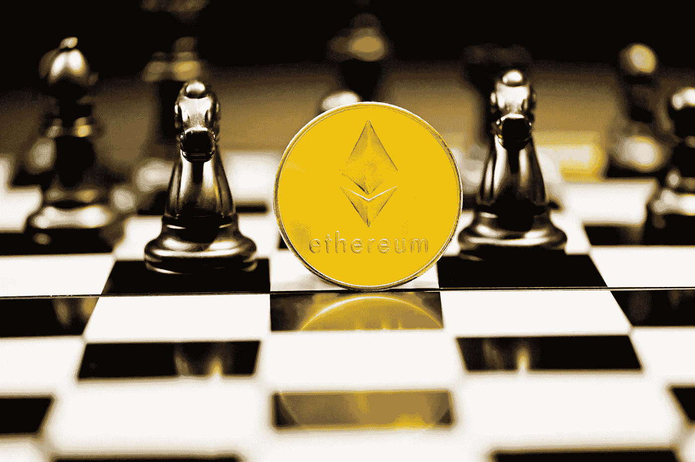

unsplash

# 介绍

在一个区块链技术蓬勃发展的世界，很明显越来越多的公司和组织热衷于探索这项技术。任何关注区块链工业一段时间的人都可能听说过以太坊。

以太坊以其尖端技术为特色，激起了公众的好奇心，我们许多人都知道它是一个拥有 DeFi、Metaverses 和 NFTs 的区块链网络。然而，以太坊还有第二个不太为人所知的私有许可版本，叫做企业以太坊，它正日益被全世界的组织和企业所接受。

这是因为以太坊的公共属性，完全没有许可，没有数据隐私，使得以太坊远离许多企业。然而，随着企业以太坊的推出，这种情况开始改变。

本文将深入探讨企业以太坊的核心。

# 企业以太坊

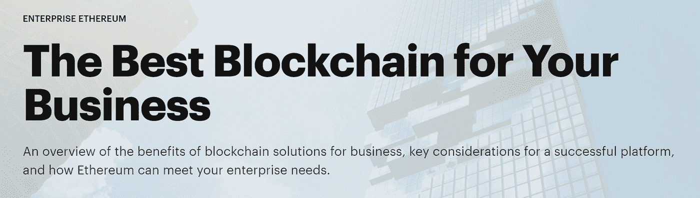

Source: consensys.net

## **什么是企业以太坊？**

企业以太坊是公共以太坊代码库的私有或授权区块链版本。顾名思义，许可区块链需要进入的一部分。在许可链中，控制层运行在区块链之上，并监督所有授权参与者采取的行动，因此不会牺牲传统集中式系统中的权威。

以太坊网络的公共性质使它们不受许多公司或政府机构的控制，企业以太坊是在企业世界中渗透和占领市场份额的一种非常有效的方法。

企业以太坊的目标是通过为主要组织提供利用基于以太坊的私有链和公共 mainnet 的能力，加速区块链技术在企业中的采用。企业以太坊由企业以太坊联盟(EEA)维护，该联盟是区块链和世界各地现有企业的成员。

## **企业以太坊联盟**

Source: medium.com/consensys-media

企业以太坊联盟(EEA)是一个全球性的、非营利的、由成员领导的行业组织，其目标是推动以太坊区块链技术作为开放标准的使用，以增强所有企业在日常业务运营中的能力。具体来说，提供一个开放的、基于标准的架构和规范，以加速企业以太坊的采用。

EEA 于 2017 年 2 月推出，汇集了各种初创企业、财富 500 强公司、技术供应商、学者和以太坊主题专家，致力于将以太坊作为企业级技术。

欧洲经济区的创始成员包括埃森哲、桑坦德银行、BlockApps、BNY 梅隆、CME 集团、康森斯、IC3、英特尔、摩根大通和微软。

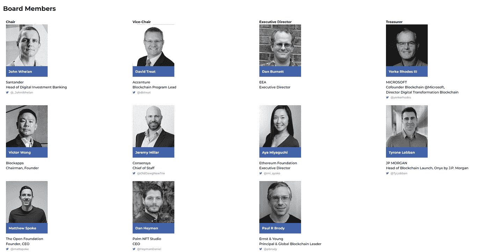

Source: entethalliance.org

目前，EEA 有超过 100 家成员公司，他们共同开发以太坊在不同行业和部门的实现。EEA 的成员代表了来自世界各地的各种企业，包括技术、银行、政府、医疗保健、能源、制药、营销和保险。

企业以太坊联盟专注于解决在企业级部署以太坊的现实挑战，是采用区块链和去中心化的重要举措。

# 企业以太坊是如何运作的？

企业以太坊根据企业的需求修改现有的以太坊客户端，无论是性能、隐私、治理还是可伸缩性。本质上，企业以太坊可以改变自己的网络大小、块大小和气体限制。因此，根据企业的要求，所有专用网络会有不同的结果。

这意味着企业以太坊不会像公共以太坊目前面临的挑战一样，比如高费用或低每秒交易量。此外，由于添加了权限特性和身份管理，如果需要，所有交易都将保持私密。

企业以太坊将与公共以太坊并行发展，公共以太坊的任何更新也将自动出现在私人区块链上。再者，公共以太坊上的去中心化 app 将支持企业以太坊。

## 企业以太坊利用私有链技术

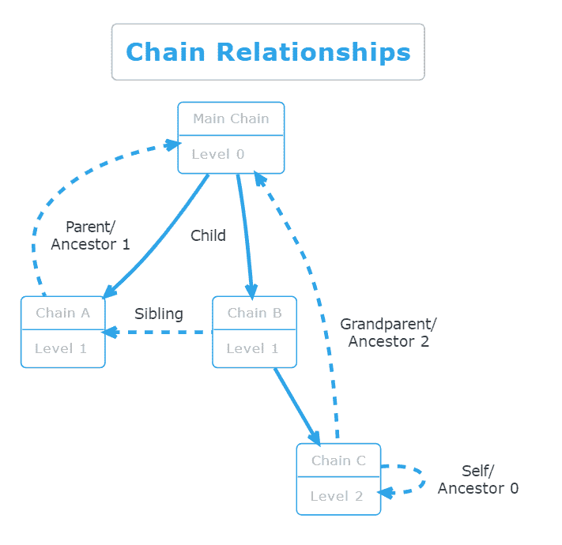

Source: docs.blockapps.net

本质上，私有链是一个独立的区块链，锚定在以太坊主网上，但是在链外执行交易，有自己的块验证共识机制。

私有链通过将事务的安全散列放入块的事务数据中，将自己的私有事务连接到主链。这允许私有链上的交易和数据被记录在主链上，但是不能被非成员识别。

无权访问私有链的用户将只能看到私有链的散列数据，但是该数据将没有私有链上发生了什么事务的其他指示，或者关于该链的任何其他信息，例如其成员或链 ID。这个散列充当主链上事务的加密“存根”，表明存在一个事务，但是看不到更多的细节。

如上图所示，私有链是作为其他链的“子链”创建的。子链也称为“嵌套链”，因为它们嵌套在当前链的下面。通过在创建私有链时声明其父链，私有链被创建为子链。可以在相同级别/深度的链之间隔离数据，以创建完全不同的成员组。

## 可伸缩性如何提高？

由于私有链是锚定到以太坊主网的独立区块链，这意味着主区块链不需要验证所有交易。相反，事务可以在主链之外处理，使节点不必验证每个事务。

离线计算是必要的，因为私有链可以优化速度和成本。例如，私有链可以使用单个“操作者”来管理交易的排序和执行。由于只有一个实体来验证交易，私有链上的处理时间比以太坊的主网快得多。

当 private chain 在链外执行事务时，它们在主以太坊执行层结算，以便从以太坊的安全保证中受益。在不知道私有链状态的情况下完成链外交易将破坏安全模型，并允许无效交易的扩散。这就是为什么运营商，即负责在私有链上生产区块的实体，被要求定期在以太坊上发布“状态承诺”。

# 企业以太坊的优势

以太坊是世界上发展最活跃的区块链。企业以太坊为商业应用提供以太坊代码库的混合实现，由于其灵活性和极其安全的架构，EE 为考虑区块链解决方案的企业提供了独特的优势:

***许可网络*** —组织将获得一个完全私有的网络，拥有公共以太坊主网的所有最佳功能。

***私密事务*** — EE 可以利用私密事务分层协议实现不同级别的隐私。

***成本*** —所有企业将以更低的成本获得区块链实施。

*—所有交易立即结算。*

****规模*** —处理大型网络规模的能力。*

****可扩展性*** —通过定制的共识，EE 可以扩展到每秒几十万个事务。*

****令牌化*** —以太坊的本地令牌化功能允许企业轻松细分大型资产，扩展其产品线，并在消费者和机构层面解锁新的激励模式。*

****智能合约*** —以太坊的智能合约提供了无限的格式，可将业务逻辑直接硬编码到协议中，帮助企业实现对账、合规、报告等自动化。*

# *以太坊企业解决方案在行动*

*下面是一些被现实世界的企业广泛使用的基于以太坊的私有链。*

# *法定人数*

*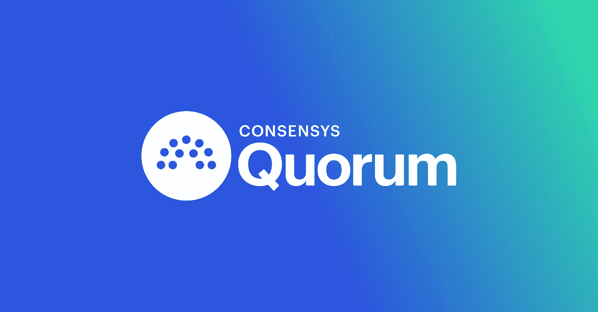*

*Source: consensys.net*

*Quorum 是一个开源协议层，它是企业构建基于公共或私有以太坊的企业解决方案的基础。Quorum 由四层开源代码库组成:客户端软件、私有事务管理、外部事务签名和附加工具。*

## *谁是 Quorum 的幕后黑手？*

*Quorum 是 ConsenSys 的企业以太坊解决方案。ConsenSys 是领先的以太坊软件公司，其产品套件包括 Infura 和 MetaMask 等，服务于数百万用户，处理数十亿美元的数字资产。约瑟夫·卢宾是以太坊的联合创始人，也是 ConsenSys 的创始人。*

*ConsenSys 的主要股东包括 JP 摩根、微软、软银、淡马锡等。*

# *项目在 Quorum 上运行*

*以下区块链应用程序已在 Quorum 上发布，并被大公司积极用于现实世界的用例。这份清单绝非详尽无遗。*

# *供应链— Covantis*

**

*Source: covantis.io*

*Covantis 由 ADM、Bunge、Cargill、COFCO、Louis Dreyfus Co、Viterra 于 2021 年 2 月成立，是一个利用区块链技术提高全球贸易效率、透明度和信息交流的平台。其平台专注于将全球贸易流程数字化，使其更加简单、安全和高效。其目标是最大限度地降低经营风险，同时提高农业贸易和航运业的市场效率。*

*Covantis 平台通过自动化 60%的执行任务、减少 80%的错误率和提高 70%的交易速度，简化了 16 个农业集团的 45 个法律实体和 500 个用户之间的协作，在全球范围内执行 3500 万吨货物。*

*近期亮点:*

*   *自 2022 年 2 月在北美推出以来，美国 50%以上的租船都是在 Covantis 的平台上完成的。*
*   *2022 年，Covantis 在巴西的大豆、玉米和豆粕市场上占据了 70%的份额。Covantis 已被用于执行超过 1600 艘来自巴西的船只。*

# *奢华——光环*

*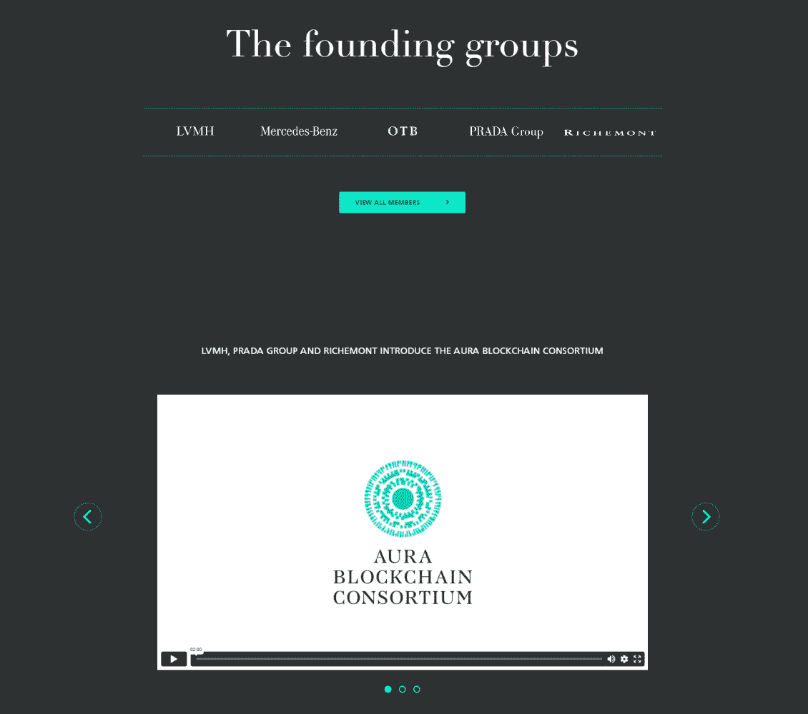*

*Source: auraluxuryblockchain.com*

*AURA 是一个基于 Quorum/以太坊区块链技术的平台，旨在为整个奢侈品行业提供强大的产品跟踪和追溯服务。Aura 区块链联盟由 LVMH、普拉达集团和历峰集团旗下的卡地亚于 2021 年 4 月创建。*

*AURA 使消费者能够访问奢侈品的产品历史和真实性证明——从原材料到销售点，一直到二手市场。*

*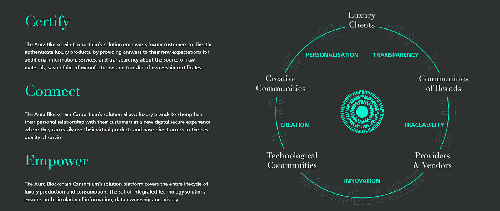*

*Source: auraluxuryblockchain.com*

*Aura 区块链联盟董事会目前由以下备受推崇的创始成员代表组成:LVMH、普拉达集团、OTB、卡地亚、历峰的一部分和梅赛德斯-奔驰。*

# *金融— Komgo*

*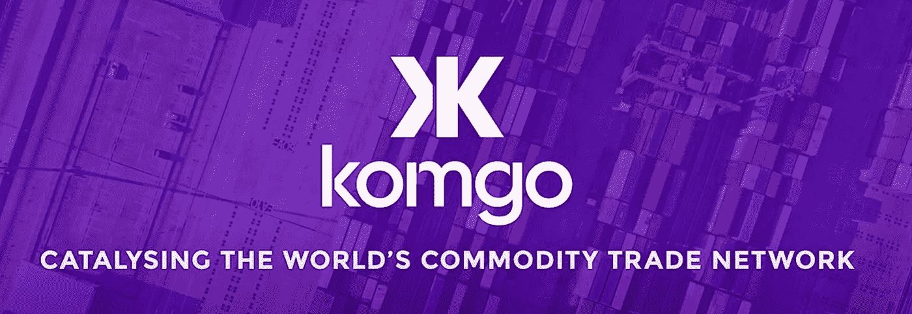*

*Source: consensys.net*

*基于以太坊/Quorum，Komgo 是世界上第一个基于区块链的商品贸易生态系统平台。Komgo 作为一个单一的信息来源，允许交易商、运营商、银行和其他授权参与者以高效、数字化的方式进行安全交易，从而简化了整个行业的操作和标准化文档。*

*即使在今天，价值 4 万亿美元的商品贸易几乎完全是通过纸质文件和电子邮件进行的。Komgo 通过在文档中创建标准化，并在各种参与者之间提供一种安全的通信和交易结算方式，彻底改变了这种状况。*

*仅在公开推出一年后，Komgo 就获得了网络成员提供的近 10 亿美元的融资。2019 年 10 月，荷兰合作银行在 Komgo 上进行了第一笔大宗商品交易——通过该平台为购买生物燃料开具了备用信用证。*

*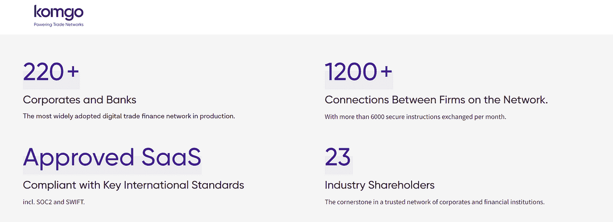*

*Source: komgo.io*

*Komgo 得到了 15 家世界上最大的全球性银行、贸易公司和石油巨头的支持，并正在快速增加新成员。其中包括 ABN AMRO 公司、法国巴黎银行、花旗银行、农业信贷银行、贡沃尔银行、荷兰国际集团、科赫供应与贸易公司、麦格理银行、摩科瑞银行、三菱日联银行、Natixis 银行、壳牌石油公司、SGS 银行和法国兴业银行。*

# *医疗保健—预测*

*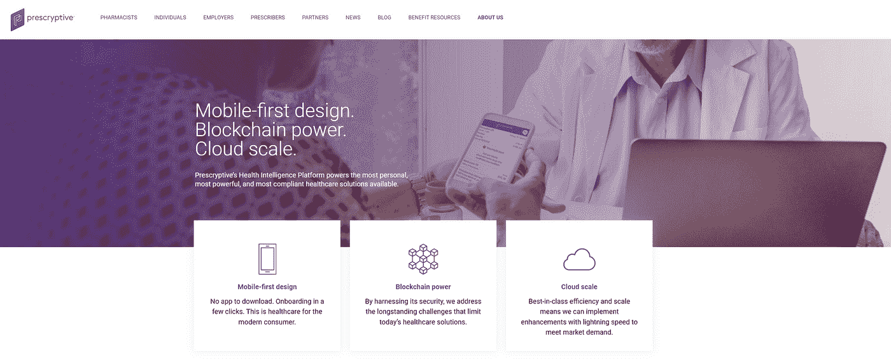*

*Source: prescryptive.com*

*Prescryptive 是一家医疗保健技术公司，它为处方药市场带来了透明度。它提供了一个通过区块链管理处方的处方智能平台。该平台在区块链中记录处方交易，该处方交易识别已经为患者开出的处方。*

*其平台使用人工智能、区块链和移动设备为其药房福利管理(PBM)客户提供变革性、个性化和合规的体验。该公司的移动优先产品将消费者、药剂师和雇主联系在一起，为人们提供做出明智决策和控制自己健康所需的信息。*

*迄今为止，Prescryptive 已经与 50，000 家药店建立了合作关系，包括专业药店和邮购药店。*

# *医疗保健—新立得医疗保健联盟*

*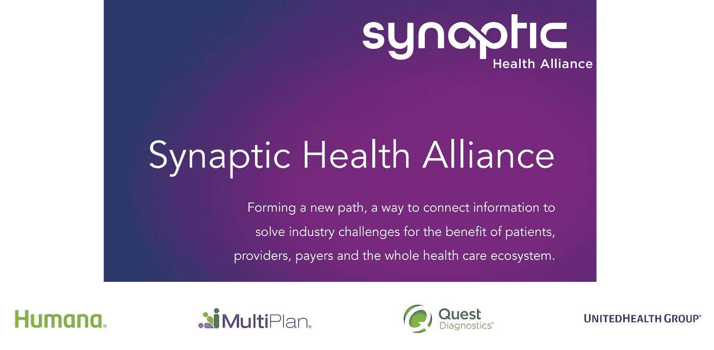*

*Source: synaptichealthalliance.com*

*突触健康联盟由 Aetna、Humana、MultiPlan、Quest Diagnostics 和 UnitedHealth Group 于 2018 年成立。其目标是创建一个区块链平台，将患者置于医疗保健系统的中心。一个激发创新、减少行政摩擦的时代。*

*美国医疗系统每年花费超过 21 亿美元来维护其人口统计数据。这是因为各个组织都有各自独立的数据库。这些既费时又难以保持准确。*

*该小组注意到，提供商数据库经常过时和不正确，这使它们成为患者和提供商的一个痛点。如果数据库通过区块链连接，对一个数据库的更新可以更新其他数据库，从而提高信息的准确性。*

# *石油 Vakt*

*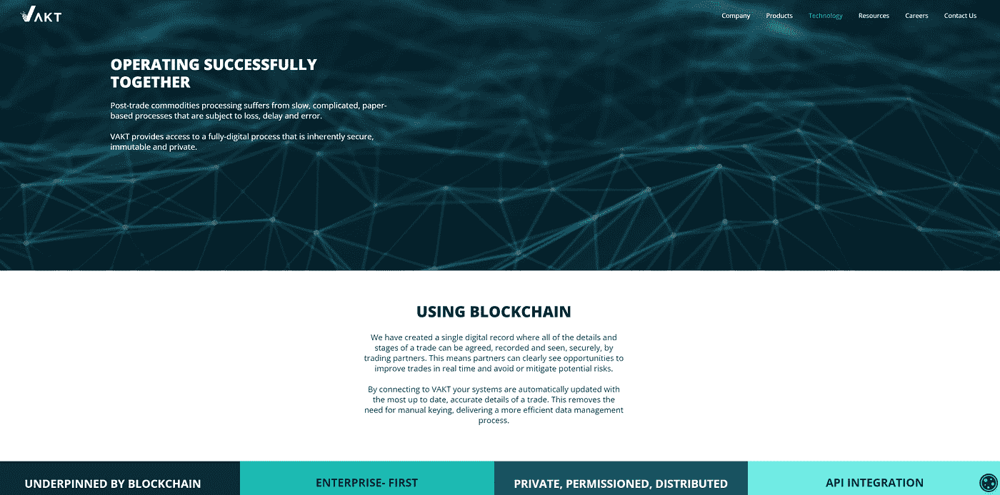*

*Source: vakt.com*

*VAKT 正在将全球石油贸易行业数字化，创造一个安全、可信的生态系统，由区块链提供支持。*

*VAKT 于 2018 年由一群石油巨头、交易员和贸易融资提供商组成，他们认识到了一个需要集体行动的问题:实物交易后流程依赖于手动、复杂、重复且容易出错的流程。*

*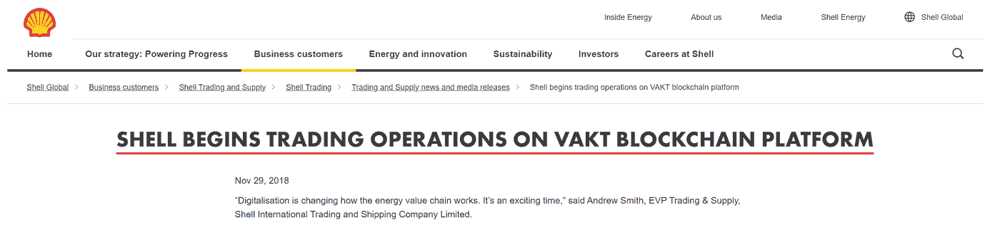*

*Source: shell.com*

*能源巨头 BP、Equinor、Shell、Gunvor 和 Mercuria 是该平台的首批用户。*

# *跨境支付——第三方*

**

*Source: partior.com*

*Partior 建立在以太坊的 Quorum 基础上，是一个开放的区块链清算和结算平台，由新加坡政府支持，星展银行和摩根大通为创始成员。它的目标是成为世界银行的总账*

*就区块链的金融管道而言，Partior 是最机构化的。该平台现已上线，两家银行通过一个货币通道进行交易，即新加坡元和美元。此外，该公司将开始增加更多的货币，包括其他 G10 单位，而中国人民币和印尼盾据报道正在筹划中。*

# *保险-国营农场和 USAA*

*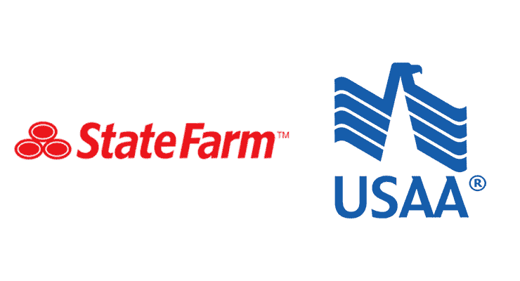*

*Source: statefarm.com; usaa.com*

*2019 年，州立农场和 USAA 公司宣布对区块链解决方案进行高级测试，以自动化耗时耗力的代位求偿权处理。保险公司在解决客户之间的索赔时使用代位求偿权来收回资金。从那时起，该解决方案已经使用历史数据进行了广泛的测试，现在根据 State Farm 于 2021 年 1 月 26 日发布的官方声明，该解决方案已全面投入生产。*

*每年，国营农场和 USAA 之间交换大约 75，000 张代位求偿权支票。随着全面投产，这些公司希望在 2021 年看到其他运营商签约参与。*

*“我们正在积极寻求其他保险公司加入我们的代位区块链解决方案，”国营农场首席索赔官 Robert Yi 说。*

**关于国营农场**

*State Farm 及其附属公司是美国最大的汽车和房屋保险提供商。其 19，200 名代理人和 59，000 名员工为大约 8，400 万份保单和账户提供服务，包括超过 8，100 万份汽车、火灾、人寿、健康和商业保单，以及超过 200 万个金融服务账户。*

**关于 USAA**

*USAA 公司家族为超过 1280 万美国军人及其家属提供保险、银行、投资、退休产品和建议。*

# *其他以太坊企业解决方案*

# *斯特拉托*

*除了 Quorum 之外，还有其他基于以太坊的私人区块链解决方案。Blockapps 的 STRATO 就是这样一个例子。*

*STRATO 是一种全栈技术，允许企业构建支持智能合约的应用程序。BlockApps 的 STRATO 平台也是基于以太坊区块链协议。*

*STARTO 为企业提供三种不同的产品——trace harvest、TraceCarbon 和 NetworkGov。*

## ***TraceHarvest***

*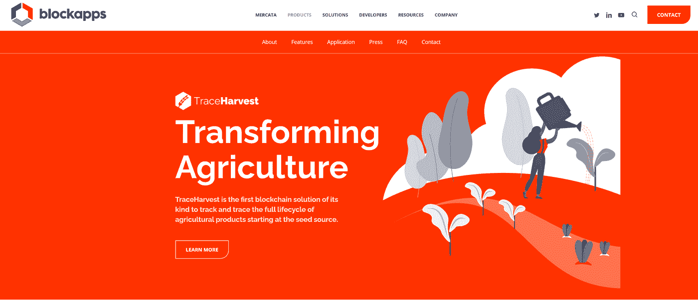*

*Source: blockapps.net*

*拜耳作物科学与 BlockApps 合作，创建了 TraceHarvest，这是一个由区块链提供动力的农业商业网络。拜耳作物科学是德国跨国制药和生物技术公司拜耳公司的一部分，拜耳公司是世界上最大的制药公司之一，年收入达 440 亿€。该公司是欧洲斯托克 50 指数的成份股。*

*通过与拜耳作物科学部门的合作，该平台已经按照最高行业追溯标准进行了构建和测试，并为粮食行业提供了一流的解决方案。农民、制造商、经销商和加工商可以在一个单一、安全的平台上有选择地共享和审查数据，使整个供应链都可以进行活动。这种简化的参与和实时信息交换使各方能够比以前的手动流程更快地发现和解决产品跟踪和完整性问题。*

*拜耳在几个生长季节中使用 TraceHarvest 来跟踪该公司价值最高的农产品的生命周期和状态，包括大豆和玉米，从销售和种植到收获。*

*成员农民、制造商、经销商和加工商使用相同的 TraceHarvest 网络来跟踪他们的产品去向，使他们能够全面了解他们的作物来源。*

## *示踪碳*

*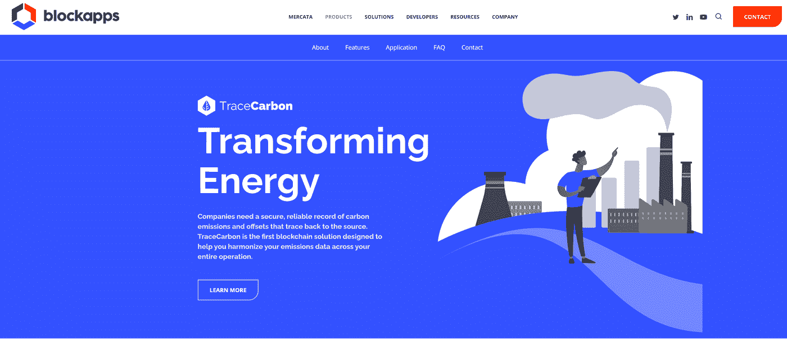*

*Source: blockapps.net*

*TraceCarbon 是一款区块链企业应用程序，通过其为二氧化碳生态系统提供的可追溯性来实现合规性和透明度，包括公司报告、项目有效性和产品生命周期分析。*

## *网络政府*

*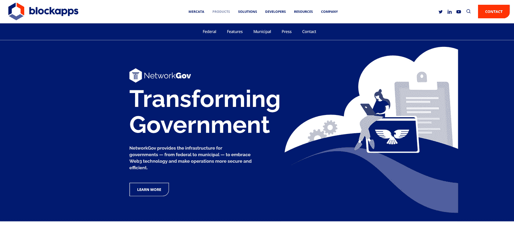*

*Source: blockapps.net*

*NetworkGov 是一个集成的区块链资产会计网络，用于跟踪供应商和机构的资产和关键事件。NetworkGov 创建了一个公共记录和令牌化资产的区块链网络。*

**里诺市**

**

*Source: flickr.com*

*2022 年 2 月宣布，雷诺市市长希拉里·希夫(Hillary Schieve)推出了雷诺市最大的小区块链——美国第一个由城市运营、以居民为中心的区块链平台。由 BlockApps 构建的区块链应用程序创建了一个单一的分类账，记录指定流程中的连续交易。*

*一旦这项技术在夏季晚些时候推出，公众和所有相关的城市部门将能够通过一个在线平台访问相同的记录，从而提供清晰度和透明度。此外，区块链技术公司创建并存储了不会丢失或更改的记录，增强了政府对公众的责任。*

# *基于以太坊企业版的其他项目*

# *数字身份证 Uport 瑞士楚格市*

*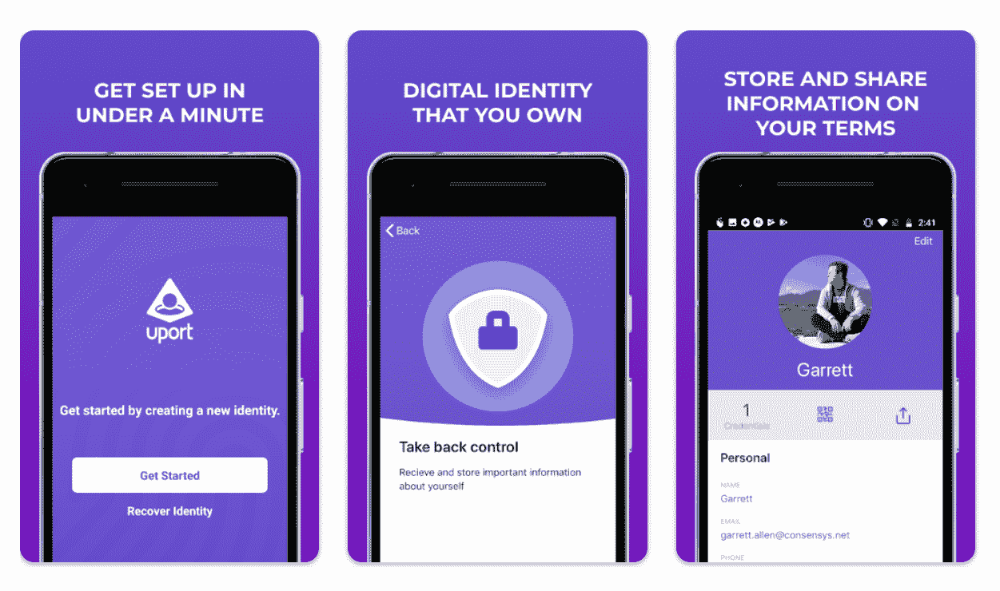*

*Source: play.google.com*

*uPort 是在以太坊区块链上注册身份的一种方式。它使用户能够以一种清晰、透明的方式识别自己并向其他用户发送信息或价值。*

***eZug App***

*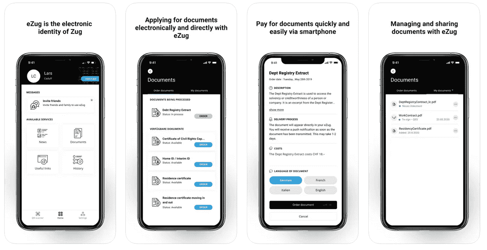*

*Source: apps.apple.com*

*瑞士楚格市利用 uPort 这一分散式身份平台，在以太坊区块链上创建了世界上第一个自主政府颁发身份项目的现场实施。*

*2017 年夏天，该市启动了一项试点计划，在公共以太坊区块链注册居民身份证。作为试点项目的一部分，350 名公民通过创建数字身份证成功注册。70 名市民参与了即将到来的节日中是否燃放烟花的投票。用户跳过了繁琐的登录过程，使用 uPort 帐户登录，投票，然后注销，无需前往投票站。不依靠中间人或计票基础设施就可以核实谁投票。试点表明，用户控制的身份支持电子投票计划的现代化，这可以为该市节省数百万的人力和生产力成本。*

*试点计划结束后，楚格市于 2017 年 11 月正式启动该计划。*

# *i2i 项目——菲律宾联合银行*

*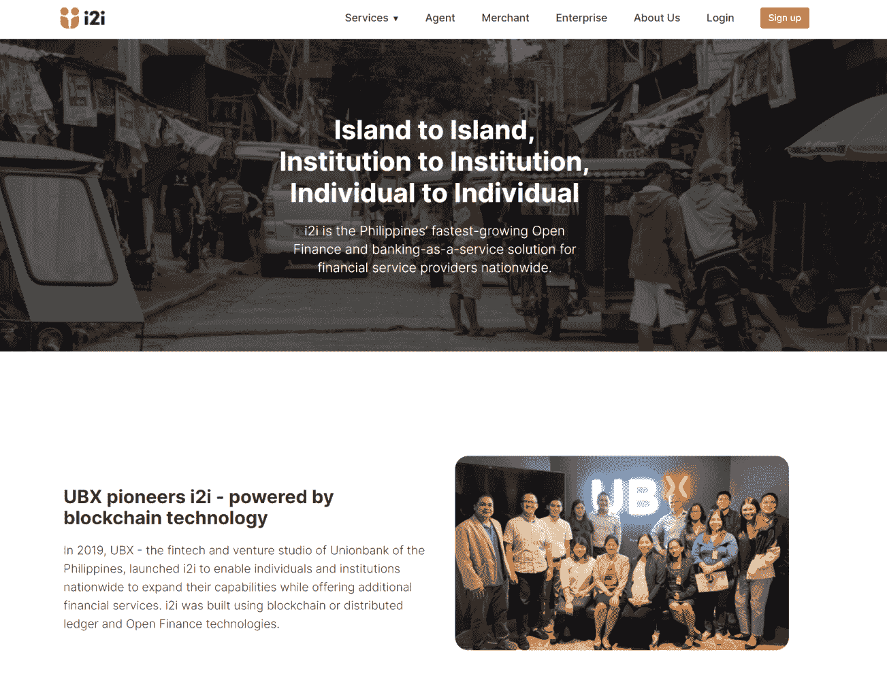*

*Source: i2i.ph*

*菲律宾是一个迅速崛起的经济体，人口超过 1 亿。然而，三分之一的人口仍然没有银行账户。为了解决这一问题，菲律宾最大的银行机构之一菲律宾联合银行利用 Enterprise Ethereum 创建了一个农村间银行支付平台“i2i 项目”。*

*i2i 项目实施了 Enterprise Ethereum，以创建一个分散的、经济高效的实时农村间银行支付平台，该平台在现有支付基础设施和中介(如菲律宾的 PhilPass 和 SWIFT)之外自主运行。i2i 项目平台致力于将农村银行和国家商业银行与中央银行连接起来，帮助偏远地区的银行融入国内金融体系，同时改善当地居民的银行服务。*

*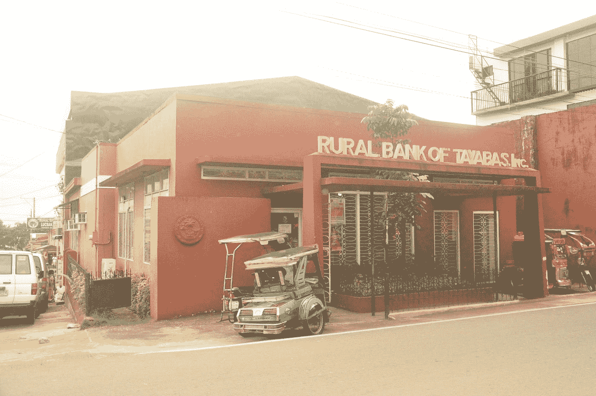*

*Source: Rural Bank of Tayabas — commons.wikimedia.org*

*菲律宾的 500 多家农村银行在农村发挥着重要作用，而商业银行在农村的业务有限。他们为农民、渔民和当地企业服务，为社区带来进步。然而，由于成本和其他障碍，农村银行被排除在国家自动票据交换所和 SWIFT 等国际支付网络之外。*

*i2i 平台于 2019 年 4 月与 35 家农村银行合作伙伴推出，在全国拥有 150 家分行和 25 万个账户，旨在为数百万以前没有银行账户的菲律宾人提供服务。仅在 2019 年 8 月，i2i 的交易额就超过了 100 万美元，当月完成了 335 笔交易。*

*今天，i2i 继续连接全国 7，000 多个地点的 1，900 多家金融机构、非金融机构、商户、汇款中心、平台和代理。*

*银联银行还尝试使用令牌化的菲亚特从新加坡华侨银行向 i2i 农村银行进行近乎实时的跨境转账。对于数百万海外菲律宾工人的家庭来说，这是一项改变游戏规则的服务，因为它降低了汇款回国的成本，增加了获得银行级汇款的机会。*

# *BBVA——贷款*

*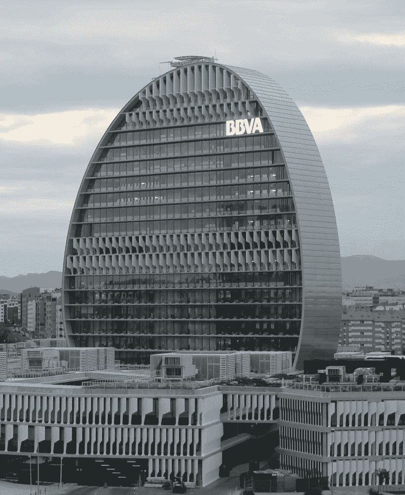*

*Source: commons.wikimedia.org — Luis García*

*西班牙银行业巨头 BBVA 通过区块链为马德里政府谈妥了一笔 2.2 亿€的可持续贷款。在过去的一年里，BBVA 利用其区块链贷款平台安排了许多不同类型的贷款，如保时捷的定期贷款、红色伊莱克特(西班牙电网公司)的银团贷款、Repsol(西班牙能源公司)的循环信贷、ACS(西班牙土木工程集团)的企业贷款等。发放贷款后，最终贷款的详细信息被散列并记录在公共以太坊主网上。*

# *马耳他——所有教育证书*

*马耳他是第一个在所有教育提供者中实施基于区块链的证书制度的国家，以促进从学生到劳动力的平稳过渡。历史上，摩擦的焦点之一是传递和核实官方记录。因此，马耳他各种类型的培训项目——高等教育、技能培训、政府项目——正在向毕业生发放成绩记录，可以立即用于求职。*

# *CargoX*

*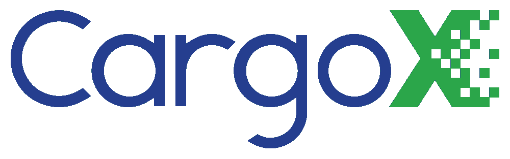*

*Source: cargox.io*

*CargoX platform 可向其业务合作伙伴或客户发送所有权文件或任何其他高度敏感的文件，涉及多个行业，包括制造、贸易、金融、能源和服务等。它基于以太坊区块链，能够仅对相关参与者进行事件审计跟踪，同时保持完全的机密性和完整的数据、身份和业务联系隐私。CargoX 平台目前为全球约 87，000 家公司提供服务，包括政府机构。*

# *百年灵*

*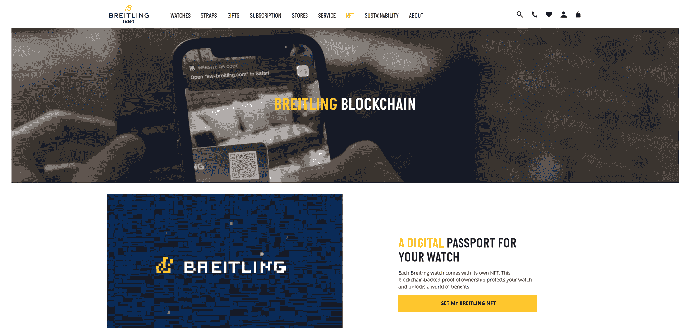*

*Source: breitling.com*

*2020 年 10 月，百年灵启用以太坊系统，将所有新款腕表放入区块链。百年灵首席数字和技术官安东尼奥·卡里罗(Antonio Carriero)表示，这将使昂贵的手表拥有电子真品证书和国际保修，以及透明跟踪任何手表的服务历史和维修的标准化方式。*

# *威瑞森*

*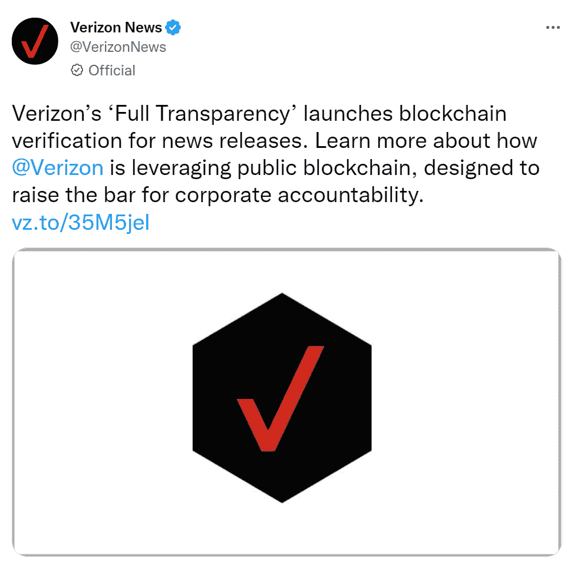*

*Source: Verizon News*

*威瑞森是一家拥有 2，300 多家零售店的美国无线网络运营商，该公司宣布将在区块链发布新闻稿。新系统名为“完全透明”，是一个总部设在区块链的新闻发布记录系统，“旨在提高企业问责制的标准。”它验证了新闻稿没有被修改。*

# *核实新闻——ANSA 新闻社*

*意大利领先的新闻机构 ANSA 推出了一个基于区块链的新闻跟踪系统，以增进公司和读者之间的信任。这个名为 ANSAcheck 的工具由区块链提供动力，据称可以让用户验证在其平台上发布的新闻的来源和历史，*

*ANSAcheck 系统基于安永专有的 EY 运营链可追溯性解决方案，该解决方案基于以太坊区块链。*

# *令牌化资产—金牛座*

*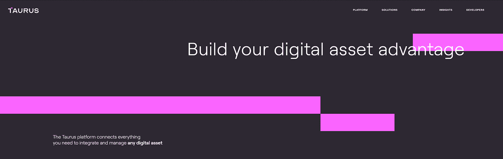*

*Source: taurushq.com*

*Taurus 使数字化和标记任何类型的资产成为可能。瑞士瑞信银行已将冒险运动公司 alaa SA 的股份令牌化，该公司在瑞士阿尔卑斯山拥有小屋和一家酒店。瑞士瑞信银行正在与总部位于瑞士的加密托管和交易平台 Taurus 合作，根据瑞士资本市场和技术协会(CMTA)的标准创建令牌。*

# *摘要*

*当考虑上述所有问题以及区块链是否是这里的最终解决方案时，人们可能会想，“为什么不利用共享数据库呢？”。*

*这个问题的答案归结为“谁”的困境，这是任何网络治理的主要挑战。考虑由许多组织/政府共享的分布式数据库中的治理归结为四个主要问题:*

*1)谁拥有数据？*

*2)谁确保数据没有被篡改？*

*3)公司网络中谁有权更新或删除数据？*

*4)谁开发和维护允许各方验证最近交易的应用层？*

*区块链通过建立一个所有用户都同意所有权和参与的共享网络，克服了“谁”的困境。一个区块链网络的成员以分散的方式共同公平地管理它。*

*企业以太坊受益于公共以太坊上发生的大量创新，由于成千上万开发人员在以太坊上构建应用程序的更多参与，公共以太坊的速度必然会更快，这使其成为世界上经过真实世界测试、弹性最强、最先进的智能合约区块链。*

**免责声明:本文包含的信息仅用于教育目的，并不构成 Wheatstones 的任何形式的建议或推荐，用户在做出(或避免做出)任何投资决定时也不打算依赖这些信息。**

> *交易新手？试试[密码交易机器人](/coinmonks/crypto-trading-bot-c2ffce8acb2a)或者[复制交易](/coinmonks/top-10-crypto-copy-trading-platforms-for-beginners-d0c37c7d698c)*