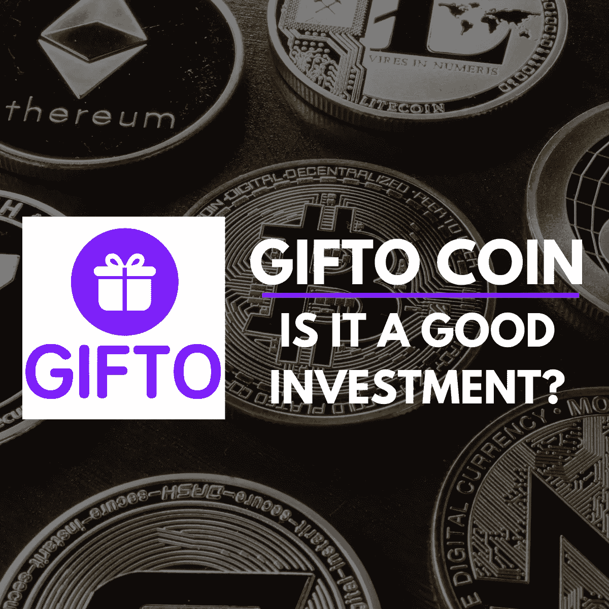
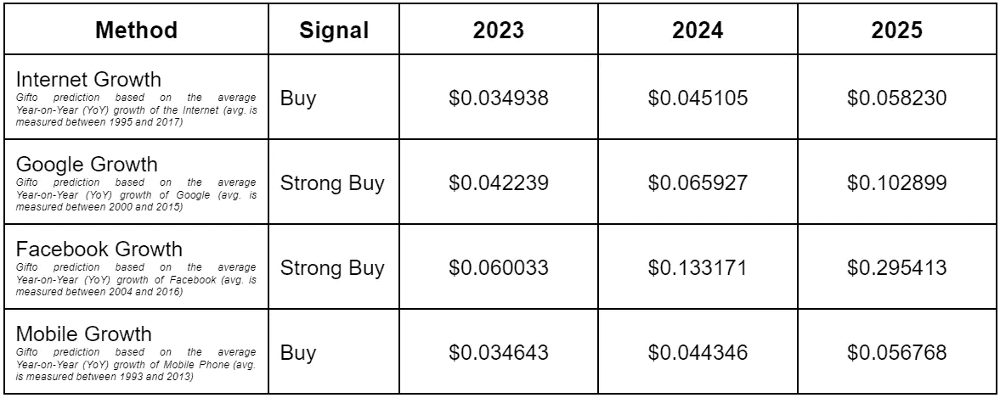
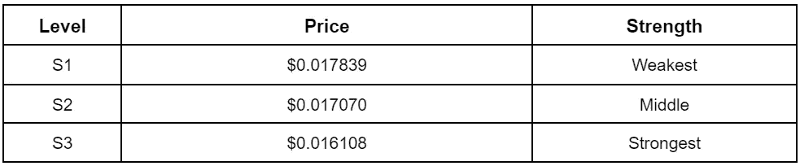
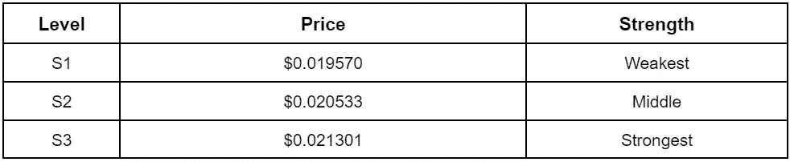
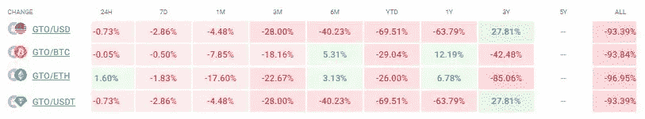
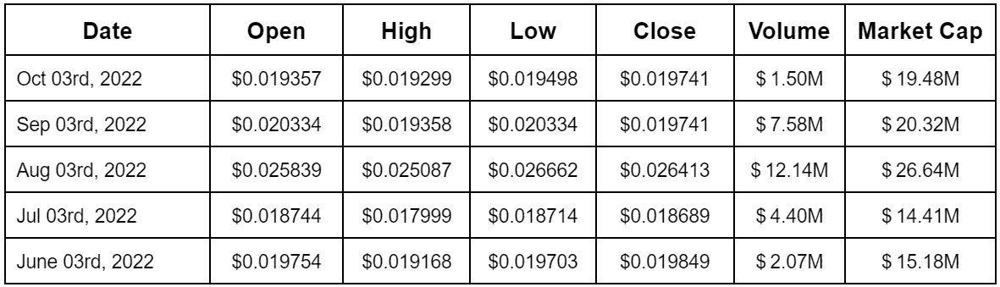

# GTO 币价格预测:期待什么？

> 原文：<https://medium.com/coinmonks/gto-coin-price-prediction-what-to-expect-d37c2e1d6e87?source=collection_archive---------6----------------------->

*The Forecast of the Gifto Coin Price*

到 2022 年 11 月 7 日，Gifto 的价值预计将升至 0.019158 美元。目前的情绪表明熊市状态，然而恐惧和贪婪指数似乎有点谨慎，为 30(恐惧)。吉福托在一个月的 30 天中有 12 天是绿色的，约占 40%。同期价格波动幅度为 3.9%。所以，现在可能不是买这枚硬币的好时机。

# 2023 年、2024 年和 2025 年 GTO 价格预测

*GTO Token Price Prediction — Source: Coincodex.com*

就替代硬币而言，我们需要考虑关键的技术创新和趋势，以获得高度准确的预测。如上表所示，互联网增长、谷歌增长等因素。参与 Gifto 价格预测。

如果事情按预期发展，随着脸书的增长，2025 年 GTO 价格将为 0.295413 美元。同时，如果 Gifto 跟随互联网的增长，它可以是 0.058230 美元。

# 吉福托的 50 天、200 天简单均线(SMA)和 14 天相对强弱指数(RSI 14)是什么？

*Gifto Price Prediction 2022 — Source: Coincodex.com*

Gifto 的交易现在位于 200 天均线下方，自 2022 年 7 月 18 日以来的过去 108 天中，它一直显示出卖出信号。此外，Gifto 的价格低于 50 天均线，这是自 2022 年 9 月 19 日以来的最后 44 天的卖出信号。

此外，自 2022 年 2 月 6 日以来，死亡交叉已经淹没了比特币市场 269 天，而黄金交叉最近发生在 2021 年 11 月 15 日。

Coincodex 使用其技术指标来洞察 Gifto 的价值，预测在 200 天的 SMA 中，到 2022 年 12 月 3 日将跌至 0.020285 美元。同时，短期 50 天 SMA 显示同期预期预估为 0.018456 美元。

 [## 加密期货和期权:交易者容易犯的 3 个错误

### 错误就像甜蜜的陷阱或有着良好伪装的无害事物。然而，一旦你犯了错误，你…

medium.com](/coinmonks/crypto-futures-and-options-3-mistakes-traders-are-succumb-to-2866c2a03f75) 

此外，RSI 动量振荡器现在位于 45.91。意味着 GTO 市场目前是中性的。对于那些对 RSI 知之甚少的人来说，一个小小的旁注是，它是一个显示加密货币状态的流行指标——超卖(低于 30)或超买(高于 70)。

# Gifto 的关键价格水平是什么？

经典枢轴点(P1)显示 2022 年 11 月 3 日的值为 0.018801 美元。Gifto 的支撑位 0.016108 美元为最强，阻力位 0.021301 美元为最强。

*Support Levels of Gifto Prices — Source: Coincodex.com*

*Resistance Levels of Gifto Prices — Source: Coincodex.com*

# 吉福托相关

Gifto 价格与 Decred、Curve DAO Token、Ethereum Classic、Oasis Network、ApeCoin 等市值排名前 10 的币有正相关关系，值为 0.252。同时，它与一些货币如 ABBC 硬币、链条、信托钱包代币、智利兹、币安硬币等负相关。

与 Gifto 正相关表明货币的运动在统计上具有显著的权重，在相同的方向上领先。负相关意味着 Gifto 与硬币/货币的方向相反。

 [## 2022 年投资的十大加密货币—第一部分

### 选择一种有利可图的加密货币进行投资反映了你对市场趋势的把握程度以及你的…

medium.com](/@libraryoftrader/top-10-cryptocurrencies-for-your-investment-in-2022-part-i-f5aaa33b3bcf) 

# 吉福托价格表现的历史

*The Historical Price Performance of Gifto — Source: Coincodex.com*

当查看 Gifto 的历史数据库时，它有助于预测增长或下降的模式。通过查看 Gifto 过去的数据，你可以对其未来的下一步行动得出许多实际的见解。这就是为什么你不仅可以预测 2025 年的 GTO 价格，还可以预测 2030 年**的 GTO 硬币价格。**

*Monthly Gifto Coin Price From June to October in 2022 — Source: Coincodex.com*

 [## 2022 年投资的十大加密货币—第二部分

### 在之前的博客中，我们根据对以下领域的研究，向您介绍了 5 种最值得投资的加密货币

medium.com](/coinmonks/top-10-cryptocurrencies-for-your-investment-in-2022-part-ii-da391c6e5d52) 

# 常见问题

# Gifto 是什么？

Gifto 是一个分散的协议，用于在以太坊区块链上创建和交换虚拟礼物。它是亚洲创新集团的骄傲产品。

# GTO 币价格预测的依据是什么？

通过考虑链上和链下指标，以及技术指标的支持，这是可能的。重点是深入挖掘吉福托过去的性价比。此外，你可以添加市场情绪作为一个有用的指标，看看投资者是否在考虑 Gifto——未来是更好还是更坏？

然而，你不能指望 Gifto 价格预测 100%准确。还是有不可预知的因素可以在一瞬间改变局势。所以，最好的方法是用强有力的工具小心地进行市场预测，但仍然要跟踪市场，以便及时采取行动。

# GTO 是一个好的投资吗？

从短期来看，Gifto 可能不值得投资，因为其价格在过去一年中下跌了 63.79%。此外，Gifto 价格的波动和现在的加密崩溃是你需要考虑的其他因素。然而，如果你想长期持有 GTO，它可以有一个更好的未来，因为该硬币的三年表现为 27.81%。

# 恐惧和贪婪指数是多少？

恐惧和贪婪指数阐明了当前市场的情绪。具体来说就是通过数字来表现整体市场的感受。范围从 0 到 100，从极度恐惧到极度贪婪。

基于个人交易风格，一些交易者把普遍的负面情绪作为通过更大的赌注赚取更高的机会。恐惧和贪婪指数接近交易心理学，但你可以通过数字洞察市场参与者的想法，而不是猜测或假设。

该指数使用许多指标来衡量市场情绪，如波动性、交易量、社交媒体情绪等。

# Gifto 死亡十字架是什么？

死亡交叉是显示 Gifto 最近价格疲软的图表模式。具体来说，这个术语表示短期移动平均线的下降。流行的移动平均线是 50 天和 2000 天。

# 什么是吉福托黄金十字勋章？

吉福托黄金交叉表示短期移动平均线在长期移动平均线上方交叉。它与 Gifto 短期移动平均线交叉，形成看涨形态。例如，15 日均线突破 50 日均线或阻力位。

# 2025 年的 GTO 币价预测会是什么样的？

根据 Coincodex 的技术部门增长预测，g to 价格将在 0.056768 美元和 0.295413 美元之间。它表明，如果事情按照 2026 年的最佳情景发展，价格将上涨 1，467.93%。

# 如何阅读 Gifto 图表并预测其价格走势？

交易者喜欢蜡烛图，因为它们比简单的折线图产生更多的信息和见解。因此，您可以通过不同的粒度观察 Gifto 价格行为的模式。

例如，你可以选择 5 分钟蜡烛图来洞察短期价格变动，而选择周线蜡烛图来识别长期趋势。常见的蜡烛图包括 1 小时图、4 小时图和 1 日图。

蜡烛的颜色也应该在你的考虑范围之内。绿色蜡烛表示收盘价高于开盘价。与此同时，红色蜡烛线向我们展示了相反的情况——收盘价比开盘价低。

# 哪些因素影响 Gifto 的价格？

Gifto 价格深受供求关系的影响。基本事件，如块奖励减半，硬分叉，或最新的协议留下明显的影响。此外，企业和政府对 GTO 的监管和采用也可能改变 GTO 硬币的价格。

除了传统的预测方法之外，许多交易者还监控 GTO“鲸鱼”的活动，这些鲸鱼控制着市场上的 GTO 的主要数量。结合所有的影响因素，你可以画出 Gifto 价格运动的全貌，然后提高 Gifto 价格预测的准确性。

非常感谢您阅读这篇文章。我们现在想给你一个优惠券代码 [**BLOGNOW10**](https://libraryoftrader.net/) 以便你下次在 Trader 的图书馆购买课程时有惊人的折扣。

更深入的金融市场和交易知识**👇**

 [## FTX:崛起、衰落和重生？

### FTX 的破产案现在是密码市场的焦点。密码投资者和交易者可能见过很多…

medium.com](/@libraryoftrader/ftx-the-rise-the-fall-and-the-rebirth-b21c639bdb87)  [## FTX 的崩溃，币安的领先地位，以及密码市场

### 币安现在正式退出对 FTX 的救助，而 FTX 已经面临严重的偿付能力问题。本周早些时候，CZ…

medium.com](/coinmonks/ftxs-collapse-binance-s-leading-position-and-the-crypto-market-1bcdd56e85e7)  [## 如何停止过度交易:你应该知道的 3 个简单提示

### 太极端的东西不好。过度交易和微观管理是交易者容易犯的常见但代价高昂的错误…

medium.com](/coinmonks/how-to-stop-overtrading-3-simple-tips-you-should-know-1343303b8268)  [## 定量和定性分析:主要区别是什么？

### 对许多人来说，交易或投资可能是一种游戏，但这不是一种完全靠运气就能赢的游戏。它需要…

medium.com](/coinmonks/quantitative-and-qualitative-analysis-what-are-the-main-differences-1e50ec1db209)  [## 交易心理学:你可能不知道…

### 交易心理学顾名思义，心理学或思维在交易中的工作方式。你可能会发现…

medium.com](/@libraryoftrader/trading-psychology-you-might-not-know-a5288f05c1cd) 

**你也可以找到我们👇**

*   交易者博客库:【https://libraryoftrader.net/blogs 
*   https://www.facebook.com/libraryoftrader[脸书](https://www.facebook.com/libraryoftrader)
*   推特:[https://twitter.com/libraryoftrader](https://twitter.com/libraryoftrader)
*   领英:[https://www.linkedin.com/company/library-of-trader/](https://www.linkedin.com/company/library-of-trader/)
*   https://www.reddit.com/user/Library_Of_Trader
*   quora:[https://www.quora.com/profile/Library-of-Trader](https://www.quora.com/profile/Library-of-Trader)
*   https://www.tiktok.com/@libraryoftrader.net

> 交易新手？尝试[加密交易机器人](/coinmonks/crypto-trading-bot-c2ffce8acb2a)或[复制交易](/coinmonks/top-10-crypto-copy-trading-platforms-for-beginners-d0c37c7d698c)