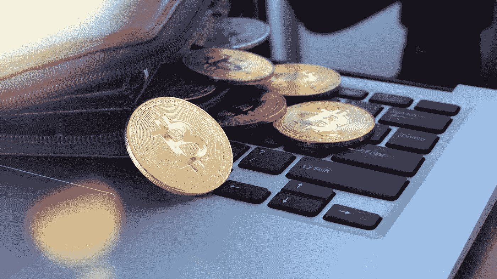

# 指南:如何选择一个加密的自我保管钱包

> 原文：<https://medium.com/coinmonks/guide-how-to-choose-a-crypto-self-custodial-wallet-ab1583a37e1b?source=collection_archive---------2----------------------->

在这一年中，集中式密码交换和服务提供商失去了很多信任。由于围绕着摄氏，FTX 和币安的事件，越来越多的人意识到自己持有密码的重要性。在这篇文章中，我将教你在选择自保管加密钱包时要注意什么。

# 什么是自保管钱包？