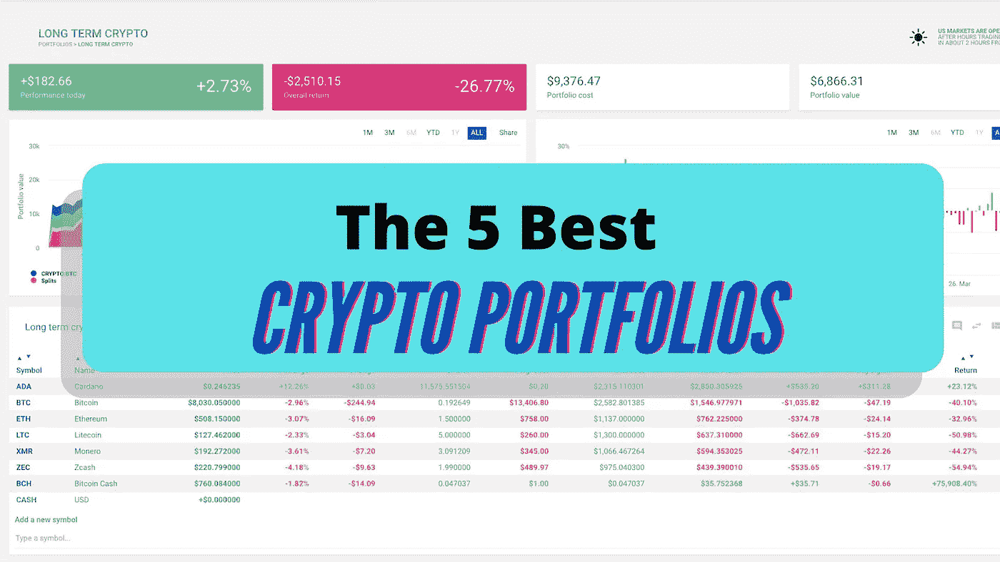

# 指南:5 个最佳加密组合

> 原文：<https://medium.com/coinmonks/guide-the-5-best-crypto-portfolios-f86478f6bb51?source=collection_archive---------1----------------------->

如何构建完美的加密组合——初学者和高级用户指南。

在本文中，我将向您展示如何构建完全满足您需求的完美加密组合——无论您是初学者还是高级加密用户。

为什么这很重要？

一个简单的事实是，大多数人没有建立好的加密投资组合，这些投资组合符合他们个人的风险状况，并反映了当前的市场形势。这就是他们赔钱的原因。

## 了解您的加密产品组合的组件

每个加密投资组合由不同的组件组成，这些组件会带来不同的风险级别。我们一个一个来看。

*   稳定债券:它们的波动性最低，风险也最低。它们是一种储备，以防你想从高风险项目中提取资金或购买新项目。
*   **大盘股:**这些是已经建立的加密项目，有着成熟的用例，如 BTC、联邦理工学院和交通部。你在市场低点买入它们，并持有多年。
*   **中型股:**这些是已经在市场上存在了相当长一段时间的秘密项目，但仍有增长潜力。它们属于中等风险，期限从几个月到几年不等。
*   **小型股:**高风险的硬币和代币，提供 10-100 倍回报的最高潜力。他们通常只被关押很短的时间。

Click me.

# 5 个最好的加密投资组合(+最差的一个)

好吧。现在让我们仔细看看不同种类的投资组合。但首先，让我告诉你如何不这样做。

上面的图表显示了一个糟糕的加密投资组合的例子，因为它包含了太多的硬币。这很容易让你失去对事情的跟踪，从而导致你错过卖出的最佳时机，尤其是那些高风险的小盘股。

相反，你应该做的是从少量的硬币开始，然后分散投资，就像我在上一篇文章中讨论的那样。

 [## 如何用少量预算投资加密

### 1.000-5.000 美元投资的最佳实践。

ren-heinrich.medium.com](https://ren-heinrich.medium.com/how-to-invest-in-crypto-with-a-small-budget-40643c0386b4) 

好的。有了这个方法，让我告诉你如何正确地做这件事。

## 1.BTC /联邦理工学院拆分—低风险

如果你是密码新手，这个组合是你的正确选择。它让你接触到提供长期增长潜力的可信项目。安全简单。如果你愿意，你可以加入少量(10%)稳定的硬币。

## 2.杠铃——低风险

这一策略因纳西姆·塔勒布而闻名。有了这个加密投资组合，你就可以覆盖风险曲线的两个极端。你资金的 10-20%是高风险投资(小盘股)，其余是低风险投资(大盘股和稳定币)。杠铃策略让你在牛市中获得丰厚的利润，同时在突然崩盘时降低风险。

## 3.50/25/25 —中等风险

在这个投资组合中，50%的资金是大盘股(和稳定的硬币)，25%是中盘股，25%是小盘股。一个平衡的投资组合，让你对已建立的项目有很大的敞口，但同时为高风险的加密货币和代币留出更多空间。

## 4.看涨投资组合——高风险

Crypto 处于牛市？那么这就是适合你的投资组合！看涨投资组合适用于总体市场趋势向上的时候，以及风险投资回报机会较高的时候。

## 5.看跌投资组合——低风险

当整体市场形势转负时，看跌加密投资组合是最佳选择。随着你的大部分资金投入到稳定的硬币和大盘股中，潜在的损失会大大降低。

# 如何充分利用您的加密产品组合

当建立你的投资组合时，有几件事你应该注意，以避免常见的错误。

1.  **了解自己的风险承受能力。**
2.  **如第一张图表所示，不要过度分散投资。**
3.  **重新平衡你的持股对于反映当前的市场状况至关重要。**
4.  确保及时从看涨投资组合切换到看跌投资组合。
5.  **不要变得贪婪和急躁。为了获得丰厚的利润，许多投资者在设计投资组合时承担了过高的风险。**
6.  **好的加密组合是一回事。但也要确保将资金放在诸如现金、黄金和房地产之外。**

> 交易新手？尝试[加密交易机器人](/coinmonks/crypto-trading-bot-c2ffce8acb2a)或[复制交易](/coinmonks/top-10-crypto-copy-trading-platforms-for-beginners-d0c37c7d698c)