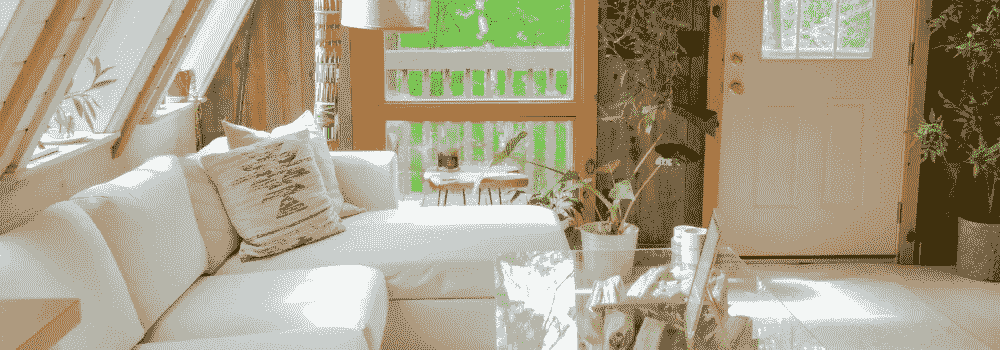

# 短期租赁投资指南

> 原文：<https://medium.com/coinmonks/guide-to-investing-in-short-term-rentals-369a3068678e?source=collection_archive---------5----------------------->

将赌注押在股市上以获得强劲的投资组合，这不适合胆小的人。股票容易波动，而投资房地产市场可以有效地产生收入，没有不可预测性。事实上，投资短期租赁可能正是你的投资组合所需要的多样化。

短租前景不错。它可能会继续成为一个受欢迎的投资选择。如果目前的业主能够在许多城市和州的指导方针内继续经营，短期租赁可能是最佳的投资选择之一。

一些州最近才允许短期租赁，而另一些州正在通过立法反对短期租赁。在密歇根州，一些城市和自治市可能会在 2021 年 10 月的投票前禁止将私人住宅用于短期租赁。这种变化对国家来说是巨大的——不仅仅是拥有这些房屋的投资者。密歇根州，以及许多其他国家，是最好的地方之一，投资度假出租。

像 Airbnb、VRBO 和 Booking.com 这样的公司已经让短期租赁成为一个家喻户晓的术语，这使得投资度假租赁物业比以往任何时候都更容易获利。房地产所有者现在可以利用短期住房和度假租赁需求，而不是寻找长期租户和进行背景调查。短期租赁通常租期不到一个月，因此与按年出租相比，业主可以获得更多租金收入。

但让我们进入短期租赁的细节，投资度假租赁物业，以及它们对投资者的可行性。

# 什么是短租物业？

短期租赁物业是指租期少于一年的租赁。这些房产可以是[单户住宅](https://blog.ark7.com/property-update/ark7-expands-to-chandler-az/)、[多户住宅](https://blog.ark7.com/blog/memphis-multifamily/)、共管公寓或联排别墅。一个人通常会考虑投资度假租赁物业，用于短期租赁住宿，而不是打算自己住在租赁的房子里。

度假屋是绝佳的短期租赁选择，尤其是在投资度假租赁的最佳地点:受旅游业欢迎的目的地。但那些处于两者之间的人，比如那些最近卖掉房子、正在等待新房子关闭的人，也可以使用短期租赁来避免陷入一年期租赁的困境。近年来，短租行业蓬勃发展，特别是对于那些想在不共享公共空间的情况下共度时光的家庭来说。拥有适合大型团体的空间、丰富的厨房设施等，提供更真实的旅行体验。

短期租赁是极好的投资机会，但物业管理是必须的，因为这是一个良好的当地市场的工作知识。

# 短租盈利吗？

如果管理得当，短期租赁可以非常有利可图。但这不是那种[被动产生收入的投资。在你决定投资这种类型的财产之前，有几件事你需要考虑:](https://blog.ark7.com/blog/getting-started-on-ark7/)

*   **是目的地吗？**每年有大量游客的城市和州是短期租赁的理想地点，因为游客可以享受家的舒适，而不必支付酒店费用。
*   **当地有哪些法律？城市法令和州法律法规经常为房地产创造条件。一些城市对最短停留时间有严格的规定，这可能会阻碍你的创收。让自己熟悉这些当地的限制，即使你是在有利于这些住宿的地区投资短期租赁。像 Airbnb 这样的租赁平台也有你租房时必须遵守的规则，尤其是清洁指南。**
*   你有营销计划吗？因为如果没有，就像建立了一个网站，却没有给任何人提供网址——这不是“如果你建立了网站，他们就会来”的情况。一个绝妙的营销策略可以让一笔小投资变成一座金矿——如果你不花太多心思，你就会跌到谷底。你可能会想，“这是旅游中心！”你不需要营销策略——也许是这样，但你仍然应该有一个如何营销房产的计划。想想高分辨率的照片、Matterport 视频和平面图——尽可能多地展示酒店的内外。人们喜欢能够想象自己在一个租赁点，例如如果布局符合他们的需求。对酒店的详细描述以及住宿中包含的所有内容也是必须的。让你的潜在客人知道租赁周围的所有便利设施，因为这有时是人们寻找短期租赁场所的决定因素。在 Airbnb、VRBO 和 Booking.com 等第三方预订引擎上列出您的酒店，以获得最大的知名度。最后，如果你有社交账户，确保你发布了你的租赁链接。你的朋友、家人和未来的客人会把你的租房消息传开，这通常是最好的宣传。

> 交易新手？试试[密码交易机器人](/coinmonks/crypto-trading-bot-c2ffce8acb2a)或者[复制交易](/coinmonks/top-10-crypto-copy-trading-platforms-for-beginners-d0c37c7d698c)

# 如何经营短租

像任何其他投资一样，投资短期租赁需要一个强有力的战略来使其发挥作用并看到利润。投资短期租赁——尤其是投资度假租赁的最佳地点——似乎是一种快速盈利的方式。但特别是如果房子位于旅游热点，市场可能会饱和，竞争过度。营销你的投资对确保你的利润稳定至关重要。从维护适当的会计到维护物业本身，经营短期租赁需要特定的方法和经验。如果你从未经营过租赁业务，这里有一些建议:

# 保持准确的记录

业主往往会在细节上陷入困境——筛选客人、物业维护、管理房源、掌握评论——所有这些加起来，特别是如果你是一个人的表演，而且你的物业几乎总是被租出去。但是不管你有多忙，有条理是很重要的，包括控制财产税、保险、维护计划和账单，以及任何其他属于业主的费用。

对一些人来说，独自经营短期租赁是不可行的。如果你觉得很难处理，专业的物业经理可以帮助你。如果这超出了你的能力范围，至少可以考虑找一个导师或者其他你认识的人，他们知道短期租赁投资领域的诀窍，可以指导你完成这个过程。

# 筛选潜在的客人

仅仅拥有完美的房产形象是不够的——现在你必须对你允许入住的客人进行选择，因为不幸的是，租给错误的人可能会让你的房产不那么完美。这就是为什么像 Airbnb 这样的平台允许你给你的客人打分，而不是反过来。如果你使用一个平台来列出你的财产，你可以看到其他财产所有者与那个客人有过什么经历，比如他们在以前的住宿中如何遵守规则，他们是否损坏了财产等等。

# 使用动态定价

你经常可以在阳光明媚、气温从不低于 75 度的地方找到一些短期出租——加州的短期出租总是有人问津！但并不是所有的目的地都享受这种奢侈，所以关注该地区的活动可以帮助你向外地游客推销你的租赁。使用动态定价工具——甚至手动调整价格，使其随季节或当地事件而波动，可以帮助你实现利润最大化。你甚至可以将自己的定价与竞争对手保持一致——看看竞争对手也无妨。

# 保持财产得到维护

大多数人期望短期租赁的房产有一定程度的维护。例如，如果你租的房子气候较冷，家里有足够的暖气吗？如果这是一个没有供暖系统的夏季度假小屋，在冬天出租可能是不可能的。

酒店的整体清洁度也是一个因素。大多数人都希望租来的房子一尘不染——不应该有其他人住过的迹象。保持您的酒店维护良好可以导致一致的预订和星级评价从您的客人。准备建立一个日常维护计划，并在每次入住结束时进行适当的深度清洁。如果你正忙于物业管理的其他方面，考虑雇佣一个维护团队和清洁服务来处理这些任务。

# 提供最好的客户服务

无论提供什么样的服务，人们都期望得到优质的客户服务。出租物业也不例外。如果你所在的地区没有很多竞争对手，你可能会过得轻松一些，但是如果你有很多激烈的竞争，你就需要更进一步。如果你的短期租赁只是你所在地区数以千计的租赁中的一个，你真的需要带来“哇”的因素。

考虑提供更多关于你所在地区的信息，比如去哪里吃饭或购物。回答他们可能提出的任何问题，如果他们有任何特殊要求，尽快满足他们的需求。如果你有预算，可以考虑提供一些客人离开时可以随身携带的特殊物品，比如浴衣。当客人可以看到你真诚地关心他们的住宿质量，他们会留下一个很好的评论，这可能会导致额外的预订——更不用说；他们可能也会回来。

# 如何最大化短期租金

在房地产行业，成功或失败取决于很多因素——但它们都归结为一点:你投入多少，就会得到多少。这是商业中的基本规则，房地产也不例外。尽管地理位置、当地房地产市场和你的整体商业模式都发挥了作用，但这一切都取决于你。

最大化短期租赁投资的最好方法之一就是对房产进行持续投资。真的是小事。你能让你的房产越“温馨”，就越好。另外，能够在你的客人逗留期间照顾他们，可以真正让他们成为回头客，这本身就是一个广告。

# 去哪里投资短期租赁房产

这完全取决于多种因素。位置，位置，位置，对吗？你希望租房离你住的地方近吗，这样你就可以亲自照顾客人了？还是会让物业管理公司处理物业？

你还需要查看州和地方的短期租赁法规，因为不是所有的地方都像其他地方一样对这种类型的财产有利。关注房地产行业的趋势不会有坏处。作为一名投资者，如果你决定卖出，你只接受能产生稳定收入和正回报的投资，这已经是你工作描述的一部分了。

实现这一目标的最佳方式之一是寻找那些受游客欢迎但又有点人迹罕至的地区，这样你就不会有太多的竞争。每个目的地都是不同的，但至少，选择一个全年都有稳定游客涌入的地方。

# 加入 Ark7，被动赚取

投资短期租赁是一个很好的赚取收入的方式。尽管有些人认为这是一种被动收入投资，但它确实需要一个精通房地产、有时间和金钱的人来完成。优秀的沟通也不会有坏处。

当你在 ark 7 上投资房产时，你可以完全放手，让你的投资资金为你服务，而无需踏足房产或登录访客。要了解更多信息，[请今天访问我们的网站](https://www.ark7.com/contact)。

> 加入 Coinmonks [电报频道](https://t.me/coincodecap)和 [Youtube 频道](https://www.youtube.com/c/coinmonks/videos)了解加密交易和投资

# 另外，阅读

*   [OKEx vs KuCoin](https://coincodecap.com/okex-kucoin) | [摄氏替代品](https://coincodecap.com/celsius-alternatives) | [如何购买 VeChain](https://coincodecap.com/buy-vechain)
*   [ProfitFarmers 回顾](https://coincodecap.com/profitfarmers-review) | [如何使用 Cornix Trading Bot](https://coincodecap.com/cornix-trading-bot)
*   [如何匿名购买比特币](https://coincodecap.com/buy-bitcoin-anonymously) | [比特币现金钱包](https://coincodecap.com/bitcoin-cash-wallets)
*   [瓦济里克斯 NFT 评论](https://coincodecap.com/wazirx-nft-review) | [比茨盖普 vs 皮奥克斯](https://coincodecap.com/bitsgap-vs-pionex) | [坦吉姆评论](https://coincodecap.com/tangem-wallet-review)
*   [如何使用 Solidity 在以太坊上创建 DApp？](https://coincodecap.com/create-a-dapp-on-ethereum-using-solidity)