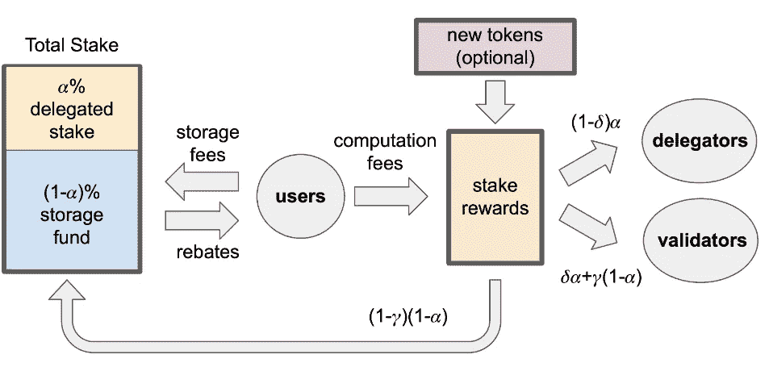

# Mysten 实验室 Sui 区块链指南

> 原文：<https://medium.com/coinmonks/guide-to-sui-blockchain-by-mysten-labs-f3f2ce0ecf9?source=collection_archive---------0----------------------->

Source: sui.io

当一群前 Meta(脸书)开发者聚集在一起，建立一个由一些最大的加密风投支持的新区块链项目时，人们最好开始关注。在本文中，我将向您展示 Sui 是什么，以及为什么投资者应该关注它。

## 👨‍🔧👩‍💼👨‍💻**隋身后的车队**

Sui 是由位于加州帕洛阿尔托的[迈斯腾实验室](https://mystenlabs.com/)研发的区块链。创始人是 Meta 的 Novi Research 的前雇员，并在 Diem(脸书已停产的数字货币项目)担任建筑师。他们五个人是:

*   郑永健([领英](https://www.linkedin.com/in/chengevan/))
*   阿德妮娅·阿比奥顿([领英](https://www.linkedin.com/in/emmanuel-abiodun/)
*   萨姆·布莱克希尔( [LinkedIn](https://www.linkedin.com/in/sam-blackshear-599b3965/) )
*   乔治·达内齐斯( [LinkedIn](https://www.linkedin.com/in/gdanezis/)
*   康斯坦丁诺斯·查尔基亚斯([领英](https://www.linkedin.com/in/chalkiaskostas/))

看看他们在 LinkedIn 上的个人资料，就会发现他们的团队在编程和密码学等领域拥有丰富的经验。似乎也有足够的领导经验来处理组织部分。

Mysten 实验室的团队目前正在进行两个项目:

*   [Sui Move](/mysten-labs/why-we-created-sui-move-6a234656c36b) ，一种基于 2018 年为脸书 Libra (Diem)项目创建的原始 Move 的修改后的编程语言。
*   Sui 项目，具有可水平扩展的吞吐量和存储的分散式区块链。

好吧，那隋是什么？

## ⛓️ **隋区块链项目**

像任何其他新区块链项目一样，隋也向我们承诺了许多创新，使其成为用户的最佳解决方案。事实上，在通常的营销谈话背后有一些有希望的想法。

*   据开发商称，隋和其他最大的不同在于上的所有生物都被设计成一个独立的物体。因此，Sui 上的事务可以并行执行。目前的 TPS 据说是 120.000 左右。
*   此外，Sui 还可以通过向每个权限添加工作人员来进行水平扩展。这种设计将大大提高交易速度。
*   Sui 使用授权的利益相关者共识证明机制。
*   Sui 还可以处理大型链上存储。
*   燃气机制:验证者设置每个时段的参考燃气费用，即 24 小时。这确保了气体进料不会从一分钟到下一分钟波动。如果验证者将费用定得太高，他们将获得较少的块奖励。为了促进良好的行为，验证者需要互相评估。目标是气体对用户来说足够低，但也足够支付验证者的费用。
*   Sui 现在有一个 [devnet](https://docs.sui.io/build/devnet) ，其中包括 4 个由 Mysten Labs 运营的验证器节点。

## 📊**隋组学**

隋区块链上的本土令牌是隋。将发行的总额是 100 亿英镑。mainnet 推出时，部分供应将投放市场。其余的将在未来几年内授予或作为赌注奖励发放。隋代币是可以分割的。

重要提示:这枚硬币还没有公开出售。

该令牌将用于:

*   成为 PoS 机制的一部分。
*   在执行和存储交易以及链上发生的其他活动时支付汽油费。
*   用作货币、交换媒介、价值储存手段等。
*   治理活动，如在线投票。

*Tokenomics of Sui (source:* [*docs.sui.io*](https://docs.sui.io/learn/tokenomics)*)*

## 🤑 **Mysten 实验室的投资者**

迄今为止，Mysten 实验室已经完成了两轮融资，一年内筹集的资金总额为 3.36 亿美元。

*   2021 年 12 月，Mysten Labs 获得 a16z 领投的投资人 3600 万美元 A 轮资金。
*   2022 年 9 月，Mysten Labs 获得了由 FTX 风险投资公司领投的 3 亿美元 B 轮融资。
*   Mysten 实验室也有币安的支持。

当像这样的大投资者参与一个项目时，这通常是一个好迹象。因为为了获得数百万美元的资金，像隋这样的项目必须经过严格的分析和评估过程，在此过程中，商业模式、使用的技术和管理的各个方面都要接受检查。

## 🌱**社交媒体**

隋活跃在各种社交媒体平台上。关注者的数量相当大，这当然也是因为该团队提供定期内容。包括技术和其他方面的新闻和更新。据我所知，用户参与度也不错。

*   [隋的推特](https://twitter.com/mysten_labs) ~78k 粉丝
*   [隋的媒介](/@mystenlabs) ~530 追随者
*   [隋的不和](https://discord.com/invite/Sui) ~129k 成员

考虑到以上因素，我们正在寻找一个坚实的 L1 区块链项目。但是还有一个更重要的点我想讨论一下:Aptos。

## ⚔️ **对比:隋 vs 阿普托斯**

因为有了 Aptos，帕洛阿尔托的前 meta 工程师们正在进行另一个 L1·区块链项目。

你可以在这里查看我关于 Aptos 的文章。

 [## Aptos 区块链分析:机遇与风险

### 是时候对 Aptos 进行分析了，Aptos 是 Aptos 实验室开发的第 1 层区块链，旨在提供更好、更快、更可靠的性能…

medium.com](/coinmonks/aptos-blockchain-analysis-opportunities-risks-1f3b0cd5f657) 

由于创始人的背景非常相似，隋和 Aptos 有许多相似之处。

*   两者都是由前 Meta (Diem)团队成员构建的。
*   双方都在努力建设他们声称的“更好、更快、更安全的区块链”。
*   区块链的两个项目都使用了 Move 编程语言。
*   两者都使用并行执行来加快事务时间。
*   两家公司都从区块链领域的顶级投资者那里获得了超过 3 亿美元的资金。
*   都有相对较高的估值。

然而，与 Aptos 相比，在查看单个项目的状态时也有一些不同。

*   由于项目众多，Aptos 的生态系统比 Sui 先进得多。
*   Mysten Labs 的媒体曝光率似乎也更低，社交媒体账户上的粉丝也更少。

在这一点上，很难说 Sui 和 Aptos 谁会是用户和投资者更好的选择。然而，由于双方都有充足的战争资金，我们可能还需要一段时间才能选出赢家。

## ⚠️ **与隋有关的风险**

作为一个新项目，隋也伴随着一些风险。

*   由于还没有推出测试版，所以仍然存在许多不确定性。
*   竞争非常激烈。还有很多其他的 L1 区块链和 Mysten 实验室将仍然有很多工作要做，以获得更多的项目，并在用户中产生必要的宣传，以取得持久的成功。
*   虽然是在 Meta 开发的，但 Move 仍然是一种非常新的编程语言。这可能会在雇用不熟悉项目迁移的新开发人员方面造成障碍，从而导致延迟。但是，从外部很难判断这实际上是不是 Mysten Labs 的问题。

好了，该结束了！

## 💡**我的想法**

一方面，隋似乎是一个很有前途的区块链项目，它有一个拥有必要技能和知识的团队，以及强有力的投资者。

另一方面，很多事情仍然不清楚，我怀疑所有这些是否证明这么早对公司进行超过 20 亿美元的估值是合理的。如此高的市值将使 SUI token 在目前的排名中排在第 30 位左右。这就是为什么我想知道这个项目在未来有多大的价格增长空间。

尽管如此，如果你想接触一个新的 L1 项目，并拥有良好的基础，你绝对应该把这个项目列在你的清单上。

*声明:文章仅代表作者个人观点。它仅用于教育和信息目的，不应被视为财务建议。*

## 📚来源

【https://pixelplex.io/blog/what-is-sui-blockchain/ 号

[https://cryptotvplus . com/2022/08/sui-all-you-need-know-on-cryptos-next-major-L1/](https://cryptotvplus.com/2022/08/sui-all-you-need-to-know-about-cryptos-next-major-l1/)

[https://www.crunchbase.com/organization/mysten-labs](https://www.crunchbase.com/organization/mysten-labs)

[https://www.youtube.com/watch?v=ItHXDdyZ_s0](https://www.youtube.com/watch?v=ItHXDdyZ_s0)

[https://beincrypto . com/my sten-labs-rises-from the ashes-of-diem-raising-in-funding/](https://beincrypto.com/mysten-labs-rises-from-the-ashes-of-diem-raising-300m-in-funding/)

[https://docs.sui.io/learn/tokenomics/sui-token](https://docs.sui.io/learn/tokenomics/sui-token)

 [## 重述隋 AMA:记号经济学

### 注意:您可以在我们的 Sui 开发者门户网站上找到关于 Sui 标记组学的更多信息。

medium.com](/mysten-labs/recap-sui-ama-tokenomics-ca00967b937d) 

> 交易新手？尝试[加密交易机器人](/coinmonks/crypto-trading-bot-c2ffce8acb2a)或[复制交易](/coinmonks/top-10-crypto-copy-trading-platforms-for-beginners-d0c37c7d698c)