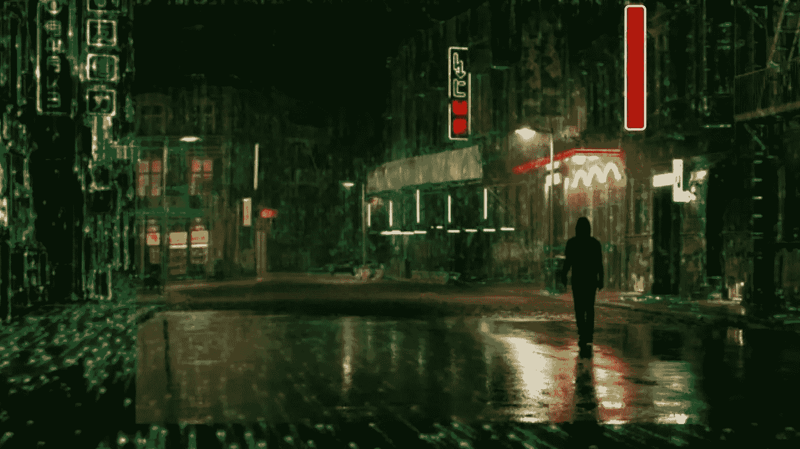

# 受乐观情绪驱动，黑客入侵了 NFT 最大的市场

> 原文：<https://medium.com/coinmonks/hacker-hacked-the-largest-nft-marketplace-powered-by-optimism-6f12194d40d0?source=collection_archive---------16----------------------->

## 第二层解决方案的乐观生态系统中最大的 NFT 市场 Quixotic 在更新后成为黑客攻击的受害者。

**This preview will be included in the NFT collection called “Uncle Fibonacci News”**

攻击者攻击了提供功能——提供可收集的代币。他部署了一份恶意合同，窃取了各种 ERC 20 代币中价值约 10 万美元的加密货币。

唐吉诃德团队修复了漏洞，但暂停了平台上的所有操作。

> 交易新手？试试[加密交易机器人](/coinmonks/crypto-trading-bot-c2ffce8acb2a)或者[复制交易](/coinmonks/top-10-crypto-copy-trading-platforms-for-beginners-d0c37c7d698c)

根据声明，NFTs 仍然是安全的。所有被盗资金自动补偿给用户，不需要他们采取任何行动。

让我提醒你，由于黑客和骗子在 2022 年第一季度的行动，加密项目损失了超过 12.2 亿美元。

最大的事件是虫洞和浪人攻击，分别造成 3 . 19 亿美元和 6 . 25 亿美元的损失。

三月黑客事件后，游戏 Axie Infinity 涉及的浪人侧链在 6 月底才被开发者重启。

📰 ***订阅*** [***斐波那契***](/@unclefibonacci) ***我来保持最新***

☕️eth:0x40a 8443813 e 8 fa 4a 9 f 88 f 18 b 77442 aa 4ed 91 fd4c

☕️BTC:1kkekcmdrghajztfxjoq 5 otg bv 1 mgucwdj