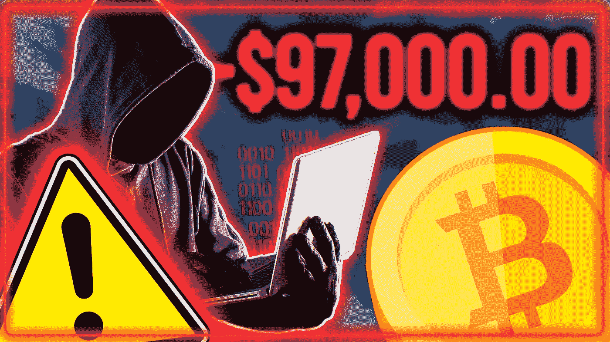

# 黑客想偷你的密码！这里有 6 种方法来保证它的安全

> 原文：<https://medium.com/coinmonks/hackers-want-to-steal-your-crypto-heres-6-ways-how-to-keep-it-safe-1418b7ffd37c?source=collection_archive---------24----------------------->

几个月前，黑客从区块链的一个网络窃取了约 6 亿美元，该网络与流行的 Axie Infinity 在线游戏有关，这是迄今为止最大的加密攻击之一。像这样的事件证实了加密是不安全的，投资者必须尽一切努力保护他们的资产免受黑客和罪犯的侵害。

在这篇文章中，我将带你了解拥有加密货币时面临的三种危险，以及帮助你保护资产安全的六种解决方案。

先说危险。由于区块链被认为是极其安全和不可更改的，许多人把这种技术称为“不可破解的”。然而，不幸的是，最近的事件表明，黑客可以在某些情况下访问区块链。以下是需要注意的三种最常见的危险！

# **加密货币的危险**

**51%攻击**

在验证过程中，被称为“矿工”的个人将审查交易，以确保它们是真实的。当一个或多个黑客控制了一半的挖掘过程时，可能会产生极其负面的后果。例如，挖掘者可以创建第二个版本的区块链，称为分叉，其中不反映某些交易。这使得矿工可以在 fork 上创建一套完全不同的交易，并将其指定为真实版本的区块链，即使它是欺诈性的。这也使得黑客可以双倍花费加密货币。这些 51%的攻击在较小规模的区块链更常见，因为矿工很难获得对更大和更复杂的区块链的有效控制。

**创建错误**

有时，在创建区块链的过程中可能会出现安全故障或错误。这在更大、更复杂的区块链中可能更常见。当这种情况发生时，寻找方法的黑客可以识别漏洞并尝试攻击。使用区块链网络运作的智能合约已经发生了这种情况。智能合同的常见功能包括协助合同交易的财务方面和自动化任务。[法律专业人士](https://www.epiqglobal.com/en-us/services/business-of-law-services)在他们的实践中可能会遇到智能合同，无论是在内部使用还是通过案例和客户问题的曝光。如果智能合约运行的区块链网络存在安全缺陷，黑客可能会在不被发现的情况下窃取用户的资金，因为欺诈活动没有被反映出来。不幸的是，由于区块链交易无法更改，要回被盗资金的唯一方法是制作一个所有用户都认可的权威区块链。

**安全性不足**

许多区块链黑客攻击发生在交易所，也就是用户可以交易加密货币的地方。如果交易所的安全措施薄弱，黑客将更容易获取数据。

# **如何保护你的加密资产**

接下来，我们将概述六个步骤来保护您的密码。这些步骤简单有效，任何人都可以使用。我们从最重要的开始！

**1。使用冷藏硬件钱包**

购买和使用冷钱包，也称为硬件钱包。冷钱包不连接互联网，因此不容易受到网络攻击。将您的加密密钥和私人密钥存储在冷钱包中是最可行的选择，因为它们是加密的，可以保证您的加密密钥和密钥的安全。有许多版本，目前的行业标准和最佳选择是 Ledger Nano，因为它是每个人的最佳选择。

为了证实这一战略，2019 年，日本交易所 BITpoint [发现](https://cisomag.eccouncil.org/attackers-nab-32-million-from-bitpoint-cryptocurrency-exchange/)有人以不同的加密货币从其热门钱包中未经授权提取了 3200 万美元，目标是超过 5 万名用户。该交易所在其热门钱包中持有五种加密货币:比特币、比特币现金、以太坊、莱特币和 Ripple。然而，BITpoint 澄清说，其冷钱包和现金持有量并未受到该事件的影响。这些证据足够得到一个硬件钱包了。

**2。使用安全的互联网连接**

在交易或进行加密交易时，只使用安全的互联网连接，避免使用公共 Wi-Fi 网络。即使在访问您的家庭网络时，也要使用 VPN 来提高安全性。VPN 改变您的 IP 地址和位置，保护您的浏览活动安全和隐私免受威胁。

**3。维护多个在线钱包**

由于创建钱包没有限制，您可以在多个钱包中分散您的加密货币投资。用一个钱包进行日常交易，其余的放在另一个钱包里。这将保护您的投资组合，并减轻您的在线加密帐户的任何违规损失。一般的经验法则是把 95%的密码放在硬件钱包里，5%放在网上钱包里。除非你押上你的密码。如果是赌注，那么在易受黑客攻击的交易所保留一部分密码的风险是可以计算的。

**4。保护您的个人设备**

确保您的个人设备拥有最新的病毒定义，以防御新发现的漏洞。使用强大的防病毒、防火墙和密码来提高设备的安全性，以避免黑客通过编写针对漏洞的代码来利用漏洞。

**5。** **定期更换密码**

在谈论安全性时，我们不能低估强密码的重要性。根据[的一项研究](https://www.prnewswire.com/news-releases/password-recklessness-leaves-american-millennials-at-risk-of-data-theft-301053289.html)，美国四分之三的千禧一代在 10 多个设备、应用和其他社交媒体账户上使用同一个密码。它还指出，他们中的大多数人在 50 多个不同的地方使用相同的密码。确保您有一个强而复杂的密码，很难猜到，并定期更改它。如果你不确定你的密码有多强，看看这个矩阵，它显示了黑客用暴力破解方法能多快找到你的密码。如果您有多个钱包，请使用不同的密码。并选择双因素身份验证或多因素身份验证来提高跨交换的安全性。

**6。不要被钓鱼**

通过恶意广告和电子邮件进行的网络钓鱼欺诈在加密货币领域非常猖獗。进行加密交易时要小心，避免任何可疑和未知的链接。

在最近的一次加密货币抢劫中，黑客组织“CryptoCore”通过鱼叉式网络钓鱼活动瞄准了加密货币交易所。自 2018 年以来，攻击者在两年内窃取了价值 2 亿美元的加密货币，目标是美国和日本的公司。 [ClearSky](https://www.clearskysec.com/wp-content/uploads/2020/06/CryptoCore_Group.pdf) 表示，CryptoCore 在实施鱼叉式网络钓鱼攻击之前启动了一个侦察阶段，以识别加密货币交易所员工和安全高管的电子邮件账户。这些攻击是通过假冒附属组织和员工的假域名，以及通过电子邮件在文档中嵌入恶意链接来进行的。

面对这种攻击，普通投资者甚至没有机会，所以要明智地选择你使用的加密交易所。

好了，我们有它，三个最常见的危险，和六个步骤来保证你的加密投资安全。

如果你喜欢阅读这篇文章，并从中获得了价值，请关注我，因为我经常发布关于投资股市或加密货币赚钱的新文章。

如果你想知道更多，请在这里观看视频或阅读我下面的文章！

> 交易新手？尝试[加密交易机器人](/coinmonks/crypto-trading-bot-c2ffce8acb2a)或[复制交易](/coinmonks/top-10-crypto-copy-trading-platforms-for-beginners-d0c37c7d698c)