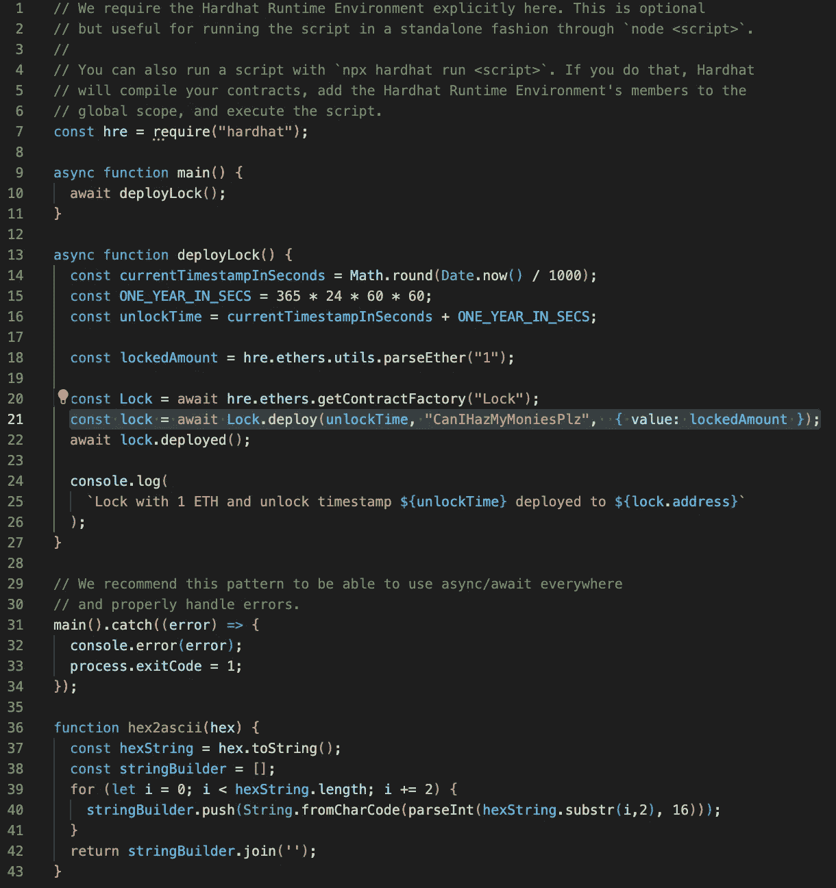

# 以太坊智能合约中的黑客秘密

> 原文：<https://medium.com/coinmonks/hacking-secrets-in-ethereum-smart-contracts-646c638c395c?source=collection_archive---------5----------------------->

演示为什么不能在“私有”方法中存储秘密。


当我开始学习 solidity 和 smart contracts 时，我第一次尝试了一个简单的合同，如果用户提供正确的密码，它将允许取款。

这似乎是一个足够简单的应用程序，我想我可以将密码作为一个私有变量存储在智能合同中，我甚至可以在未来使用 changePassword 方法进行更改。

`string private password = "CanIHazMyMoniesPlz";`

在许多应用中，存储秘密是件好事。
例如，我可以:

*   创建一个文字游戏，让人们根据猜测付费
*   隐藏秘密内容的 URL，只有令牌持有者才能看到
*   为 web3 游戏中的随机数生成器存储随机种子
*   制作一个 NFT，其特征在某个时间戳之后显现
*   等等。

然而，在我深入研究之后，我很快发现这根本不是处理私人信息的安全方式。可靠性合同存放在区块链，区块链对全世界公开。雄心勃勃的区块链探险家可以检索和利用你合同中的任何数据。

> 不要在你的智能合约中存储秘密！

尽管名字如此，存储在“私有”变量中的数据对每个人都是可见的。

# 如果他们不是，为什么他们被称为“私人”？

学习 solidity 时，您会了解到可以创建以下范围的变量(从最小到最大许可):

*   `private`、`internal`、`external`、`public`

当试图从一个智能协定访问另一个智能协定时，调用智能协定无法看到私有变量。因此，有人可能会认为可以安全地将秘密信息存储在私有变量中，而不必担心有人会访问和利用这些私有信息。

然而，这个声明并不意味着“私有”,因为没有人可以读取数据。相反，Private 指的是变量的范围(即什么代码可以访问它)。

这些是上面提到的关键字的更清晰的定义:

*   private:只能从自己的协定中调用
*   内部:可以从自身和派生的契约中调用
*   外部:可以从外部合同(所有非内部的合同)中调用
*   public:可以从内部和外部契约中调用

> Scope 关键字不影响变量的可见性，因为变量存储在区块链中，并且总是由每个人使用。

# 从头开始的演示


Photo by [Mark Williams](https://unsplash.com/@markwilliamspics?utm_source=medium&utm_medium=referral) on [Unsplash](https://unsplash.com?utm_source=medium&utm_medium=referral)

下面我将向你展示这个概念的一步一步的演示。

我们将执行以下操作:

1.  为开发环境设置 hardhat
2.  创建并编译智能合同和部署脚本
3.  设置本地以太坊节点，并在本地部署智能合约
4.  运行一些代码来检索智能协定中私有变量的值

打开你的终端，让我们开始吧！

# 安装安全帽


Hardhat 是一个流行的工具，用于开发以太坊上的可靠性合同。我们将在演示中使用它，因此我们首先需要安装它。

我假设你已经安装了 npm。如果您没有安装它，请按照如下指南进行安装:

[](/@hayasnc/how-to-install-nodejs-and-npm-on-mac-using-homebrew-b33780287d8f) [## 如何用自制软件在 Mac 上安装 NodeJS 和 NPM

### 步骤 1:安装自制软件

medium.com](/@hayasnc/how-to-install-nodejs-and-npm-on-mac-using-homebrew-b33780287d8f) 

首先让我们建立一个安全帽项目

1.  创建新文件夹
2.  进入文件夹并运行`npx hardhat`

3.为了保持代码简单，我们将在这个项目中使用 javascript。选择该选项并按 enter 键接受其余的默认选择。

您应该会看到类似下面的屏幕。


然后，它应该开始安装 npm 依赖项并设置您的项目。一旦完成，你可以检查目录，你应该会看到如下…


4.在您最喜欢的编辑器中打开`./contracts/Lock.sol`(我将使用 [VSCode](https://code.visualstudio.com/) )。

# 设置带有秘密的智能合同

您开立的合约在特定的时间内锁定。我们可以修改这个智能合约，如果您提供正确的密码(存储为私有变量),就可以有一个方法让您提前获得资金。

1.  创建一个新的私有方法，调用如下:
    `string private password;`
2.  更新构造函数以设置密码:

```
constructor(uint _unlockTime, string memory _password) payable {
    require(
        block.timestamp < _unlockTime,
        "Unlock time should be in the future"
    );
    unlockTime = _unlockTime;
    owner = payable(msg.sender);
    password = _password;
}
```

3.创建一个新的`forceWithdraw`方法，它与`withdraw`方法相同，但是接受一个密码并检查它，而不是时间戳。它应该是这样的:

```
function forceWithdraw(uint _password) public {
    require(strcmp(_password, password);
    require(msg.sender == owner, "You aren't the owner");
    emit Withdrawal(address(this).balance, block.timestamp);
    owner.transfer(address(this).balance);
}/** Compare 2 strings */
function strcmp(string memory s1, string memory s2) pure internal returns (bool) {
    return keccak256(abi.encodePacked(s1)) == keccak256(abi.encodePacked(s2));
}
```

(注意，Solidity 不能比较字符串，所以我必须添加一个助手函数`strcmp`来执行字符串相等检查)

您的整个合同应该如下所示:


4.最后，您需要更新部署设置来设置密码。您只需要将密码参数添加到部署方法中，如下:
`const lock = await Lock.deploy(unlockTime, "CanIHazMyMoniesPlz", {value: lockedAmount});`

我重构了部署脚本，将部署提取到一个私有方法中，但是您可以在下面看到我的脚本是如何结束的:



尽管这是人为的，但该合同将允许所有者通过输入密码提前取回锁定的 ETH。密码是在合同创建时设置的，但在合同代码本身中看不到。

正如您将在下一节中看到的，即使您没有访问部署脚本的权限，您仍然能够弄清楚私有`password`参数中存储了什么

# 运行本地以太坊节点并部署

现在您已经准备好了代码，您可以启动 ethereum 本地实例并部署到区块链。我们可以用 hardhat 命令很容易地做到这一点:

1.  运行`npx hardhat node`在本地运行你的节点
    ——注意这会产生一堆带有地址和私钥的钱包。
    -还要注意它在顶部运行的地址。最有可能的是它应该在`http://localhost:8545`上运行。该消息将如下所示:

```
Started HTTP and WebSocket JSON-RPC server at [http://127.0.0.1:8545/](http://127.0.0.1:8545/)
```

2.在另一个终端窗口中，使用以下命令编译脚本并将其部署到本地节点:

```
> npx hardhat compile ; npx hardhat run scripts/deploy.js --network localhost
```

通过检查您的以太坊节点终端窗口，您可以看到它已被部署，您应该会看到类似下面的内容:


3.请注意此处的合同地址。如果您返回到另一个窗口，您还应该在运行命令的响应中看到合同地址。它应该是这样的:

```
Lock with 1 ETH and unlock timestamp 1692636050 deployed to 0x5FbDB2315678afecb367f032d93F642f64180aa3
```

> 现在，您已经在本地部署了合同！

接下来，我们将进入控制台访问区块链，并找出密码！

# 从区块链中提取秘密

现在有趣的部分来了！让我们进入 javascript 控制台并检索存储信息。

1.  Hardhat 带有一个 javascript 控制台，提供一些关键功能，并自动加载库 [ethers.js](https://docs.ethers.io/v5/getting-started/) 。我们将使用这个库对本地以太坊区块链进行网络呼叫。加载控制台，并使用以下命令将其连接到本地主机上的区块链:

```
npx hardhat console --network localhost
```

2.接下来，我们将使用以下命令初始化一个提供者:

```
const provider = ethers.getDefaultProvider('[http://localhost:8545'](http://localhost:8545'))
```

将提供者视为区块链的客户端接口。这可以用来从我们的区块链节点获取我们需要的信息。

3.让我们使用提供者来检查所有者钱包的当前余额。我们可以对比一下这个来证明`forceWithdraw`确实起作用了。运行下面的命令并记住返回的数字(应该是 9998.99…):

```
> ethers.utils.formatEther(await provider.getBalance('0xf39Fd6e51aad88F6F4ce6aB8827279cffFb92266'))
'9998.999714736'
```

4.现在让我们连接到合同。使用以下代码执行此操作，但请确保将附加的地址替换为您的合同地址:

```
> const Lock = await ethers.getContractFactory('Lock');
undefined
> const lock = await Lock.attach('0x5fbdb2315678afecb367f032d93f642f64180aa3');
undefined
```

5.您可以通过使用错误的密码来测试 force retract 不起作用。尝试以下方法:

```
> lock.forceWithdraw("bad password")
Promise {
  <pending>,
  [Symbol(async_id_symbol)]: 1507,
  [Symbol(trigger_async_id_symbol)]: 6,
  [Symbol(destroyed)]: { destroyed: false }
}
> Uncaught:
Error: cannot estimate gas; transaction may fail or may require manual gas limit [ See: [https://links.ethers.org/v5-errors-UNPREDICTABLE_GAS_LIMIT](https://links.ethers.org/v5-errors-UNPREDICTABLE_GAS_LIMIT) ] (reason="Error: VM Exception while processing transaction: reverted with reason string 'incorrect password'",
...
```

如您所见，没有正确的密码，该命令不起作用。

> 让我们检查节点存储中的正确密码

6.在 hardhat 控制台中，运行以下命令

```
> const passwordHex = await provider.getStorageAt(lock.address, 2);
undefined
```

> 注:`2`代表内存位置。我将在下一节解释这一点

您可以检查为`passwordHex`返回的值，它应该如下所示:

```
> passwordHex
'0x43616e4948617a4d794d6f6e696573506c7a0000000000000000000000000000'
```

7.十六进制值对我们来说并不那么有用。我们现在必须将十六进制转换成字符串。让我们创建一个函数，将它转换成可读的字符串

```
> const decode = hex => {
... const hexStr = hex.toString();
... let stringBuilder = [];
... for (let i=0; i < hexStr.length; i += 2) {
..... stringBuilder.push(String.fromCharCode(parseInt(hex.substr(i,2), 16)));stri
..... }
... return stringBuilder.join('');
... }
undefined
```

8.对 passwordHex 运行函数以获取值

```
>console.log(decode(passwordHex))
CanIHazMyMoniesPlz
undefined
```


Safe Cracked!

现在，您可以使用找回的密码取回您的资金:

```
> ethers.utils.formatEther(await provider.getBalance('0xf39fd6e51aad88f6f4ce6ab8827279cfffb92266'))
'9998.99941542475'
> await lock.forceWithdraw('CanIHazMyMoniesPlz')
{
  hash: '0x80241e3ece8a5a2888978040cb9de0a7b918108f6cc28537fb796c1ff36d18ff',
  ...
}
> ethers.utils.formatEther(await provider.getBalance('0xf39fd6e51aad88f6f4ce6ab8827279cfffb92266'))
'9999.999367167822353675'
```

# 这个神秘的“2”位置是什么？

上面我忽略了一件事，那就是我们如何从`getStorageAt`函数中获得位置参数‘2’。

为了获得这一价值，我们必须了解存储是如何工作的。

这里有一个关于稳固性规则的简单总结:

*   在函数外部声明的变量是状态变量，默认情况下，所有状态变量都存储在存储器中。
*   `immutable`和`constant`实际上被编译成代码，因此不会占用任何存储空间。
*   每个存储槽的大小为 32 字节
*   如果符合
    ，单个存储槽可以容纳多个变量——例如，一个布尔值只需要一位，所以如果它们是背靠背的，你可以在单个存储槽中存储 8 * 32 = 256 个布尔值
*   结构和固定数组开始一个新的存储槽
*   动态数组为每个元素创建一个槽
*   映射是声明映射的键和存储槽的连接[查看[这就回答](https://ethereum.stackexchange.com/questions/114186/how-does-ethereum-fit-a-mapping-into-storage)关于映射如何存储的更多细节]

这有点简单，但对你来说足够了。如果您想了解 EVM 如何处理存储的更多细节，请查看本指南。

使用这些规则，我们可以查看我们的可靠性代码，并计算出密码存储在 slot 2 中，如下所示:


# 不要把秘密藏在仓库里

如上所述，存储在存储器中的秘密是不安全的。更糟糕的是，黑客可能会创建工具来简化或自动化许多步骤，我在上面建议让这个过程变得更快更容易。

你最好的办法是首先不要依赖这些秘密的存在。然而，有时您需要为您的应用程序存储秘密。寻找解决这个问题的方法超出了本文的范围，但是您可以探索以下一些方法:

1.  你的申请的那一部分需要属于区块链吗？区块链对许多用例来说非常好，但对其他用例来说就不那么好了。考虑是否有更好的选择，比如调用常规的网络服务。这造成了集中化的问题，但在某些情况下可能是相关的。
2.  能不能靠`msg.sender`。`Msg.sender`是一个不拥有键就无法真正操作的字段。在某些应用中，这可能有助于保护您需要保护的任何东西。
3.  作为上述内容的变体，钱包密钥可用于“签名”信息(即加密/解密)。您可以将加密的数据存储在区块链中，只允许签名者使用他们的密钥(存储在区块链之外)来访问它。[详见本代码](https://github.com/pubkey/eth-crypto/blob/master/tutorials/encrypted-message.md)
4.  一种有趣的方法是[提交揭示模式](https://karl.tech/learning-solidity-part-2-voting/)。这种模式应用有限，而且有点复杂，但它是一种策略，可以用来隐藏用户提供的信息，直到所有用户都提交了他们的输入。(例如，秘密拍卖)

区块链数据的隐私是一项尖端技术中的尖端。未来将继续开发方法来支持在区块链上存储私有数据的用例。然而，在那之前…

> 不要把秘密藏在仓库里
> 
> 加入 Coinmonks [电报频道](https://t.me/coincodecap)和 [Youtube 频道](https://www.youtube.com/c/coinmonks/videos)获取每日[加密新闻](http://coincodecap.com/)

# 另外，阅读

*   [SmithBot 评论](https://coincodecap.com/smithbot-review) | [4 款最佳免费开源交易机器人](https://coincodecap.com/free-open-source-trading-bots)
*   [比特币基地僵尸工具](/coinmonks/coinbase-bots-ac6359e897f3) | [AscendEX 审查](/coinmonks/ascendex-review-53e829cf75fa) | [OKEx 交易僵尸工具](/coinmonks/okex-trading-bots-234920f61e60)
*   [如何在印度购买比特币？](/coinmonks/buy-bitcoin-in-india-feb50ddfef94) | [瓦济克斯审查](/coinmonks/wazirx-review-5c811b074f5b)
*   [加密交易机器人](/coinmonks/crypto-trading-bot-c2ffce8acb2a) | [Probit 审查](https://coincodecap.com/probit-review)
*   [隐料斗替代品](/coinmonks/cryptohopper-alternatives-d67287b16d27) | [HitBTC 审查](/coinmonks/hitbtc-review-c5143c5d53c2)