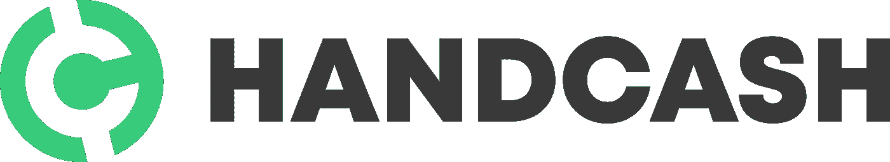

# 与 Circle 的 USDC 稳定币相结合的手动现金

> 原文：<https://medium.com/coinmonks/handcash-integrating-with-circles-usdc-stablecoin-33b3bc4bf9fa?source=collection_archive---------23----------------------->

在社交媒体上，HandCash 宣布与 Circle 的 USDC [Stablecoin](https://www.circle.com/en/usdc) 整合后，出现了“褒贬不一”的评论，但作为一个用 [HandCash](https://app.handcash.io/#/home) 构建[盈利应用](https://tipstampers.com)的开发者，这种整合令人欣慰。

通过我的眼睛，只有对比特币-SV 和 HandCash 用户的好处。有一种方便的方法将 BSV 转换成数字化的美元是没有坏处的。如果 USDC 的持有者可以在他们新发现的 HandCash 钱包里将他们的数字美元兑换成 BSV，这也没有什么坏处。通过这种方便的集成，消除了两个主要的棘手问题。

我不知道 Circle 和 HandCash 是否能够让用户将 USDC 兑换成实际的银行账户美元，但如果他们做到了，那将是 BSV 的又一次伟大整合，因为这将消除另一个痛点——甚至可能是 HandCash 的支付轨道选项“完整循环”之前的最后一个痛点

(双关语)

现在，也许一个与任何其他东西集成的 BSV 钱包对一些人来说似乎违反直觉，但当人们赚到 BSV 时——比如说，在我的应用程序中——一些用户会希望有一个*选项*将他们的收入从 BSV 这样的不稳定资产转换成稳定的等值美元。对于那些不愿意承担风险的人来说，它将风险从组合中剥离出来。拥有这样的选择是一件好事。

另一件好事是汉卡什选择了 USDC 而不是其他稳定的硬币。USDC 是市场上首要的稳定货币——有其适当和透明的支持——而且很可能在相当一段时间内保持这种状态。随着最近算法稳定币市场的混乱和围绕 Tether 具体持股的问题，USDC 已经成为数字美元转换最明显和最受欢迎的选择。合法性和透明度毕竟是有价值的。尤其是当不可避免的规则开始起作用的时候。

此外，市值超过 500 亿美元，这是一大笔钱，新用户很容易上手。这为汉卡什和 BSV(还有我)创造了巨大的机会。当然，这种整合不会立即导致 USDC 持有者外出并将其转换为 BSV，但它确实给了像我这样的 BSV 应用程序进入公众视线的激励和机会，吸引人们加入并使用我们基于 BSV 的应用程序。如果成功的话，USDC 持有者可以在他们的 USDC 转换钱包中轻松地将其持有的股份转换成 BSV 货币:HandCash。无论如何，潜力是存在的。

这里只是推测，但随着时间的推移，USDC 也有可能将 BSV 区块链用于他们的发行，因为他们很快就会意识到以太坊和其他地方的采矿费用是 BSV 所能提供的无法相比的。在这一点上，这是一个白日梦，是的，但鉴于他们对 BSV 和汉卡什的友好和接受，这似乎是很有可能的。这对于与行业内其他区块链合作的基于区块链的公司来说非常罕见。(感谢 Circle 无视噪音，看到了比特币和 HandCash 的潜力。)

因此，作为 BSV 的支持者和 HandCash 应用开发者，我对这种整合感到满意。在我看来，除了积极和潜力之外，似乎什么都没有。当专业的 Stablecoin 遇上专业的区块链，不禁让人觉得是数字天堂里的天作之合。

干得好，手卡什团队。

还发布了@[https://tipstampers . com/posts/hand cash-integrating-with-circle-s-usdc-stable coin](https://tipstampers.com/posts/handcash-integrating-with-circle-s-usdc-stablecoin)

> 交易新手？试试[密码交易机器人](/coinmonks/crypto-trading-bot-c2ffce8acb2a)或者[复制交易](/coinmonks/top-10-crypto-copy-trading-platforms-for-beginners-d0c37c7d698c)