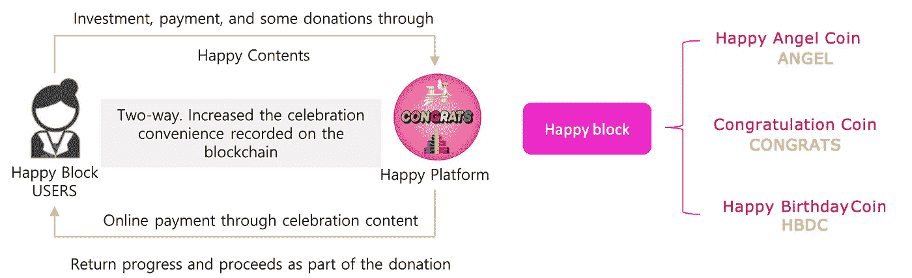

# 生日快乐现在在区块链上

> 原文：<https://medium.com/coinmonks/happy-birthday-is-on-blockchain-now-83dce18cd85?source=collection_archive---------29----------------------->

**区块链是一种让人们实现世界上几乎任何想法的技术。这里举一个“喜庆”的例子——**[**欢乐街区平台**](https://happycoinholdings.com/) **。**

Source: [Happy Block Platform](https://happycoinholdings.com/)

> “人天生就是要被庆祝的，所以不应该有被边缘化的人。这是一个任何人都可以自由认可庆祝活动并同时投资和庆祝的项目”*—*[*Happy Coin Holdings 白皮书如是说。*](https://happycoinholdings.com/whitepaper(ENG).pdf)

该生态系统由生日快乐硬币(HBDC)、祝贺硬币(祝贺)、快乐天使硬币(天使)组成，它们共同构成了快乐街区。祝贺币由快乐天使币和生日快乐币的共识算法决定。随着天使和生日快乐硬币被激活，快乐块形成，快乐流动资金池和祝贺硬币被设计成增加它们的价值。价值提升与用户的赌注和利用率挂钩，可以自由互换。

The platform structure. Source: [*Happy Coin Holdings’ white paper*](https://happycoinholdings.com/whitepaper(ENG).pdf)

生日快乐平台可以认为是一个奖励生态系统。当事件发生时，它会提供特殊的奖励，并创建一个集中的事件，在该事件中，这些奖励可以通过与大量未指定用户的交互来共享。当收到关于朋友生日的通知时，可以自动处理付款。客户可以使用自动礼品智能合约创建奖励分配结构，这将允许 Happy Platform 支持稳定的活动，而不是一次性的活动。

生日快乐硬币更像是快乐时刻的纪念品，而不是金钱方面的宝贵资产，但它也应该有一些作为货币的价值。作为礼物收到的硬币可以在各国的加盟店使用。该平台的用户可以使用送货、花束、生日蛋糕和生日相关的服务。硬币也可以作为捐赠给一些有困难的朋友，通过平台寻求帮助。

从技术上讲，快乐硬币是一种稳定的硬币。其价格由负责发行的快乐硬币控股公司支持。硬币在以太坊上运行。

乍一看，该项目似乎有点无用，但除了为亲近的人创建小型区块链生日“派对”外，还可以分析区块链上记录的生日庆祝数据，为多个市场创建各种服务形式。此外，该系统可用于大型公司和企业的人力资源部门的自动奖励。

顺便说一下，项目的合作伙伴包括币安、比特币基地和雅虎财经，所以这个项目可能比看起来更有潜力。

好吧，我们说“恭喜！”祝大家生活在一个幸福的区块链未来！

> 交易新手？试试[加密交易机器人](/coinmonks/crypto-trading-bot-c2ffce8acb2a)或者[复制交易](/coinmonks/top-10-crypto-copy-trading-platforms-for-beginners-d0c37c7d698c)