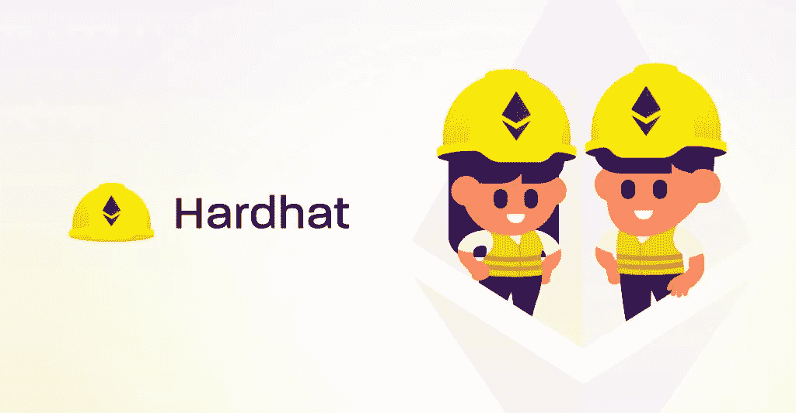

# 几个月带资源的安全帽学习指南。

> 原文：<https://medium.com/coinmonks/hardhat-learning-guideline-for-few-months-with-resources-5ffb0b29f90a?source=collection_archive---------73----------------------->

# Hardhat 是一个用于构建基于以太坊的应用程序的开发环境。以下是学习安全帽的几个月计划建议:

1.  首先让自己熟悉以太坊平台及其底层技术，比如区块链和智能合约。你可以通过阅读在线资源和教程，或者参加在线课程来做到这一点。
2.  接下来，安装 Hardhat 并在本地机器上设置一个开发环境。这通常包括安装 Node.js 和 Hardhat CLI，以及您需要的任何其他工具和依赖项。
3.  一旦建立了开发环境，就可以通过构建简单的基于以太坊的应用程序来尝试 Hardhat。您可以使用 Hardhat 文档和在线资源来了解不同的特性和功能，并获得您可以构建的项目的想法。
4.  随着您的进展，考虑进行更复杂的项目，包括与现有以太网的交互，如 mainnet 或 testnet。这将使您有机会在真实环境中部署和测试您的应用程序。
5.  除了构建项目，一定要花时间学习开发基于以太坊的应用程序的最佳实践，例如**安全性**、**可伸缩性**和**测试**。在以太坊平台上构建应用程序时，这些都是重要的考虑因素。

> 交易新手？在[最佳加密交易](/coinmonks/crypto-exchange-dd2f9d6f3769)上尝试[加密交易机器人](/coinmonks/crypto-trading-bot-c2ffce8acb2a)或[复制交易](/coinmonks/top-10-crypto-copy-trading-platforms-for-beginners-d0c37c7d698c)

总的来说，学习 Hardhat(或任何新技术)的关键是定期练习，当你获得更多经验时，承担越来越复杂的项目。

[https://hardhat.org](https://hardhat.org/)

有许多资源可用于学习 Hardhat 和构建基于以太坊的应用程序。这里有几个选项可以考虑:

1.  Hardhat 文档:官方的 Hardhat 文档是一个全面的资源，涵盖了开发环境的所有方面，包括安装、配置和使用。你可以在 https://hardhat.org/docs/[查阅文件。](https://hardhat.org/docs/)
2.  以太坊开发者社区:有一个庞大而活跃的以太坊开发者社区，他们很乐意帮助新人了解这个平台和 Hardhat。你可以加入在线论坛，如**以太坊栈交流**或**以太坊子论坛**，向其他开发者提问并获得反馈。
3.  在线课程:有许多专门涵盖以太坊开发和 Hardhat 的在线课程。一些选项包括 Udemy 上的“**以太坊和坚固性:完整的开发者指南**”和 Pluralsight 上的“**建筑以太坊 DApps** ”。
4.  书籍:有几本涵盖以太坊开发和 Hardhat 的书籍，包括 Andreas M. Antonopoulos 的“**掌握以太坊**”和 Ivan Liljeqvist 的“**以太坊智能合约开发**”。

总的来说，学习 Hardhat 的最好方法是结合不同的学习资源，并以动手的心态对待它们。练习构建项目并尝试不同的特性和功能，以便对 Hardhat 的工作原理有一个深入的了解。