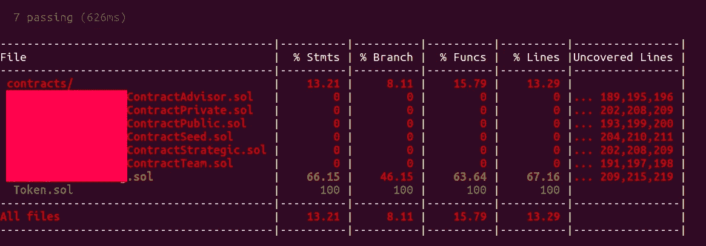
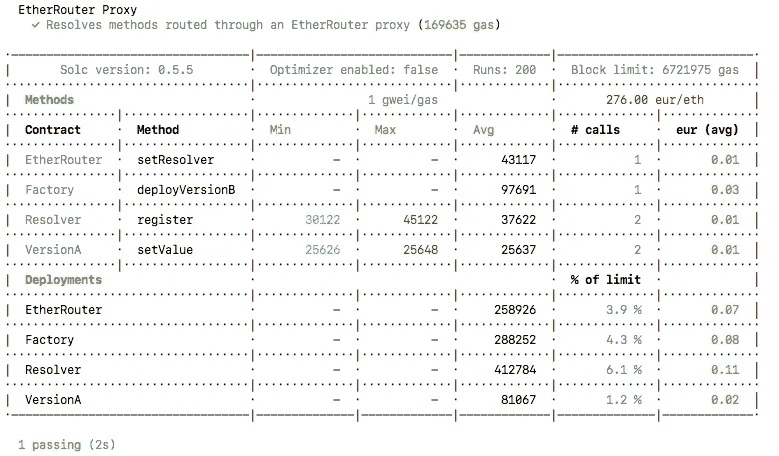

# 让我们的生活更轻松的安全帽插件

> 原文：<https://medium.com/coinmonks/hardhat-plugins-to-make-our-life-easier-79d5939d7d81?source=collection_archive---------35----------------------->


# **什么是安全帽？**

Hardhat 是开发人员用来测试、编译和部署智能合约的环境。Hardhat 通过包含一个内置的本地以太网和大量支持插件，使开发人员更容易工作。

今天我们来看看一些插件，它们会让我们的生活变得更简单。

# **可靠性-覆盖范围:**



可靠性覆盖用于发现我们是否覆盖了测试用例中代码的所有部分。

从 v0.7.12 开始，solidity-coverage 工具支持 Hardhat，直接在 HardhatEVM 上运行，这样就不需要手动安装了。

要使用这个插件，将下面一行添加到 hardhat.config.js 中

> **要求('坚固性-覆盖范围')**

那就跑

> **npx 安全帽覆盖范围**

# 安全帽-气体-记者:



为了更好地理解这个插件，我们需要了解 gas

# **什么是气？**

气是指在以太坊上成功进行一笔交易所需的费用。燃气费用以太坊的本币 ether (ETH)支付。天然气价格以 gwei 表示，gwei 本身是 ETH 的一个单位，每个 gwei 等于 0.000000001 ETH (10^-9 ETH)。

每当有人撰写智能合同时，他们都应该考虑相关的天然气成本。如果煤气费太高，它会耗尽我们所有的余额。

为了避免这样的事情，我们可以优化我们的代码，降低汽油成本。

要安装此插件

> **npm 安装安全帽-气体-报告器-保存-开发**

并将以下内容添加到 hardhat.config.js 中:

> **要求("安全帽-气体-报告者")；**

然后运行命令

> **npx 安全帽测试**

# 安全帽-部署:

Hardhat-deploy 附带了许多特性，这将减轻开发人员的工作。例如，在普通的部署脚本中，我们将使用 accounts[0]和 accounts[1]。这将会令人困惑，因为哪个帐户是用户，哪个是部署者。

为了避免这种混乱，这个插件有一个命名功能，在这个功能上我们可以指定哪个账户做什么。

要安装此插件

```
npm install -D hardhat-deploy
```

并将以下语句添加到您的`hardhat.config.js`

```
require('hardhat-deploy');
```

它还需要一个依赖项，所以添加下面的语句

```
npm install --save-dev  @nomiclabs/hardhat-ethers@npm:hardhat-deploy-ethers ethers
```

那就跑

> **npx 安全帽部署**

除了这些插件，在 hardhat 插件页面上还有很多其他插件。你可以从下面的链接下载。如果你想通过创建自己的插件来为 hardhat 做贡献，你也可以这么做。

[](https://hardhat.org/hardhat-runner/plugins) [## 由 Nomic Foundation 开发的面向专业人员的以太坊开发环境

### 插件是 Hardhat 的支柱，它们是用你在 Hardhat 中使用的相同的配置 API 构建的…

hardhat.org](https://hardhat.org/hardhat-runner/plugins) [](https://hardhat.org/hardhat-runner/docs/advanced/building-plugins) [## 由 Nomic Foundation 为专业人员构建插件|以太坊开发环境

### 在这一节中，我们将探索为 Hardhat 创建插件，这是集成其他…

hardhat.org](https://hardhat.org/hardhat-runner/docs/advanced/building-plugins) 

> *交易新手？试试* [*加密交易机器人*](/coinmonks/crypto-trading-bot-c2ffce8acb2a) *或* [*复制交易*](/coinmonks/top-10-crypto-copy-trading-platforms-for-beginners-d0c37c7d698c) *上* [*最好的加密交易*](/coinmonks/crypto-exchange-dd2f9d6f3769)

> 加入 Coinmonks [电报频道](https://t.me/coincodecap)和 [Youtube 频道](https://www.youtube.com/c/coinmonks/videos)获取每日[加密新闻](http://coincodecap.com/)

# 另外，阅读

*   [免费加密信号](/coinmonks/free-crypto-signals-48b25e61a8da) | [加密交易机器人](/coinmonks/crypto-trading-bot-c2ffce8acb2a)
*   杠杆代币的终极指南
*   [16 款最佳折叠电动自行车](/coinmonks/top-17-folding-electric-bikes-5e296f0918cb)
*   [28 款最佳电动自行车点评](/coinmonks/the-28-best-electric-bikes-review-and-buying-guide-in-2023-7bb3146cb403)
*   前三名[币安期货交易机器人](/coinmonks/top-3-binance-futures-trading-bots-e6031f84b3f9)