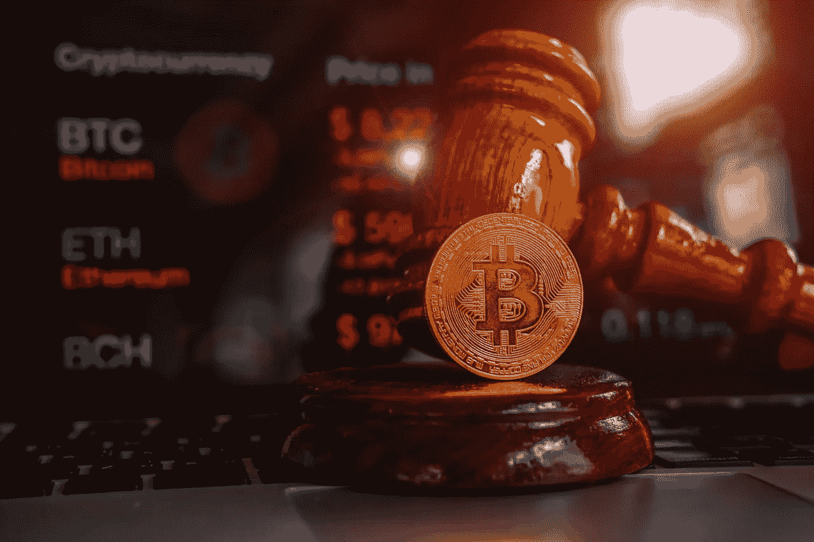

# 加密法规的协调:为新的欧洲央行法律做准备

> 原文：<https://medium.com/coinmonks/harmonisation-of-crypto-regulations-preparation-for-new-ecb-laws-f422bb19f013?source=collection_archive---------57----------------------->

据报道，来自 19 个欧盟成员国的监管机构将参加 7 月份的监管委员会会议，审议新政策框架 MiCA 的可能实施情况。

欧洲中央银行(ECB)将为新法律的实施做准备，警告欧盟成员国需要协调加密货币的法规。

根据英国《金融时报》周日发布的一份报告，欧洲央行对可能的双重监管感到担忧。问题可能是欧盟的相关中央银行和加密公司可能有相互重叠的法规。官员们正准备引入加密资产政策框架:称为加密资产市场，简称 MiCA。

6 月 30 日，欧洲议会、欧洲理事会和欧盟委员会达成协议，将加密货币的发行者和加密服务提供商纳入单一框架的法律控制之下。

据报道，来自 19 个欧盟成员国的监管当局将参加 7 月份的监事会会议，审议 MiCA 的可能实施。该法律生效后，资产服务提供商将必须满足某些要求，以保护投资者并警告客户投资的潜在风险。这些风险是由加密市场的波动性和对经济和政治新闻突然变化的敏感性造成的。

> 交易新手？试试[加密交易机器人](/coinmonks/crypto-trading-bot-c2ffce8acb2a)或者[复制交易](/coinmonks/top-10-crypto-copy-trading-platforms-for-beginners-d0c37c7d698c)

随后，官员们有 18 个月的审查期来评估拟议的法规，并决定它是否包括与加密部门有关的其他产品，如不可替代的令牌(NFT)。

采纳期可能相当困难，因为还没有实施严格的规则。据报道，一位不愿透露姓名的国家监管机构表示:“这非常具有挑战性。”。既然离 MiCA 还有 18 个月，问题就在于是说“在它到来之前，做你喜欢做的事，没有规定”，还是努力应对。

在采用 MiCA 之前，各个欧盟成员国的金融当局必须主要在其境内控制加密。与此同时，官员们最近签署了一项协议，建立一个机构来监督与加密相关的公司遵守反洗钱规则的情况。一个生动的例子是德国，联邦金融监督局负责向有意在国内提供服务的加密公司发放许可证。