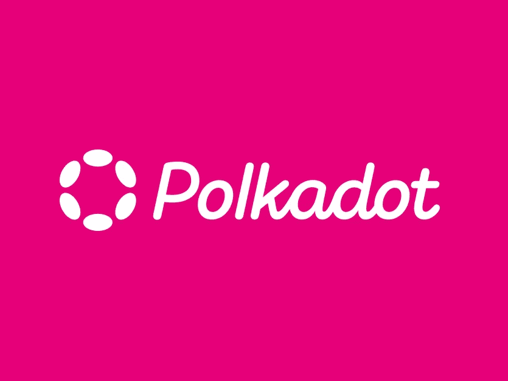
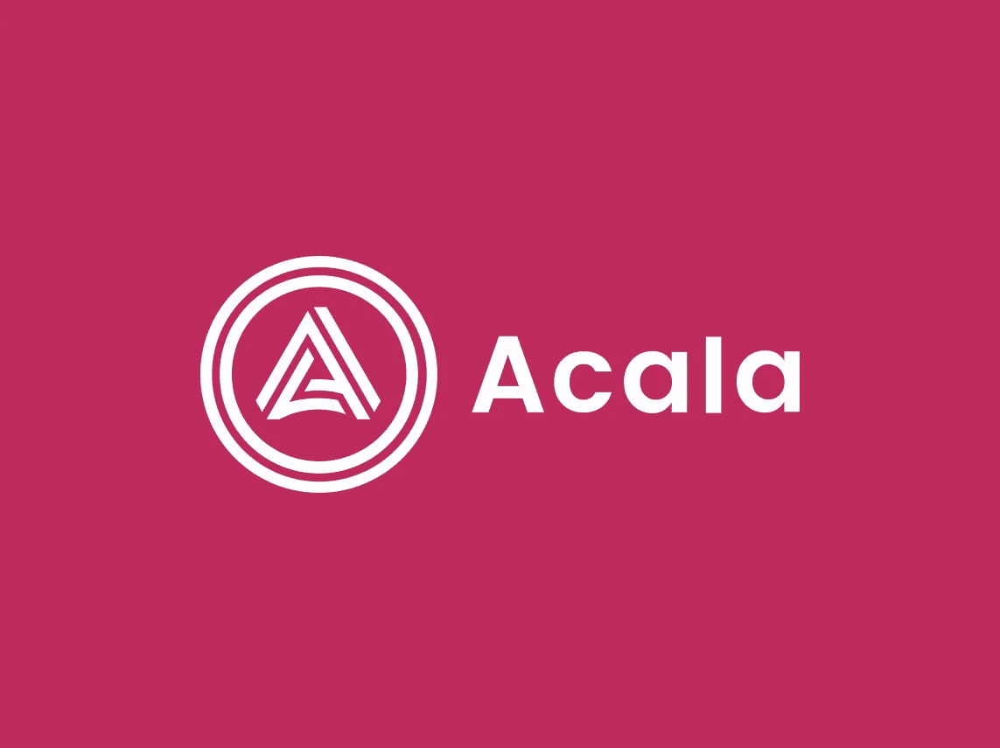
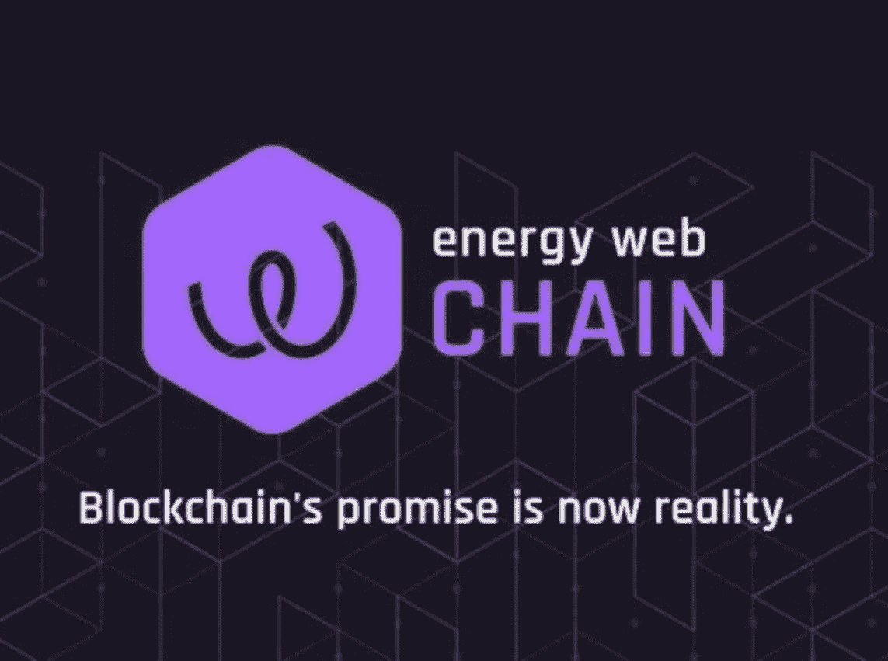

# 区块链通信解决了吗？

> 原文：<https://medium.com/coinmonks/has-blockchain-communication-been-solved-10a6f1e0c074?source=collection_archive---------55----------------------->

对可能性生态系统的一瞥。

Image: Volodymyr Hryshenko

除了各种安全性、可扩展性和定制问题之外，每个区块链的一个主要问题是，最重要的是区块链之间无法有效地相互通信。即使每个链都以一种智能的方式解决了一个特定的问题，也很难找到想要进行交互的共同点。第一个第三方解决方案专注于仅连接特定功能和/或由于架构原因排除其他区块链。不那么波尔卡多特( [**圆点**](https://phemex.com/academy/what-is-polkadot-coin) )，雪崩( [**AVAX**](https://phemex.com/academy/what-is-avalanche-avax-crypto) )，宇宙 [( **原子**)。](https://phemex.com/academy/cosmos-atom)这是我今天要关注的第一个电话。

Polkadot 被设计为第 0 层，这是一个可互操作的基础层，适用于所有区块链，包括其资产、交易和合同。作为一个异构多链网络，任何类型的数据都可以通过任何类型的区块链传输，从而为所有参与者提供共享的安全性和互操作性。

它的生态系统由建立在 Polkadot 之上或与之相连的项目组成。称为 parachains 的特殊区块链连接到 Polkadot 的中继链，能够并行处理并通过网桥进行通信。一个多链连接定制的区块链网络。

## ***波尔卡多特，DOT — $17.95，庞斯***

*由 2016 年成立的奇偶技术公司(Parity Technologies)建造，由以太坊前首席开发者加文·伍德(Gavin Wood)领导。该项目的开发由瑞士楚格的 web3 基金会负责协调。它在 2017 年的第一个 ICO 吸引了 1.45 亿美元，其中 9800 万美元不幸输给了一个 bug。2019/2020 年的第二轮融资为 Polkadot 又争取到了 1 亿美元。* [*https://polkadot . network/*](https://polkadot.network/)

目前有 166 个项目与波尔卡多特和草间弥生网络(测试网络)相连，其中 116 个是专门为波尔卡多特区块链建造的。到目前为止，100 个名额中的 14 个已经在公共科学图书馆拍卖。

**我们区分以下时隙获取模型:**

*   **常见的好副链**
    (关键功能如以太坊桥，“自由”)
*   **副线程**
    (由多个项目共享，现收现付模式)
*   **副链**
    (单个项目每两年租赁一次，副链槽拍卖)

从更广泛的角度来看，有 542 个项目以不同的方式致力于 Polkadot 的开源创作共享系统。有关当前项目的概述，请访问 https://parachains.info/#projects 的[和 https://www.polkaproject.com/#/](https://parachains.info/#projects)的

像任何 SaaS 平台一样，它的成功将主要取决于用户数量，也就是说将他们的定制区块链连接到 Polkadot 中继链的开发者数量。互联互通或者用通俗的话说就是区块链之间的“交流”是其价值主张的核心。

> 类似于脸书这样的平台，互联链的数量类似于注册用户的数量。效用随着梅特卡夫定律(不是摩尔定律)而增加:
> 
> 波尔卡多特网络的价值与系统连接用户数量的平方成正比。

在这个生态系统中，有两家公司特别吸引了我的注意力:

金融应用是加密领域最受期待的，它允许绝大多数用户以自主的方式进行投资和交易。平台界面简单，通过元掩码连接到协议是可能的，这使得它对于广大用户来说是高度可访问的。

## Acala，ACA——1.44 美元，脑桥，

*它成立于 2019 年，旨在成为 Polkadot 的最终去中心化金融网络和流动性中心。金融 dApps 支持交易、贷款服务、流动性供应、赌注和高利息收益。与 Terra 的 Ancor 协议类似，它由一种 ERC20 兼容的美元稳定币支持，计入其效用令牌价值以防止投机。* [*https://acala . network/*](https://acala.network/)

## **Acala 的主要资产:**

*   **aUSD** —波尔卡多特生态系统中第一枚分散的、加密支持的稳定硬币，使用 dot 作为抵押品铸造。
*   **LDOT & lcDOT** —流动性押记点，押记点的流动性储备资产。lcDOT 是流动性众筹 DOT，是 PLO 参与者借给某个项目的 DOT 的象征性表示。
*   ACA —具有固定供应的本地网络令牌。它充当稳定硬币创造的储备资产以及支付交易费用的货币。

截至本文撰写之时，Acala 的市值为 536，283，736 美元，24 小时交易量为 27，789，261 美元。有趣的是，它得到了潘迪拉资本的联合资助，这是一家我个人喜欢关注的风险投资公司。

 [## Acala 宣布推出流动性众筹贷款 DOT (LCDOT ),为 Polkadot 众筹贷款参与者提供持续的…

### LCDOT 加入 Acala 的衍生产品套件，在 Acala 的 DeFi 经济中启用新的 DeFi 用例

medium.com](/acalanetwork/acala-liquid-crowdloan-dot-lcdot-launch-on-polkadot-f28d8f561157) 

从各种各样的顶级项目中，我更愿意指出一个具有主流采用的巨大上升潜力的“缓慢增长者”。它拥有传统公司迄今为止最大的真实承诺，并解决了一场即将到来的全球规模的危机，这场危机将关系到我们所有人:

## 能源网，EWT-5.01 美元，活动方案

*EWF 是世界上最大的能源区块链生态系统——连接全球设备和用户之间的能源资产基础设施。能源网络基金会已经成为业内最大的开源生态系统，专注于能源领域的去中心化，并通过区块链技术成为世界能源未来的领先选择。* 

**

***能源网**的市值为 211，431，143 美元，24 小时交易量为 726，427 美元。相对较低的数字是由于项目处于早期阶段。到目前为止，它在 25 个国家有 100 多个合作伙伴，正在进行 50 个项目，包括几个政府和主要的能源公司。*

*我个人认为，能源是工业革命以来最重要的“商品”。数字经济将要求我们成功地供应、交易和管理能源资源。分散式网格层是西门子、谷歌、通用电气、意昂等投资者和合作伙伴的共同愿景。*

* [## 平价技术和能源网络合作伙伴推出新的能源网络联盟接力链

### 新联盟中继链将通过 Parity 的底层区块链框架实现 parachains 即服务

medium.com](/energy-web-insights/parity-technologies-and-energy-web-partner-to-launch-new-energy-web-consortia-relay-chain-205e66529441) 

你认为哪个解决方案是重要的？还有哪些项目推荐去看一看？很高兴知道你的想法。* 

*大家好，我是 Oama Richson，您最喜欢的关于区块链、隐私和预防性医疗保健的作家。确保留下来。*

*谢谢你。*

> *交易新手？尝试[加密交易机器人](/coinmonks/crypto-trading-bot-c2ffce8acb2a)或[复制交易](/coinmonks/top-10-crypto-copy-trading-platforms-for-beginners-d0c37c7d698c)*