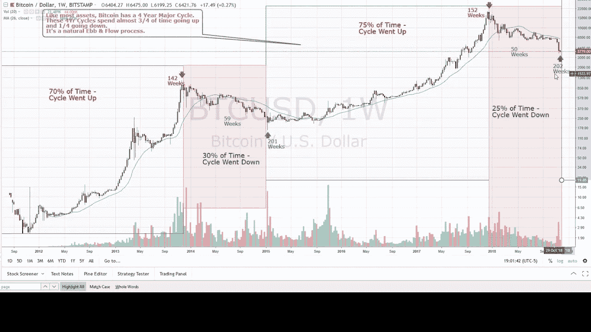

# 加密货币已经触底了吗？现在的市场趋势是什么！

> 原文：<https://medium.com/coinmonks/has-cryptocurrency-hit-its-bottom-what-current-market-trend-says-a7af4461be71?source=collection_archive---------6----------------------->

Image Source: Yahoo UK

现在是 2022 年底，加密货币在熊市中挣扎。市场充满了恐惧和不确定性。最近的新闻事件显示，比特币和替代币的牛市突破不太乐观。

随着[最近在 2022 年 11 月 FTX](/coinmonks/why-crypto-market-went-down-the-ftx-drama-explained-3d5b7ae3d0b0) (美国第二大加密交易所申请破产)的倒闭，投资者强烈要求对处理用户资金的集中式加密交易所的储备进行透明和独立审计。

另一方面，许多加密硬币正在升级他们的区块链技术。集中式加密交换在符合不同国家的监管框架要求方面取得了进展。Crypto.com、币安、比特币基地、库币和等大型加密交易所正在与第三方独立会计审计公司一起建立储备证明系统，从而建立更高的透明度标准。

总体而言，考虑到最普通的情况，短期内的近期趋势表明加密市场正在触底反弹，在撰写本文时，比特币(16，707 美元)和以太坊(1，178 美元)的当前价格显示出持续的熊市趋势。

> 目前，很难预测比特币和替代硬币在短期内的准确价格走势，因为加密市场表现出最动态的波动性，每个新闻事件都会迅速反映价格走势，这表明了其敏感性。

从新闻事件中，让我们了解未来六个月可能的市场趋势。

## #1 美联储加息:

Image Source: Macrotrends; Interest rate plot of 5 years showing the current rate at 4.5%

2022 年 12 月 13 日周二公布的美联储 CPI 报告显示，通胀率为 7.1%(低于 7.3%的预估)。它预测了一些积极因素，即美联储的鹰派立场正在发挥作用，从市场上消除了金融流动性。

美国联邦政府的目标是 2%的通货膨胀率。考虑到控制通胀的鹰派立场，市场预计 6 个月内将多次加息 50 个基点(0.5%)。

> 利率目前为 4.5%，是 5 年来的最高利率。

由于担心全球经济衰退，预期的加息周期可能会导致美国利率升至 5.5%以上。这种取向显示了股票和密码市场的长期熊市。科技股、标准普尔 500 和纳斯达克指数的下跌明显体现了这一趋势。

> 此外，债券收益率正处于最高水平，美元和其他法定货币一起升值。

## #2 币安打法律战:

Image Source: [Binance](https://www.binance.com/en/blog/from-cz/who-is-guangying-chen-and-is-binance-a-chinese-company-2386330931319516973)

美国司法部(US Department of Justice)一直在拖延提起与 2018 年之前的案件有关的刑事调查和洗钱指控，美国政府批评币安在美国提供没有 KYC 验证(Know your customer)的传统金融服务。

这条新闻见证了用户在 24 小时内从币安提取了价值 16 亿美元*(足够在孟买买一栋豪宅的钱)*的资金，以及来自长期投资者的等量新存款的增加。在撰写本文时，币安硬币的价格跌至 220 美元的每周最低点，目前交易价格为 245.8 美元。

币安方面，赵昌鹏(又名 CZ，CEO)表示储备充足，其中 80%主要在 USDT 和 BUSD 两地。币安实施并向许多发达国家的政府提供网络安全、执法项目和咨询援助，以保护投资者的资金和利益。

在法律方面，币安已在阿联酋、法国、美国、巴林和哈萨克等许多发达国家获得经营许可。

## #3 加密货币的经济周期:

Image Source: Bob Loukas (Youtube)

每个市场都在一个经济周期中运行。加密货币和传统金融的历史视角见证了全球经济依次经历市场顶部、底部、衰退和复苏。这些行动的发生是因为不同国家的中央银行的货币政策和宏观经济消息。

加密货币有一个 4 年的周期，牛市开始于比特币减半之前，随后是 1 年的上升趋势序列，最后 2 年是下降趋势和价格整合。

如果从经济周期的角度来看，比特币和替代硬币的当前设置突出了价格的触底和未来遥远的趋势逆转，比特币的下一个减半期将发生在 2024 年。

我们可能会在 2023 年年中左右看到加密市场的熊市趋势逆转，届时美国联邦储备委员会的加息周期预计将见顶，随后的降息将引发看涨情绪。

此外，考虑到投资者的人口实力，来自印度的一些积极的监管消息将使加密货币的 30%税收规则和 1% TDS 合理化，这将有助于推动大规模的牛市。

## 最后一行:

尽管加密货币市场似乎不受监管、不确定且令人恐慌，但该市场正朝着稳定和成熟的方向发展，从婴儿期到成年期。

不可否认，这个行业通过区块链和 web 3.0 给经济带来的技术革命在这一点上被许多管理机构和公众低估了。考虑到加密货币在全球的大规模采用及其经济潜力，我们不能禁止和逃避，而是必须接受加密货币，并将其作为一种资产类别小心地放在金融系统中。

加密货币是即将到来的技术金融世界的最终未来。比特币和替代币将在遥远的 3 年后恢复到历史高点(ATH)。然而，很难预测趋势逆转的确切时间。

从新闻事务来看，加密市场是最具活力的市场之一，它会立即从红色信号转变为绿色信号，有可能显示出成为全球经济领先指标的能力。

 [## Prajwal Barate -培养基

### 阅读 Prajwal Barate 在媒体上的文章。学生、山地自行车手、加密货币分析师和有抱负的内容…

medium.com](/@barateprajwal25) 

> 感谢阅读这篇文章，更多更新和见解，请点击上面的链接关注我的个人资料，并为下面的努力鼓掌。
> 
> *交易新手？试试* [*密码交易机器人*](/coinmonks/crypto-trading-bot-c2ffce8acb2a) *或* [*复制交易*](/coinmonks/top-10-crypto-copy-trading-platforms-for-beginners-d0c37c7d698c)
> 
> *分散密码持有量，了解* [*币安替代品*](https://coincodecap.com/binance-alternatives)
> 
> *加入 Coinmonks* [*电报频道*](https://t.me/coincodecap) *和* [*Youtube 频道*](https://www.youtube.com/c/coinmonks/videos) *获取每日* [*加密新闻*](http://coincodecap.com/)

# 另外，阅读

*   [复制交易](/coinmonks/top-10-crypto-copy-trading-platforms-for-beginners-d0c37c7d698c) | [加密税务软件](/coinmonks/crypto-tax-software-ed4b4810e338)
*   [网格交易](https://coincodecap.com/grid-trading) | [加密硬件钱包](/coinmonks/the-best-cryptocurrency-hardware-wallets-of-2020-e28b1c124069)
*   [密码电报信号](/coinmonks/top-3-telegram-channels-for-crypto-traders-in-2021-8385f4411ff4) | [密码交易机器人](/coinmonks/crypto-trading-bot-c2ffce8acb2a)
*   [最佳加密交易所](/coinmonks/crypto-exchange-dd2f9d6f3769) | [印度最佳加密交易所](/coinmonks/bitcoin-exchange-in-india-7f1fe79715c9)
*   [面向开发者的最佳加密 API](/coinmonks/best-crypto-apis-for-developers-5efe3a597a9f)
*   最佳[密码借贷平台](/coinmonks/top-5-crypto-lending-platforms-in-2020-that-you-need-to-know-a1b675cec3fa)
*   [免费加密信号](/coinmonks/free-crypto-signals-48b25e61a8da) | [加密交易机器人](/coinmonks/crypto-trading-bot-c2ffce8acb2a)
*   杠杆代币的终极指南