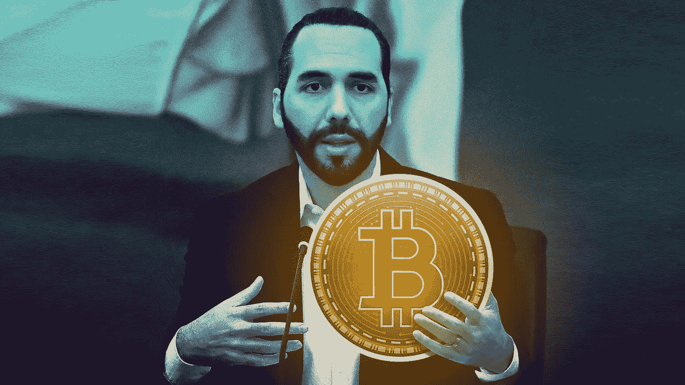
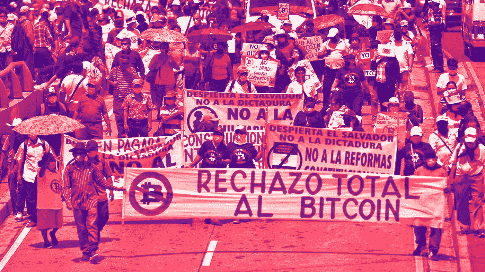
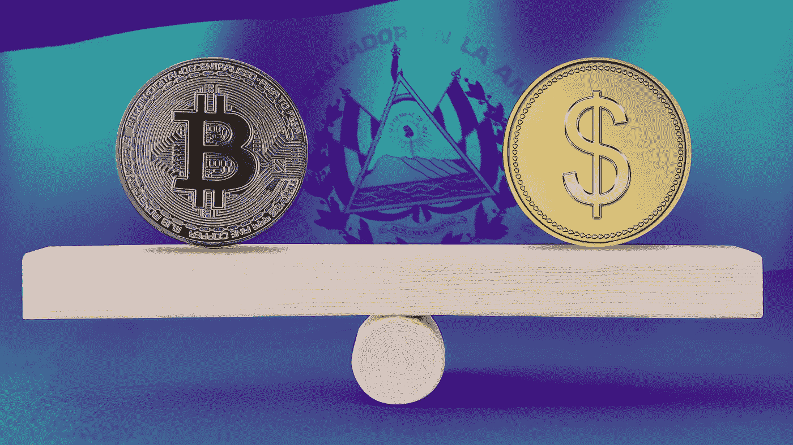

# 萨尔瓦多的比特币实验仅仅过了 1 年就已经失败了吗？

> 原文：<https://medium.com/coinmonks/has-el-salvadors-bitcoin-experiment-already-failed-after-only-1-year-58552673d1c6?source=collection_archive---------36----------------------->

每隔几年，crypto 中就会出现一些令人难忘的瞬间。脑海中浮现出的几个例子是，有史以来第一次用 1 万 BTC 的比特币购买了两个披萨，Mt Gox 黑客是第一个彻底摧毁市场的黑客，卡洛斯·马托斯(Carlos Matos)向人群大喊“Bitconnnnect ”,标志着 2017 年牛市的开始。加密史上最近的事件之一是中美洲国家萨尔瓦多采用比特币作为法定货币。就在一年多前的 2021 年 9 月 1 日，这个小小的发展中国家创造了历史，成为第一个将比特币合法化的官方国家。当我们走过这一当时有争议但大胆的举措的周年纪念日时，我们必须问……自那时以来情况如何？

**比特币如何成为萨尔瓦多的法定货币**

在世界上所有采用加密货币作为官方货币的国家中，为什么是萨尔瓦多？为什么不是像中国这样的全球超级大国或者像开曼群岛这样的避税天堂呢？甚至像香港或新加坡这样的城市国家？萨尔瓦多似乎不太可能，但当你靠近一点看时，它实际上是比特币实验蓬勃发展的完美匹配。这是一个发展中国家，不到三分之二的人口没有银行账户。这些公民可以通过他们的移动设备直接相互交换数字货币，而不是依赖于银行机构。萨尔瓦多的千禧年总统 Nayib Bukele 签署了一项法律，规定比特币是全国的法定货币，这意味着商人必须接受任何想用比特币支付的人的支付。政府还设立了一个名为 Chivo 的钱包，内含价值 30 美元的比特币，以帮助公民入门。

**萨尔瓦多在加密年成为一个不太可能的英雄**

这发生在以比特币为首的加密货币辉煌的一年，在 12 个月内经历了 10 倍的增长。像 MicroStrategy 和特斯拉这样的公司正在涉足数字货币，普遍的感觉是，这一次加密货币将会留下来，它将解决我们所有的问题。出于所有正当的理由，萨尔瓦多突然成为了前沿和中心。区块链企业家和爱好者开始搬迁，该国开始利用火山发电探索比特币采矿，甚至邀请其他国家领导人参加比特币讨论。布克勒总统甚至吹捧一个 10 亿美元的比特币贷款支持的城市，称为比特币城，这将是该国未来的技术中心。

对于任何参与加密的人来说，这都是一个激动人心的时刻，许多人都在问哪个国家会为下一个顶级数字货币开绿灯。当然，不是每个人都对这个消息感到高兴。以向发展中国家发放巨额法定贷款而闻名的国际货币基金组织(IMF)勃然大怒。他们坚持认为萨尔瓦多犯了一个可怕的错误，应该废除这项法律，因为数字货币仍然太不稳定。Bukele 总统用嘲笑该机构的 memes 回应，并加倍为政府金库购买更多比特币。地面上也出现了混乱，因为许多商人仍在努力过渡和采用，抗议活动发生了，因为许多人感到困惑和愤怒，他们是他们不同意的实验的一部分。

**比特币崩盘**

潮流已经改变了。Crypto 在那辉煌的一年接近尾声时达到顶峰，在 2022 年期间，它将收回自 2021 年初以来的大部分涨幅。与任何繁荣一样，投资者变得贪婪和过度杠杆化，最终流入的资金会枯竭，特别是在全球经济开始改变方向和通货膨胀开始的时候。萨尔瓦多的一袋比特币从购买时的 1 亿美元下跌到 2381 枚比特币的 4000 万美元左右。美国也以怀疑的目光关注着这种加密货币，它现在是法定货币，对美元的霸权构成了实际威胁。几位反对比特币的美国参议员提出了调查中美洲国家和实验结果的法案。

**风险与回报以及比特币在萨尔瓦多的未来**

尽管如此，萨尔瓦多继续推进这一大胆的计划，拒绝出售或屈服于国际货币基金组织的呼声。尽管国际货币基金组织在他们头上挥舞着 13 亿美元的发展计划，声称他们不能获得它，因为比特币对国家构成了风险。值得注意的是，尽管比特币可能不像一年前那样炙手可热，而且该国正在从其登月投资中获得巨大收益，但该国国内仍能感受到好处。汇款已经起飞，通过 Chivo 钱包占闪电网络使用量的 400%的增长。这导致了更便宜的利率，因为比特币是一个更实惠的选择。由于区块链和加密货币项目受到欢迎的监管和政治环境，该国的创新也在蓬勃发展。结合这一事实，即该国实际上并未出售其积累的任何比特币(意味着没有任何实际损失)，我们开始怀疑所有这些声称实验失败的文章是否完全真实。

没有人说这很容易，成为第一个接受比特币作为法定货币的国家总是一个有风险的举动。事实上，这个国家，以及布克勒总统，一年后仍然屹立不倒，这本身就是了不起的。看看接下来的 12 个月会给萨尔瓦多带来什么将是非常有趣的。

> 交易新手？试试[加密交易机器人](/coinmonks/crypto-trading-bot-c2ffce8acb2a)或者[复制交易](/coinmonks/top-10-crypto-copy-trading-platforms-for-beginners-d0c37c7d698c)