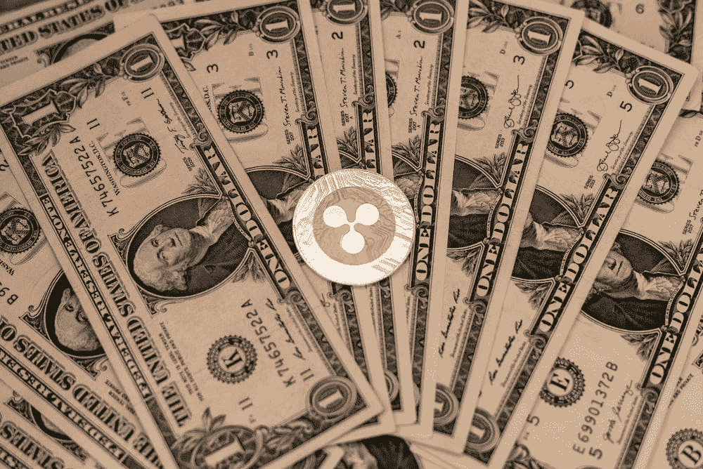

# Ripple 是否已经输掉了对 SEC 的诉讼？

> 原文：<https://medium.com/coinmonks/has-ripple-already-lost-the-lawsuit-against-the-sec-4c00212b7cee?source=collection_archive---------5----------------------->

美国证券交易委员会(SEC)已经起诉 Ripple 销售未经许可的证券，该案件仍在进行中。然而，Ripple 已经输掉这场官司的原因有很多，我们在下面列出了其中的五个。

# 美国证券交易委员会有充分的理由反对 Ripple