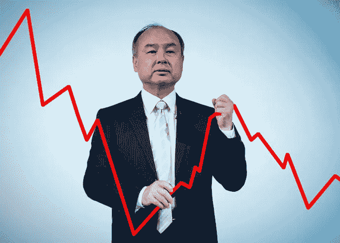
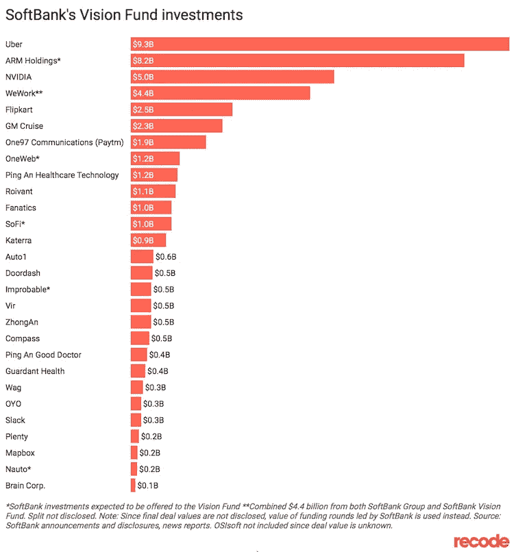
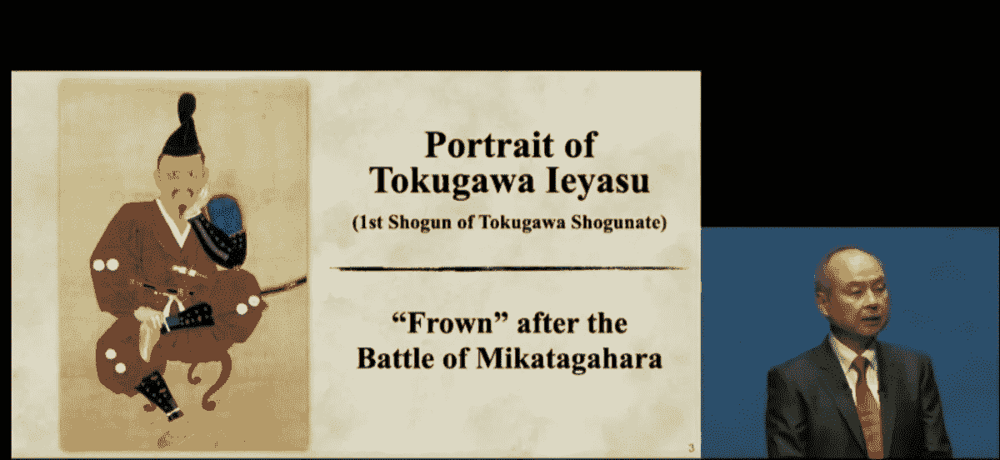

# 软银变软了吗？

> 原文：<https://medium.com/coinmonks/has-softbank-gone-soft-a0c1a5bce3f0?source=collection_archive---------18----------------------->

SoftBank sustained losses so big, it might be hard to bounce back from this one.

“软银集团报告了创纪录的 3.16 万亿日元(323 亿美元)的净亏损，因为全球科技股的抛售继续打击其愿景基金的投资组合。”

“愿景基金部门在截至 6 月 30 日的三个月中亏损了 2.33 万亿日元，此前一个季度亏损了 2.2 万亿日元。由于日元走软，软银还报告了 8200 亿日元的外汇损失。”

数字惊人。

但这是什么新东西吗？

也许不是他。

也许是市场的原因。

也许是加密传染病在传播。

会不会是判断失误、喝多了或者只是 excel 表格上的一些计算错误？

当市场崩溃时，媒体把孙正义描绘成一个恶棍，这难道不有趣吗？

但当情况好转时，他们就装饰他。

回想几年前，他为愿景基金筹集了 1000 亿美元后，每个人都在为他欢呼和赞美。

还记得他在 2000 年网络泡沫破灭时损失了 700 亿美元吗？

媒体把他描绘成“历史上损失金钱最多的人”。

在历史上。

赢得这个头衔并不容易。

现在，他以 211 亿美元的身价成为日本第三大富豪。

他作为投资者的黄金时期是在 2000 年，当时他向阿里巴巴投资 2000 万美元。

这一数字在 2018 年飙升至 1.3 亿美元。

一点也不差。

也许这就是为什么每个人都乐意给他几十亿美元。

Just look at the size of their investments.

2017 年，他为愿景基金筹集了 1000 亿美元。

当时，它是市场上最大的风险基金的 50 倍。

这是前所未闻的。

Vision Fund 2 规模略小，为 400 亿美元，原因是 WeWork 的崩溃吓跑了许多有限合伙人。

在愿景基金 1 期和 2 期之间，诞生了数十只独角兽，其中许多甚至进行了 IPO。

有优步、滴滴、开门、众安、Klarna、Trax、Coupang、DoorDash 和 WeWork。

你必须承认，不管人们会怎么说，孙正义确实单枪匹马地刺激了经济，用他的资金催生了一些独角兽。

所以当市场暴跌，儿子亏损，媒体给他泼冷水。

当市场回升时，孙正义的投资组合也跟着上涨，你可以打赌媒体会把他誉为专家。

市场经历周期，没有例外。

儿子今天失去的，他明天可以弥补回来。

他仍然坐拥巨额资金和良好的声誉。

Son showed the portrait of Tokugawa Ieyasu, a legendary shogun in the 1500s who was defeated in battle and forced to learn from his mistake.

是的，他真的找到了 500 年前的资料。

至少他努力反省、道歉并承担了一些责任。

有多少处于他这种地位和身份的首席执行官会如此公开地道歉呢？

仍然会有人足够信任他，给他几十亿美元。

不管损失有多大，我相信他会成功的。

媒体应该接受这是生活的一部分，而不是小题大做吗？

不，那还有什么好兴奋的？

-

市场会很快反弹吗？

-

#初创公司#商业# startupx #成长#成功#社交媒体#文化#企业家精神#战略#自虐#愿景基金#市场#投资组合#投资者#亿万富翁#软银#谦逊

> 交易新手？试试[加密交易机器人](/coinmonks/crypto-trading-bot-c2ffce8acb2a)或者[复制交易](/coinmonks/top-10-crypto-copy-trading-platforms-for-beginners-d0c37c7d698c)