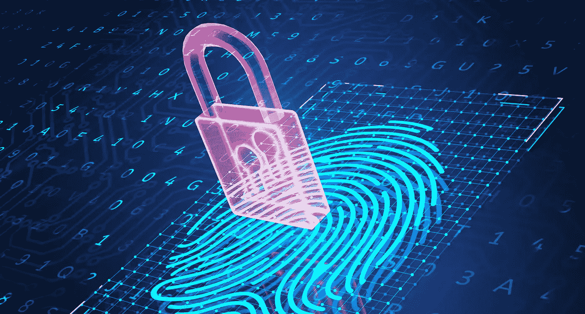

# 哈希、不对称加密和数字签名

> 原文：<https://medium.com/coinmonks/hashing-asymmetric-encryption-and-digital-signatures-9eb4acaecf69?source=collection_archive---------32----------------------->

## 区块链

在上一篇文章中，我们讨论了分散交易系统中出现的挑战。在本文中，我们将通过学习哈希、非对称加密以及我们如何使用它们来生成数字签名，开始深入研究区块链是如何应对这些挑战的。

在 2008 年金融危机之后，推出了比特币，它为分散货币中的两个主要问题提供了解决方案——达成共识和验证真实性。比特币在很多方面都是数字黄金标准。就像黄金一样，比特币是稀缺的——这意味着你不能凭空创造这种货币。比特币需要被开采，就像黄金应该如何被开采一样，它们被开采的速度是有限的。此外，与黄金一样，比特币是全球性的，不与某个国家挂钩，充当国际基础货币。

那么，比特币和底层技术——区块链——如何帮助解决共识和用户认证的问题呢？

在我们看到区块链如何着手解决这两个问题之前，我们需要了解区块链的两个主要组成部分。它们是哈希和不对称加密。让我们看看他们是什么，他们是如何工作的，尽管我们将在以后看到这两个人在区块链扮演的角色。

# 散列法

哈希将任何数据转换为固定大小的字符串。可以把它想象成一台机器，它接受任何数据作为输入，输出一个固定大小的字符串。无论如何，输出大小都不会改变。因此，无论您输入一个两位数的数字还是一部小说的整个文本，输出字符串的大小都保持不变。

我们称这个输出字符串为哈希。哈希的一个主要优点是，您无法将哈希转换回原始数据。这个优势使得散列有很多用例。有许多哈希算法可用，比特币使用的是 [SHA-256](https://en.wikipedia.org/wiki/SHA-2) ，它产生一个 256 位长的字符串。

> 交易新手？在[最佳加密交易](/coinmonks/crypto-exchange-dd2f9d6f3769)上尝试[加密交易机器人](/coinmonks/crypto-trading-bot-c2ffce8acb2a)或[复制交易](/coinmonks/top-10-crypto-copy-trading-platforms-for-beginners-d0c37c7d698c)

# 不对称加密

另一方面，非对称加密是一种加密技术。与通常的对称加密不同，在对称加密中，我们使用一个密钥来加密和解密数据，而非对称加密使用一对密钥，即私钥和公钥。我们可以从私钥计算公钥，但不能反过来。

当我们用一个密钥加密数据时，我们只能用另一个密钥解密。例如，我们可以用相应的公钥来解密用私钥加密的数据，反之亦然。我们可以公开共享公钥，但必须将私钥保密。

# 机密

当使用公钥加密数据时，只有私钥可以解密该数据。这保证了保密性。也就是说，如果 Alice 想要向 Bob 发送一个秘密消息，那么 Alice 可以在将数据发送给 Bob 之前，使用 Bob 的公开密钥对数据进行加密。一旦加密，我们只能用 Bob 的私钥解密数据。因为只有 Bob 有私钥，所以只有 Bob 可以读取数据。这样我们可以确保保密性。

# 真实性

类似地，当我们用私钥加密数据时，我们只能用公钥解密。这可以帮助我们验证数据的真实性。假设 Alice 想给 Bob 发一条消息，Bob 想确认确实是 Alice 发的消息，那么 Alice 就可以在发给 Bob 之前用自己的私钥加密消息。如果 Bob 可以用 Alice 的公钥解密该消息，那么 Bob 可以确保使用 Alice 的私钥来加密该消息。因为只有爱丽丝可以拥有私钥，所以我们可以确认消息的真实性。

用于生成公钥和私钥的一种流行算法是 [RSA](https://en.wikipedia.org/wiki/RSA_(cryptosystem)) 算法，但比特币使用 [ECDSA](https://en.wikipedia.org/wiki/Elliptic_Curve_Digital_Signature_Algorithm) 算法。

# 数字签名

我们使用哈希和不对称加密来创建数字签名。区块链交易广泛使用数字签名，可以毫不夸张地说，没有数字签名，区块链交易就会分崩离析。

我们通过散列数据，然后使用私钥加密数据来创建数字签名。通过用相应的公钥解密数字签名，可以确保数据的真实性。哈希可以验证数据的完整性。让我们看看它是如何发生的。

让我们假设爱丽丝给鲍勃发了一条信息。当 Bob 收到来自 Alice 的消息时，他想做两件事:

*   确保确实是 Alice 发送了消息(验证真实性)。
*   确保收到的消息是 Alice 发送的消息。换句话说，消息在传输过程中没有被篡改(验证完整性)。

因此，Alice 可以做的是对消息进行哈希处理，然后用她的私钥对获得的哈希进行加密，生成消息的数字签名。Bob 然后可以接收消息和数字签名，并用 Alice 的公钥解密数字签名。如果他能用爱丽丝的公钥解密数字签名，那就证明是爱丽丝发送的。一旦鲍勃解密了签名，他将得到消息的散列。然后，Bob 可以对他收到的消息进行哈希处理，并将该哈希与从数字签名中获得的哈希进行比较。如果两个哈希值相同，那么 Bob 可以确认没有人篡改过消息。

在本文中，我们看到了散列和非对称加密的工作原理，以及我们如何使用它们来生成数字签名。我们将在后续文章中看到如何在区块链使用它们来解决与分散式交易相关的挑战。在下一篇文章中，我们将开始了解区块链事务是如何工作的。

*原载于 2022 年 11 月 16 日*[*【https://www.thearmchaircritic.org】*](https://www.thearmchaircritic.org/mansplainings/hashing-asymmetric-encryption-and-digital-signatures)*。*