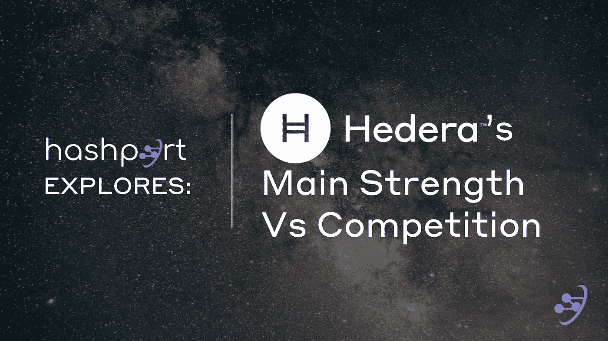
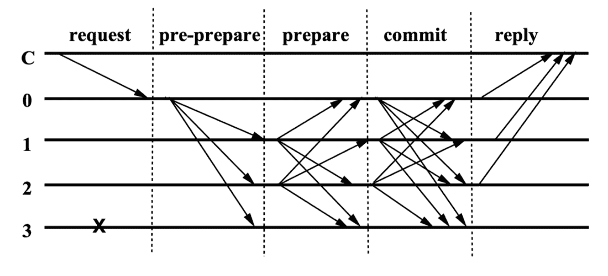
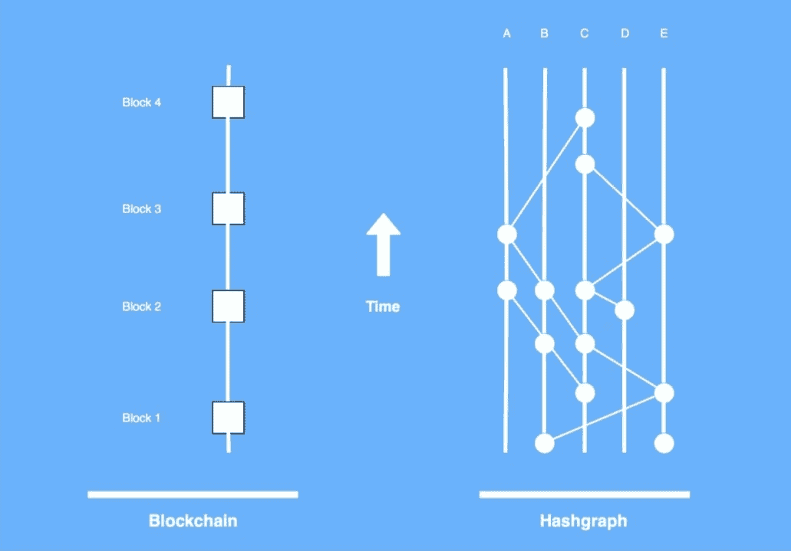
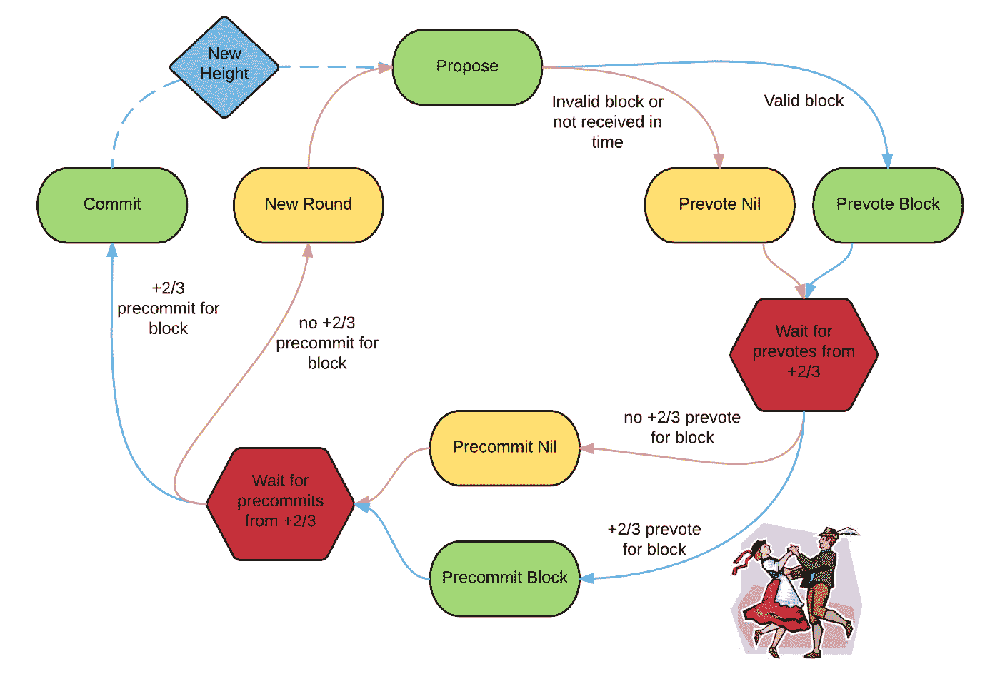
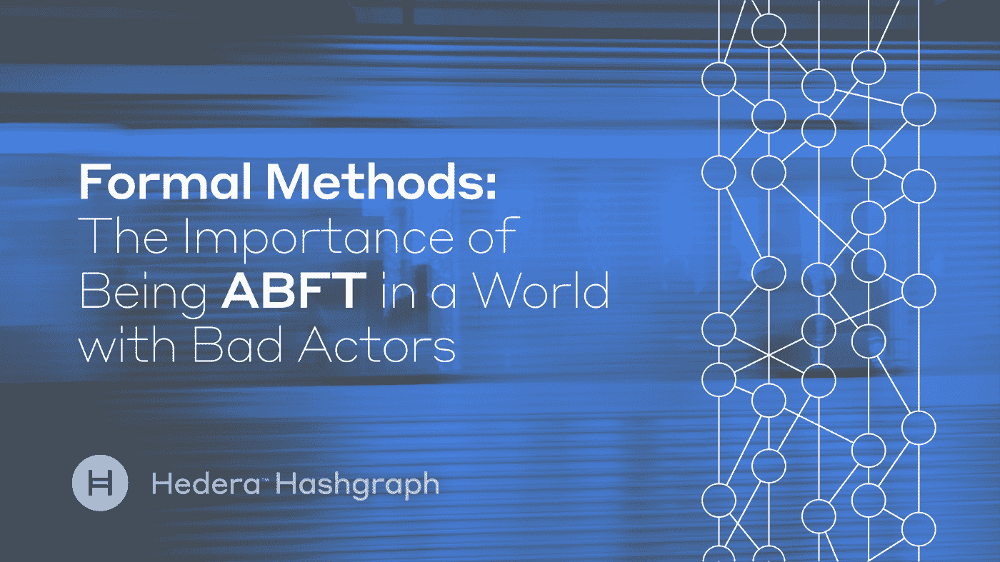
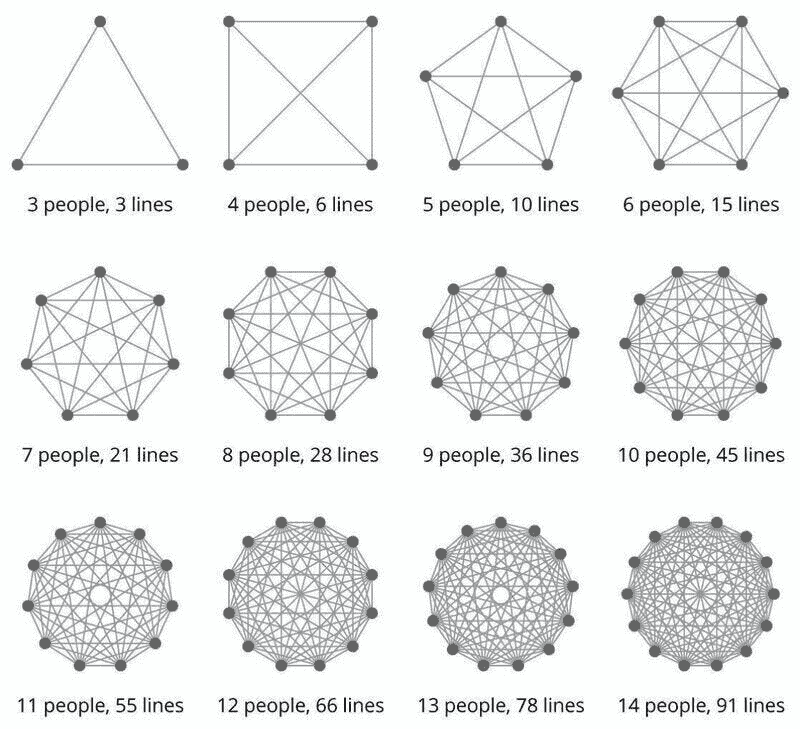
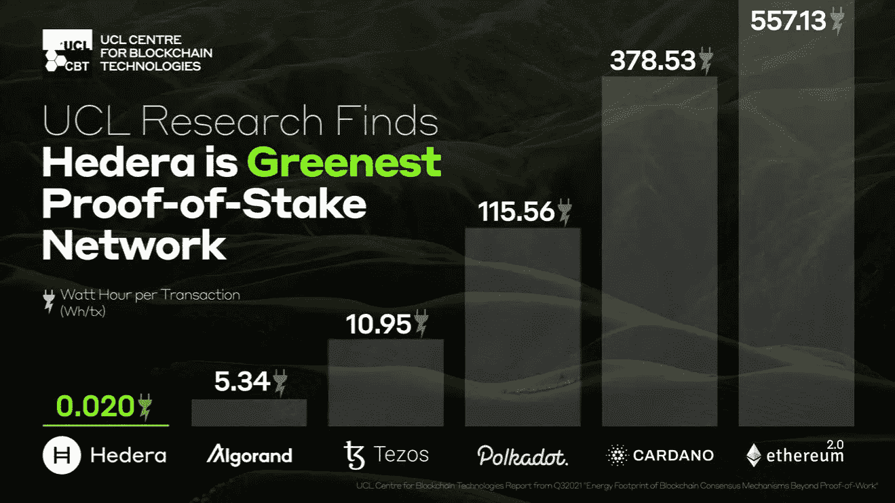

# 哈什波特探索:海德拉的主要力量与竞争

> 原文：<https://medium.com/coinmonks/hashport-explores-hederas-main-strength-vs-competition-2c28e5c883e3?source=collection_archive---------4----------------------->

> "海德拉不是区块链，它是一个哈希表."

我打赌你已经听过一百遍了！

那么到底是什么让[海德拉](https://hedera.com/)从竞争中脱颖而出，又是什么让[哈希图](https://hedera.com/learning/hedera-hashgraph/what-is-hashgraph-consensus)与其他共识机制有所区别呢？让我们通过目前与 [hashport](https://www.hashport.network/) 整合的不同网络来探究这些问题。

**共识算法** 每个分布式账本的核心就是所谓的共识机制。它本质上是节点就提交给分类帐的交易顺序达成与网络中所有其他诚实节点相同的协议的能力。诚实的节点应该能够以相同的顺序处理这些交易，并计算相同的状态(即，更新相同的帐户余额)，即使多达三分之一的节点是错误的或恶意的。

大多数区块链要么遵循[中本聪共识](https://coinmarketcap.com/alexandria/article/what-is-the-nakamoto-consensus)，要么遵循经典 [PBFT 共识](https://dzone.com/articles/what-you-need-to-know-about-pbft-consensus-plus-ap)的某种修改，要么两者兼而有之。

Nakamoto consensus 只是最长的链规则，具有最多工作证明的链，任何节点都可以很容易地计算出与其他诚实的对等节点保持一致。

PBFT 是节点之间发送投票和接收投票以决定是/否问题的 3 阶段通信。

Source: [https://medium.com/unitychain/if-you-really-want-to-make-sense-of-blockchain-you-cannot-ignore-the-classics-an-introduction-to-3c72dc8c5515](/unitychain/if-you-really-want-to-make-sense-of-blockchain-you-cannot-ignore-the-classics-an-introduction-to-3c72dc8c5515)

[以太坊](https://ethereum.org/en/)、 [BNB 链](https://www.bnbchain.org/)和[多边形](https://polygon.technology/)可以被认为是中本聪和 PBFT 的混合体，而[雪崩](https://www.avax.network/)结合了中本聪共识的概率属性和它自己的雪崩子采样算法。

例如，以太坊通过使用([LMD-幽灵](https://ethereum.org/en/developers/docs/consensus-mechanisms/pos/gasper/))来衡量其分叉，并使用 BFT 风格的投票算法([卡斯珀·FFG](/unitychain/intro-to-casper-ffg-9ed944d98b2d))来检查其区块链时期的终结性，从而模拟最长链规则。

Hashgraph 的不同之处在于，它引入了一个新的共识，具有一组独特且令人满意的属性。那么这些属性是什么呢？

**Hashgraph vs PBFT vs 雪崩** BNB SmartChain 和 Polygon 使用 [Cosmos-SDK](https://v1.cosmos.network/sdk) 和受经典 PBFT 算法启发的 [Tendermint](https://tendermint.com/) consensus 的分叉版本。

Tendermint 协议分轮进行，每轮都有一个专门的提议者(也称为协调者或领导者)。领导人选举是一种股权加权的循环选举机制，领导人根据其投票权按比例轮换。

每一轮的沟通步骤与 PBFT 相似。在最佳条件下(如果领导者诚实，沟通及时可靠等)，Tendermint 通过三个沟通步骤达成共识:“提议、预先投票和预先提交”。

这些步骤中的每一步都有超时，超时后会复位以防止算法停止(否则节点可能会无限期地等待步骤条件变为真，然后再继续下一步)。这种循环之间的连续转换避免了活性问题，并保持协议运行。

从上面可以推断出，在给定的高度上可能需要不止一轮来完成一个方块。

可能延迟一轮结束的几个原因是:
当选的领导者离线(DDoS)。
·当选领导人提议无效阻挡。
·当选的领导者提出一个不及时传播的阻塞。
在到达预提交步骤时，足够多的验证者未能及时收到提议块的超过 2/3 的 prevotes。尽管> 2/3 的预先投票是进行下一步所必需的，但至少有一个验证者可能投票给了<零>或恶意投票给了其他东西。

超过 2/3 的预提交被足够的节点接收，但超过 2/3 的建议块的预提交没有被足够的验证器节点接收。

Source: [https://medium.com/softblocks/explaining-how-tendermint-consensus-works-433066cbc465](/softblocks/explaining-how-tendermint-consensus-works-433066cbc465)

Tendermint 解决这些“时间延迟”问题的方法是选择一个新的领导者并进入下一轮，或者在每个连续的回合中增加某些回合超时参数。

以太坊也是如此。在比特币中，挖掘难度决定了区块加入链的速度。在以太坊中，时间是固定的，分为槽(1 槽= 12 秒)和纪元(1 纪元= 32 槽)。在每一个时间段，一个验证委员会被随机选出，他们的投票被用来决定被提议的区块的有效性。

然后随机选择一个验证者作为每个槽的领导者，负责创建一个新的块，并将其发送到网络上的其他节点。

在 Avalanche consensus 中，Avalanche 将 X 链无领导区块提议机制置于后台，并通过在每个区块高度引入六个提议者的股权加权随机选举来减少其线性 C 链上的“竞争”。

每位申请人都有五秒钟的提交时间。提议者不能在其提交窗口开始之前提交其区块(该区块将被视为无效)，但可以在其提交窗口到期后提交其区块，与下一个提议者竞争。

从上面可以立即注意到，每个砌块高度需要“同步”努力，以优化砌块的及时生产。所有这些网络都有我们称之为“部分同步”的假设。这些“同步”问题的出现是因为区块链的线性性质，以及仔细解决其分叉的需要。由于网络延迟，区块链节点可能暂时具有与其对等节点不同的网络视图，并且在做出最终提交决定之前，需要等待增加其分叉选择的保证。

Hashgraph consensus 不需要在它的通信节点之间有特定的时间假设来保证它的安全运行。Hashgraph 不需要减速来解析它的分叉。随着 [DAG](https://hedera.com/learning/distributed-ledger-technologies/directed-acyclic-graph) 结构的增长，Hedera 上的每个节点总是以与其他节点完全相同的 Hashgraph 自顶向下全局视图结束。Hashgraph 通过其“关于流言蜚语的流言蜚语”协议实现了这一点。一个节点可以离线五分钟，也可以离线一个小时，都无所谓。只要它最终能够与某个其他节点同步，它就会立即收到过去事务的完整缺失历史，并计算出正确的最终状态。

Hashgraph 据说是完全[异步](https://hedera.com/learning/hedera-hashgraph/what-is-asynchronous-byzantine-fault-tolerance-abft)。

Source: [https://medium.com/hedera/formal-methods-the-importance-of-being-abft-in-a-world-with-bad-actors-7308a4997fdd](/hedera/formal-methods-the-importance-of-being-abft-in-a-world-with-bad-actors-7308a4997fdd)

在基于领导者的系统中，如果数据包被延迟/丢弃或领导者受到攻击，达成共识可能会被延迟一段未知的时间，甚至[被阻止](https://fortune.com/crypto/2022/10/01/solana-back-online-after-latest-outage/)。对领导者的攻击可能导致网络范围的活跃度问题，因为领导者节点是潜在的瓶颈。

Hashgraph 是无领导的，因此任何节点都可以在不确定的时间内离线，而不会影响整个网络的一致性。这使得 Hedera 对诸如分区、eclipse 攻击、DDoS 等网络攻击更具弹性。

此外，上面提到的所有基于 PBFT 的协议在每一轮中都需要某种二次消息复杂度来将它们的投票传达给它们的对等方。这种复杂性随着网络中节点数量的增加而增加。

下图有助于解释一次只添加一个节点会成倍增加在所有节点之间发送投票所需的通信时间。

Source: [https://www.linkedin.com/posts/pascalbornet_communication-innovation-teams-activity-6980766334460583937-juqa?trk=public_profile_like_view&originalSubdomain=ae](https://www.linkedin.com/posts/pascalbornet_communication-innovation-teams-activity-6980766334460583937-juqa?trk=public_profile_like_view&originalSubdomain=ae)

即使 Avalanche consensus 也需要几轮每轮 O(1)的通信开销，以便查询对等体的分叉选择偏好。

相比之下，Hashgraph 除了八卦签名的事务和它们的时间戳之外，不需要任何投票通信开销。

因为每个节点都有事务历史的全局视图(也称为 Hashgraph ),所以它们在本地计算一致性。海德拉称这个过程为“虚拟”投票。

除了节省带宽，这个过程还确保成员根据规则计算他们的投票。如果 Alice 是诚实的，她将为诚实的虚拟 Bob 计算虚拟投票。即使 Bob 是恶意的，他也不能通过使虚拟 Bob 错误地投票来攻击 Alice。

上述特性是 Hedera 比大多数网络更快、更便宜、更节能的主要原因。

**速度与成本与效率** 为了比较我们当前的集成网络，以下是一些最新指标:

**速度(截至 2022 年 9 月)** 海德拉:10000+TPS(3 秒至 100%终结)
(15 米气体/秒)
以太坊:12 TPS(10-20 秒阻断时间)
(15 米气体/阻断)
多边形:6500 tps (3 秒阻断时间)
(30 米气体/阻断)
雪崩:4500 TPS

**交易成本(截至 2022 年 9 月)** [海德拉](https://docs.hedera.com/guides/mainnet/fees):0.0001 美元固定
[以太坊](https://ycharts.com/indicators/ethereum_average_transaction_fee#:~:text=Ethereum%20Average%20Transaction%20Fee%20is,82.58%25%20from%20one%20year%20ago):0.66 美元可变
[多边形](https://blog.polygon.technology/polygoninsights-week38/):0.012 美元可变
[雪崩](https://docs.avax.network/quickstart/transaction-fees):0.02 美元可变
[BSC](https://ycharts.com/indicators/binance_smart_chain_average_transaction_fee_es):0.19 美元可变

**能源效率:(截至 2022 年 9 月)** “[UCL 区块链技术中心](http://blockchain.cs.ucl.ac.uk/)”(UCL CBT)和“[Crypto Carbon Ratings Institute](https://carbon-ratings.com/)”(CCRI)都发布了不同的报告，结果略有不同，分析了九个基于 PoS 的分布式账本的碳足迹，包括 [Hedera](https://hedera.com/) 、[以太坊](https://ethereum.org/en/)、 [Cardano](https://cardano.org/) 、 [Tezos](https://tezos.com/) 、[polkadkad](https://polkadot.network/)

在这些论文中，许多计算被公式化，其中数学消耗模型被用于预测每个交易的预期能量消耗，作为网络负载的函数。该模型不仅显示了基于 PoS 的 DLT 每笔交易的能源消耗比比特币高三个数量级，还强调了 DLT 本身之间的显著差异。

这些报告的指标如下:
[报告 1](https://hedera.com/ucl-blockchain-energy) :
超越工作验证的区块链共识机制的能量足迹(UCL):
以太坊:557.13 wh/tx(合并后为 3000tps ~ 2.8wh/tx)
卡尔达诺:378.53 wh/tx
波尔卡多特:115.56 wh/tx
Tezos:10.95 wh/tx【T30

[报告二](https://www.carbon-ratings.com/dl/pos-report-2022):
PoS 区块链协议(CCRI)的能效和碳足迹:
Cardano:51.59 wh/tx
Tezos:41.45 wh/tx
Polkadot:17.42 wh/tx
雪崩:4.76 wh/tx
Algorand:2.70 wh/tx
Solana:0.16 wh/tx

[报告三](https://carbon-ratings.com/dl/polygon-report-2022):
Polygon 区块链(CCRI)的能效和碳足迹:
Polygon: 0.1031 wh/tx

**结论** 一些共识算法有证明它们是 BFT 的证据，但是这些证明依赖于不能反映当今互联网现实的假设，包括防火墙、僵尸网络、DDoS 攻击、蠕虫和病毒。Hedera 获得了异步 BFT 地位，这是分布式网络安全的黄金标准。

海德拉群龙无首。节点同时传输事务，这反过来使得更高的吞吐量共识成为可能。更高的吞吐量允许:

*   共识节点收取更少的交易费用，因此即使与第 2 层解决方案相比，网络也更便宜。
*   每次交易的能耗更低，因此网络比大多数 L1 更环保。

尽管 hashport 团队的大部分成员最初都来自 Hedera 生态系统，但 hashport 平台是不可知的，因为它旨在连接所有 EVM 和非 EVM 区块链。它对一个网络没有偏好。它不偏爱任何生态系统。它是独立的，因为它有自己的一套验证器、自己的费用结构和自己的一套规则。

我们相信市场是最公平的仲裁者，理性的经济参与者将最终决定哪些网络值得保留世界上最有价值的资产，哪些不值得。

**关于** [**哈希波特**](https://www.hashport.network/)

hashport 是一个企业级的公共设施，它促进了数字资产在分布式网络之间的移动，以一种快速、安全和经济的方式扩展了它们的功能。为了保持平台中立，hashport 函数不使用专有令牌。该网络建立在一个强大且高性能的架构之上，由一群来自世界各地的业界领先的验证合作伙伴提供安全保护和运营。hashport 通过了严格的  [安全审计](https://omniscia.io/limechain-hashport-round-2)并遵循行业最佳实践；定期执行全面的网络测试，以确保网络的完整性。

[**网站**](https://hashport.network/) **|** [**推特**](https://hashport.net/3Gn2S3g)**|**[**Reddit**](https://hashport.net/3GpPADa)**|**[**电报**](https://hashport.net/3GjYqCu)**|**[**LinkedIn**](https://hashport.net/3Gpq4hy)[**YouTube**](https://hashport.net/hashportYouTube)**|**

*免责声明:hashport 网站上提供的信息不构成投资建议、财务建议、交易建议或任何其他类型的建议。你不应该把任何网站内容当作建议。*

> 交易新手？在[最佳加密交易](/coinmonks/crypto-exchange-dd2f9d6f3769)上尝试[加密交易机器人](/coinmonks/crypto-trading-bot-c2ffce8acb2a)或[复制交易](/coinmonks/top-10-crypto-copy-trading-platforms-for-beginners-d0c37c7d698c)

> 加入 Coinmonks [电报频道](https://t.me/coincodecap)和 [Youtube 频道](https://www.youtube.com/c/coinmonks/videos)获取每日[加密新闻](http://coincodecap.com/)

# 另外，阅读

*   [免费加密信号](/coinmonks/free-crypto-signals-48b25e61a8da) | [加密交易机器人](/coinmonks/crypto-trading-bot-c2ffce8acb2a)
*   [杠杆代币](/coinmonks/leveraged-token-3f5257808b22)终极指南
*   [16 款最佳折叠电动自行车](/coinmonks/top-17-folding-electric-bikes-5e296f0918cb)
*   [28 款最佳电动自行车点评](/coinmonks/the-28-best-electric-bikes-review-and-buying-guide-in-2023-7bb3146cb403)
*   前三名[币安期货交易机器人](/coinmonks/top-3-binance-futures-trading-bots-e6031f84b3f9)