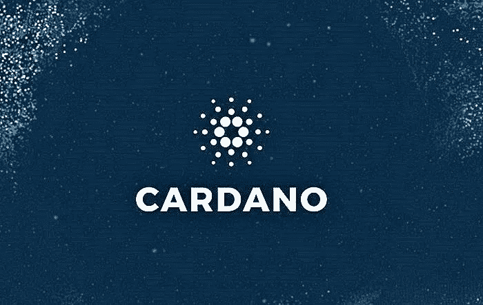
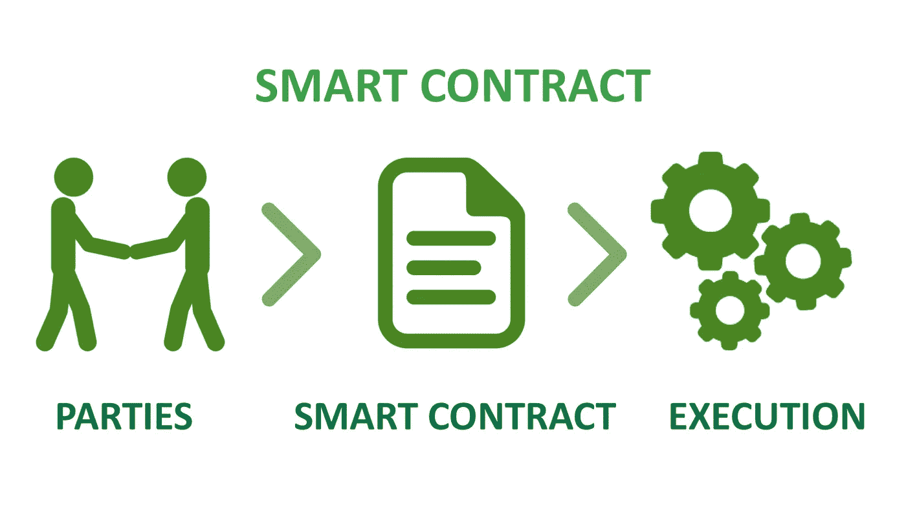
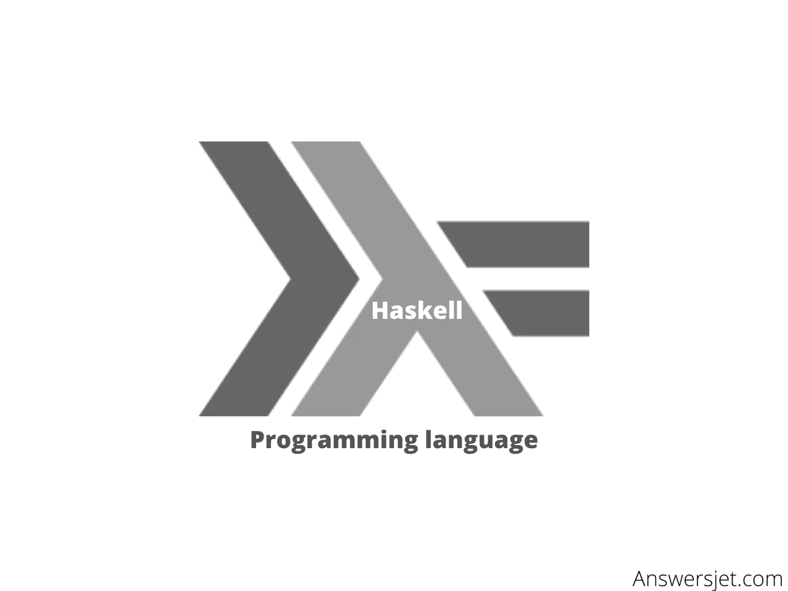

# Haskell 编程语言:建立在 Cardano 区块链网络之上。

> 原文：<https://medium.com/coinmonks/haskell-programming-language-building-on-cardano-blockchain-network-2957b45d4d9e?source=collection_archive---------9----------------------->

# 智能合同、Cardano 网络和 ADA 生态系统的简短指南

## 什么是智能合同？

智能合同是一种软件合同，允许双方预先定义金融交易的条款，并依靠软件自动完成交易。智能合同被广泛认为比手写协议更安全，因为它们是用特定的编程语言编写的，如果不使合同本身无效，就无法对其进行更改。

## 关于为什么在区块链开发中选择编程语言是复杂的，有几个原因。

> 首先，区块链的分布式特性使得在不复制网络中所有节点上的代码的情况下很难运行应用程序，这可能会增加代码的大小以及代码中出现错误的机会。
> 
> 其次，在执行速度、运行时内存占用和选择合适的编程语言的灵活性方面，并不是所有的语言都有相同的表现。

在选定一个特定的方案之前，有必要考虑所有的利弊。

## Cardano 智能合约与当前智能合约的比较

Cardano 是一个新的区块链平台，旨在实现比当前系统更高的效率和可扩展性。由于其可证明的利害关系证明算法，它也更加安全。下面我们来仔细看看 Cardano 可能比 Etherum 更好的一些原因。

首先，Cardano 的目标是成为智能合约的通用平台。这意味着它可以用来创建任何东西，从分散的应用程序到更传统的商业合同，如贷款协议或股东协议。ADA 加密货币也将被用作这些交易的交换媒介。

从它的代码来说，编程语言是 Haskell，它是由 Alan M. Borning 教授在 20 世纪 60 年代创造的。编写这段代码的目的是让计算机能够使用简单的语言来完成复杂的任务，让人们容易理解。该代码旨在解决传统编程语言中存在的许多问题，如安全缺陷和不可追踪的交易。由于这些原因，它被广泛认为是当今最安全的代码之一。

Cardano 还拥有许多其他令人印象深刻的功能。例如，您将能够创建自己的 Dapps，而不需要“叔叔”节点来处理您的事务。这是由于该平台的新 Ouroboros 算法，它允许更快的处理时间。它还消除了对采矿的需求，从而减少了整体使用的资源——这种理念也将减少用于保护其他区块链的高能耗工作证明。

## Haskell 编程语言简介

Haskell 是一种代数函数式编程语言，它允许创建安全的智能契约，可以部署到像 Cardano 这样的分散式网络中。它从一开始就被设计成高度模块化、类型安全和无状态的，以允许创建大型的分散式应用程序。此外，它被设计为要求尽可能少的依赖性，特别是针对跨平台支持，以创建可以在所有主要操作系统和硬件上工作的大型分散式应用程序，Haskell 程序在单个线程中运行，并且在加载和执行之前不能与其他线程交互。这意味着 Haskell 智能契约可以异步执行操作，而不会影响同一应用程序或网络中的其他并发任务。

## **为什么 Haskell 是构建 Cardano 智能合约的合适语言**

1.  Haskell 是一种灵活而强大的通用编程语言，它在结构上类似于 C，但比 Python 或 Ruby 更容易学习，表达能力更强。它是静态类型的，纯功能性的，具有一流的功能。这意味着它可以比其他流行语言更直接、更有效地表达问题。
2.  Haskell 社区很小，但是非常活跃，有数百个活跃的项目和许多高质量的库和框架。其中包括 async 等并发库、hsqldb 等数据库集成库以及 Happstack 等 web 服务器开发工具。在现有库的基础上构建使得 Haskell 应用程序很容易在一个分散的环境中与现有的基础设施和服务集成。
3.  **Haskell 是为跨平台使用而设计的**。它不依赖于特定的操作系统或架构，这使得它几乎可以在任何系统上编译，从 Windows 到 MacOS 到 Linux，甚至是手机。这使得它非常适合 Cardano 开发，因为它可以在各种平台上运行，从开发人员的笔记本电脑到服务器，再到像 Raspberry Pi 这样的嵌入式设备。

## 在 Cardano 区块链网络上编写智能合同

普路托斯是一个 Haskell 框架，用于编译智能合约代码，以便在 Cardano 区块链上运行。其他可以用于 Cardano 区块链的编程语言包括 Glow Lang、Marlowe 等。，但普路托斯是其中最快的。

> 普路托斯是基于 Haskell 的，所以使用它需要事先了解 Haskell 编程。

根据 Cardano Testnets 的说法，普路托斯合同由运行在区块链上的部分(链上代码)和运行在用户机器上的部分(链外或客户端代码)组成。

普路托斯智能合约是一个 Haskell 代码，运行在用户的钱包中，并将代码发送到区块链，由区块链中的节点运行。智能合约运行在区块链上，而不是用户的机器上。

普路托斯智能合同具有用于定义智能合同及其状态的定义。这些定义中包含端点，它们定义了智能合约的行为。这些端点是由钱包执行的功能。它们被称为链外函数，用于建立交易并将其发送到区块链。

## **结论**

Cardano 的智能合同编程语言和 Marlowe 的金融智能合同领域专用语言都是基于 Haskell 构建的。Cardano 的链外和链内代码都是用 Haskell 编写的。

> 然而，Haskell 并不是最流行的编程语言之一。

另一方面，Cardano 选择了 Haskell，因为它认为它的普路托斯和马洛智能合同可以正确地内置在一种精确的、正式证明的语言中，可以立即提供高水平的保证。

在此之前，由此产生的漏洞、代码故障和智能合约利用对区块链和智能合约语言产生了毁灭性影响，导致了巨大的财务损失，通常高达数十亿美元。

> 交易新手？试试[密码交易机器人](/coinmonks/crypto-trading-bot-c2ffce8acb2a)或者[复制交易](/coinmonks/top-10-crypto-copy-trading-platforms-for-beginners-d0c37c7d698c)