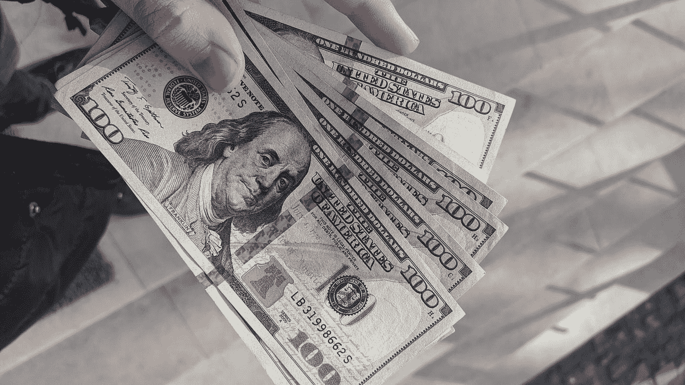
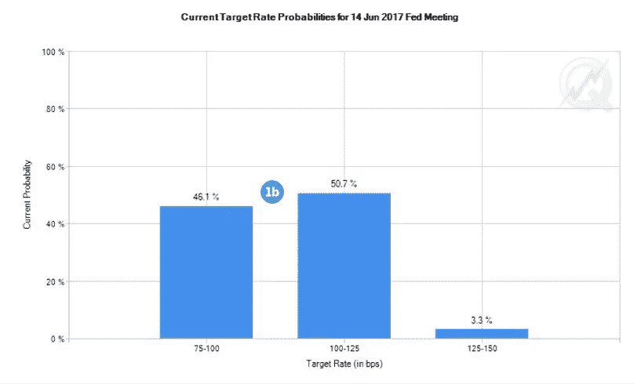
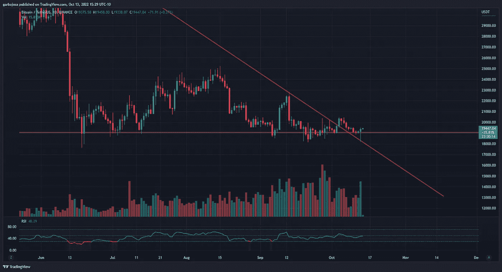
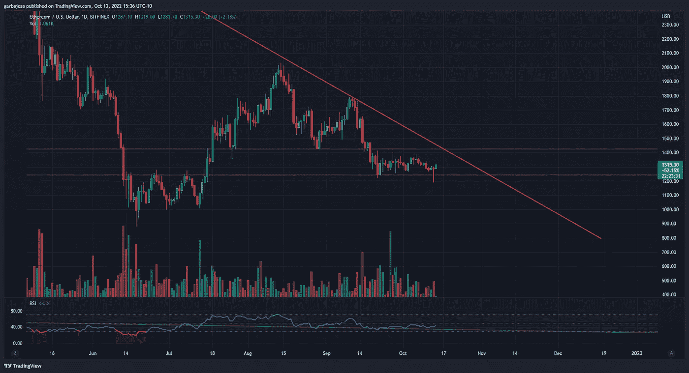
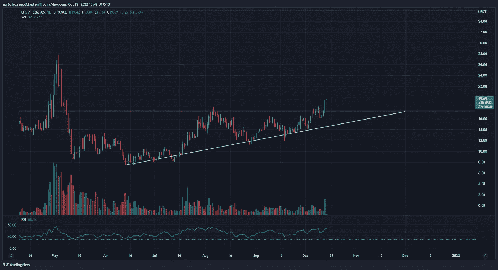
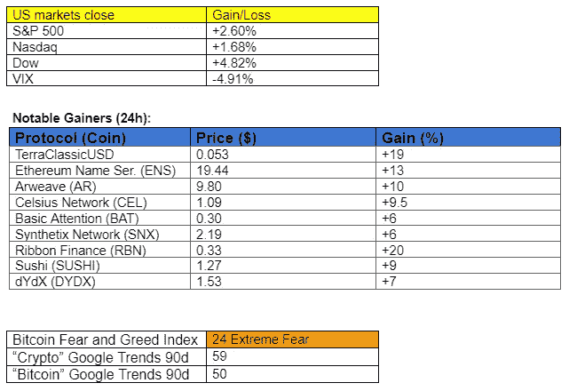
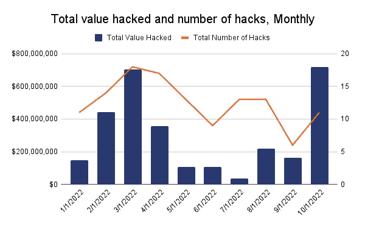

# 秘密市场克服了通胀担忧了吗？

> 原文：<https://medium.com/coinmonks/have-crypto-markets-conquered-inflation-worries-9a83994b2978?source=collection_archive---------45----------------------->

## 每日征服#104

最好的每日新闻、见解和阿尔法信息来源。

Photo by [Frederick Warren](https://unsplash.com/@carnations?utm_source=medium&utm_medium=referral) on [Unsplash](https://unsplash.com?utm_source=medium&utm_medium=referral)

*密码市场是一个狂野、奇妙而令人生畏的地方；不要一个人跋涉！订阅加密征服者，让我们成为您的向导。*

订阅这份每日时事通讯，永不错过任何一期。

**概述**

*   市场对通货膨胀的加剧不屑一顾。
*   Crypto 看起来准备好过一个愉快的周末了。
*   占星家马人在摄氏公司倒闭前将其推向市场。
*   DeFi hacks 最糟糕的一个月。

早上好，家人，

事实 1:通货膨胀将会持续。

事实 2:市场今天不再关心了。

如果说我们昨天学到了什么的话，通胀仍有弹性，并将随着供应面面临的所有挑战而保持高位。

好消息是，在下一次美联储会议和随后的加息之前，市场还有 19 天时间。在昨天高于预期的核心价格指数(CPI)之后，市场现在认为加息 100 个基点的可能性为 50%。

*来源:* [*FedWatch 工具*](https://www.cmegroup.com/tools-information/quikstrike/cme-fedwatch-tool-user-guide.html)

未来两周市场的反应将在很大程度上说明投资者在高印量之后的感受。价格行为可能会保持波动，但如果价格在未来几周保持不变，这是一个强烈的信号，表明股票和密码最糟糕的时期可能已经过去。

# 市场更新🌍

BTC/USDT·1D

在高于预期的 8.2%的 CPI 公布后，市场迅速摆脱了美国市场的早期下跌。BTC 跌至 18，910 美元的低点，很快回升至防守良好的 19，000 美元支撑位上方。由于多头的热情，价格从之前的下降趋势支撑(红色)反弹。BTC 收盘上涨 1.15%，至 19，375 美元，看起来周末行情看涨。

*高分辨率* [***图表***](https://www.tradingview.com/x/ot6GYWNj/)

**1D 联邦理工学院/美元**

在早盘触及 1，190 美元的低点后，ETH 展现了与 BTC 类似的复苏，看起来将测试 2021 年 11 月开始的下降趋势阻力(红色)。价格行动将不得不增加数量，以打破长期阻力，但 ETH 已经找到了 1，250 美元支撑位上方的家。如果本周末市场表现强劲，预计瑞士联邦理工学院将在与 BTC 的比赛中取得一些进展。ETH 完成每日蜡烛下跌 0.56%，至 1287 美元。

*高清* [***图表***](https://www.tradingview.com/x/1qOeWEx5/)

**恩斯/USDT·1D**

以太坊名称服务(ENS)是自 6 月底以来在收入和价格行为方面表现最好的协议之一。这里 ENS 突破了一个健康的成交量背后的上升三角形阻力。价格通常会下跌，以重新测试类似模式中的阻力转向支撑，这标志着那些仍然看涨 ENS 的人的良好进入。ENS 今天上涨+13.30%，至 19.42 美元。

*高分辨率* [*图表*](https://www.tradingview.com/x/84PD0MvX/)

如果你喜欢这份报告，并且认为它值 20 分(0.01 美分)，请按下面的鼓掌按钮来支持我的写作。(最多 50 次！)谢谢！

# 新闻观察📰

秘密占星家在秋天之前抓住了营销摄氏。马人·奥特曼，一个著名的加密影响者，前谐谑秀嘉宾，占星家，被指控在没落之前营销了[。一份法庭文件显示，Altman 从 Celsius 那里收到了大约 3 万美元，用于在她的社交媒体账户上推销该平台。也许是上周的满月。](https://twitter.com/CoinDesk/status/1580688248841478144?s=20&t=P5qgA1Mhq5fx9KfunFWIVA)

创下 DeFi hacks 的月记录。继 10 月份在 11 次黑客攻击中 DeFi 平台被盗 7 . 18 亿美元后，黑客们创造了新的 DeFi 黑客记录。2022 年，DeFi 总共被盗 30 亿美元。

*来源:* [*砌块*](https://twitter.com/meeynarh96/status/1580693656293367808?s=20&t=UBBC0Fs6BgSZNh1xWmUNGA)

**新闻花絮:**

*   系绳[将](https://www.coindesk.com/business/2022/10/13/stablecoin-issuer-tether-cuts-commercial-paper-holdings-to-zero/)商业持股削减至零。
*   加密资产管理公司 BlockTower [推出](https://www.coindesk.com/business/2022/10/13/crypto-asset-manager-blocktower-launches-150m-venture-capital-fund-report/)1.5 亿美元的风险投资基金。
*   Uniswap Labs [在 Polychain Capital 领投的 b 轮融资中筹集](https://twitter.com/Uniswap/status/1580532185597026306?s=20&t=aCzJedI6dtcFM_USYYJZAQ)1.65 亿美元。
*   币安第 21 次季度焚烧 206 万 BNB 代币(5 . 47 亿美元)。
*   英国[通过](https://www.gov.uk/government/news/paperless-trade-for-uk-businesses-to-boost-growth)一项潜在使用区块链进行贸易文件的法案。
*   珍妮特·耶伦[在国际货币基金组织会议上推动 CDBCs。](https://www.coindesk.com/policy/2022/10/13/yellen-stresses-need-for-central-bank-digital-currency/)
*   JP 摩根 c

**NFT &元宇宙更新🐵**

*   **Coinshares** [**介绍了一个实验性的人工智能机器人**](https://twitter.com/CoinSharesNFTAI?ref_src=twsrc%5Etfw%7Ctwcamp%5Etweetembed%7Ctwterm%5E1580622903221096452%7Ctwgr%5Ee4861136a0552bfcf0bd5478e9de1d0b14f69b9f%7Ctwcon%5Es1_&ref_url=https%3A%2F%2Fwww.coindesk.com%2Fweb3%2F2022%2F10%2F13%2Fcoinshares-releases-experimental-ai-bot-that-tries-to-calculate-the-fair-price-for-an-nft%2F) **来计算 NFTs 的公平价格。**
*   **日本视频游戏开发商 Konami Digital Entertainment**[**正在**](https://www.konami.com/games/corporate/en/news/release/20221013/) **招聘 Web3、NFT 和元宇宙的角色。**

**我的五分钱……**

请关注周一的美国股市。如果情况继续向上，市场可能会发出通胀担忧已经消化的信号。此外，尽管 CPI 高企，但 BTC 和瑞士联邦理工学院拒绝了重要的支撑位，加密市场看起来准备迎接一个看涨的周末。

祝你周末愉快！

***加布里埃尔***

*关注我* [*推特*](https://twitter.com/web3_gabri) *每日更新！*

订阅这份每日时事通讯，不要错过任何一期。

> 交易新手？试试[加密交易机器人](/coinmonks/crypto-trading-bot-c2ffce8acb2a)或[复制交易](/coinmonks/top-10-crypto-copy-trading-platforms-for-beginners-d0c37c7d698c)