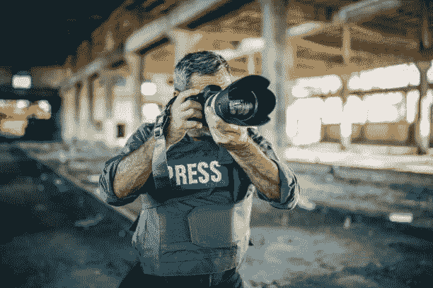

# NFTs 标志着股票图像平台的终结了吗？

> 原文：<https://medium.com/coinmonks/have-nfts-signaled-the-beginning-of-the-end-for-stock-image-platforms-ee4f094ea343?source=collection_archive---------45----------------------->

多年来，优质照片平台一直通过向全球顶级品牌出售稀有、独特的图片来获利。他们通过出售摄影记者拍摄的图像获利颇丰，这些摄影记者不远万里去捕捉我们美丽宇宙中的场景、事件和奇迹。

多年来，像 [Shutterstock](https://www.shutterstock.com/) 、 [GettyImage](https://www.gettyimages.com/) 和 [Alamy](https://www.alamy.com/) 这样的平台已经成为照片行业家喻户晓的名字。随着这些品牌变得流行，他们稳步增加了他们的佣金和图像利润的份额，给原创内容创作者留下了很少甚至没有。

随着不可替代代币的出现，以及无需依赖照片平台就能以高得多的价格出售图像的潜力，原创图像创作者现在有机会获得他们应得的东西。然而，在这个交叉点上，存在着股票照片平台的困境——创作者的收益标志着他们业务的结束。

> 交易新手？尝试[加密交易机器人](/coinmonks/crypto-trading-bot-c2ffce8acb2a)或[复制交易](/coinmonks/top-10-crypto-copy-trading-platforms-for-beginners-d0c37c7d698c)

# 创作者微不足道的收益

众所周知，摄影记者为了获得独特的图像会走极端。从去寒冷的北极和南极，到去阿富汗和伊拉克的死亡前线，所有这些都是为了捕捉事件并呈现事件发生的现场图像。

发现记者付出的努力只挣得微薄的报酬，这令人恼火。有报告显示，当图像最终被出售时，创作者只能从他们上传的图像中获得 15%到 40%的利润(最多)。另一方面，众所周知，库存照片平台会保留图片销售额的 60%至 80%。

众所周知，像半岛电视台、美国有线电视新闻网(CNN)等顶级新闻机构会为图片支付高达 3 万美元的额外费用，尤其是那些与重大军事行动和冲突等趋势新闻事件直接相关的图片。令人沮丧的是，冒着生命危险拍摄这些照片的记者得到的报酬还不到总收入的三分之一。

# 非功能性测试是更好的选择

与过去相比，NFT 现在为摄影记者提供了一个更好的选择。随着数字证书表明这些创作者是其作品的原始所有者，他们现在保证他们的辛勤工作会有更好的回报。

想象一下，一张活动照片以 35k 美元的价格出售，而创作者只需向市场支付 2.5%的佣金。这意味着这样的创作者可以方便地获得 34k 美元，并享受他们的劳动成果。

另一方面，如果一个新闻平台决定购买 NFT 这样的图像，他们可以谈判一个相当低的价格(与作为中间人与优质照片平台打交道相比)，因为他们直接与创作者打交道。最终，由于没有中间人，减轻了交换中最重要的两方(用户和创作者)之间的沟通障碍

# 陷入寒冷的照片平台

如果 NFTs 可以成为创作者和用户的度假胜地，这将标志着照片平台从整个过程中的消除。因此，这将标志着股票照片平台的结束，因为他们将不再有产品出售。这些平台知道自己不再重要，可能会被迫大幅降低要价和佣金。

# 实现 Web3 梦想

web3 背后的整个理念是以各种形式彻底解构集权。本质上，这一切都是为了取代集权实体手中的束缚和权力集中。取而代之的将是一个去中心化的结构，每个人都掌控着自己的命运(收入和资产)，创造者得到他们真正应得的尊重。

# 最后的想法

随着 web3 空间的发展速度，摄影记者认识到 NFT 为集中式照片平台提供了更好的替代结构只是时间问题。启示就在眼前，NFTs 和 web3 梦想将很快成为所有摄影记者的现实。