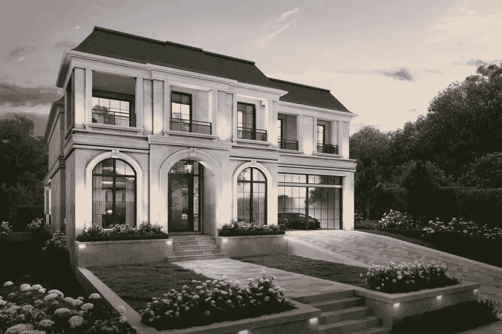
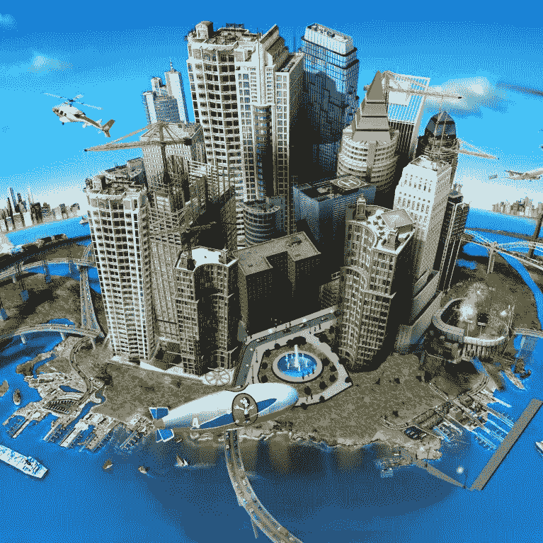
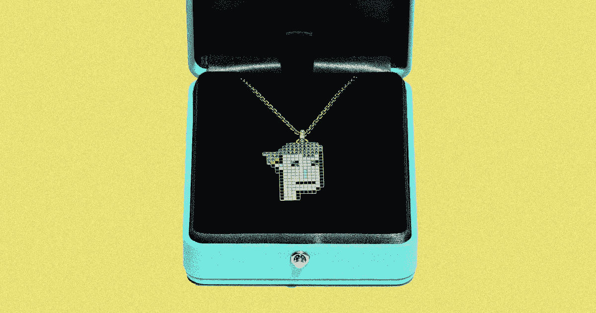

# 你听说过元宇宙的“双胞胎”吗？

> 原文：<https://medium.com/coinmonks/have-you-heard-of-a-metaverse-twin-9a0f91efb152?source=collection_archive---------36----------------------->

The NFT could theoretically be worth more than the real estate in the future.

有人正在出售迈阿密的一栋豪宅，它还附带一个位于元宇宙的“孪生”住宅。

"这座名为“倒影庄园”的迈阿密豪宅售价 770 万美元，出售时有六间卧室和六个半浴室，面积为 12975 平方英尺。"

元宇宙正在进行一个名为“阿尔法城市”的新项目，这个项目与分散土地或沙盒项目非常相似，但图形要好得多。

想想网络 3 和更好的图形模拟人生城市。

因为说真的，ain 没人有时间看像素化的脸和低质量的元宇宙！

实际的房子相当不错。

欧式风格，配有健康侧厅、游戏室、超棒的游泳池和有盖露台。

老实说，如果虚拟的房子最终比实体的房子更值钱的话，那就太棒了！

Golly! Remember Sim City?

谁知道，若干年后，当元宇宙变得司空见惯时，我们的虚拟和数字身份比我们的物理身份更有价值。

想象一下，你是一个非常富有的客户，想要在迈阿密的房地产上花点钱。

还有什么比这更好的方法呢？

它让人们谈论。

你可以炫耀你在元宇宙的整个豪宅。

甚至可能增加另一个游泳池或改变 wimp 上城堡的外观颜色！

对于那些认为这是一个噱头营销伎俩。

也许吧。

这确实令人惊讶，并让加密社区喋喋不休。

销售房地产时真的需要一个元宇宙双胞胎吗？

难道这是骗局？

阿尔法城会在 2-3 年内建成吗？

Even Tiffany & Co. is deep into NFTs now, releasing their partnership with CrpytoPunks recently which sold out immediately.

谁知道呢。

但是如果它爆炸了，不仅我的房产会增值，元宇宙的双胞胎也会价值数百万！

谈论投资的良好回报。

在不久的将来，你购买的每栋房子或每块土地都会有一个元宇宙双胞胎。

只要是在一些知名的区块链和元宇宙，比如沙盒或分散土地，就会有次级价值被释放。

这不仅是一个有趣的概念，它也证明了所有权不变，并带来了整个元宇宙概念更有意义的成果。

-

你会在元宇宙买“土地”吗？

-

# startups # business # startupx # growth # success # social media # culture # alpha city # metaversetwin # Miami # houses # eth # BTC # crypto # opensea # markets # bear market # NFT #利润#房地产

> 交易新手？试试[加密交易机器人](/coinmonks/crypto-trading-bot-c2ffce8acb2a)或者[复制交易](/coinmonks/top-10-crypto-copy-trading-platforms-for-beginners-d0c37c7d698c)