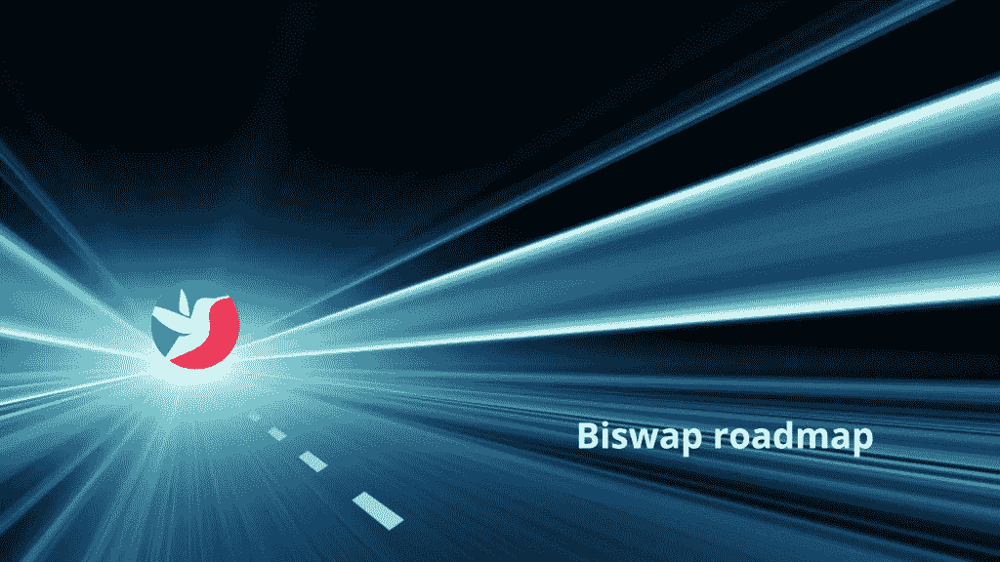

# 你看过更新的 Biswap 路线图了吗？这是最新消息！

> 原文：<https://medium.com/coinmonks/have-you-read-the-updated-biswap-roadmap-heres-what-s-new-fb6550846a8d?source=collection_archive---------55----------------------->

更新后的 Biswap 路线图揭示了该项目的未来？

Biswap 路线图每 3 个月更新一次，考虑社区反馈和市场上发生的一切。

在这篇文章中，我将分享我对 2022 年第三季度最新 Biswap 路线图更新的分析和看法，以及它对该项目的近期前景的揭示。

# 什么是 Biswap？

[就交易量、用户数量、TVL 等而言，Biswap](https://biswap.org?ref=17e072df21070a31a429) 是 BNB 智能链(BSC)上第二大、最受欢迎的分散式交易所。

该交易所以 BSC 最低的交易费用、多类型转介系统和广泛的创新 DeFi 产品或功能而闻名。

交流的一些主要亮点包括:

*   最低的交易费用。
*   流畅的用户体验。
*   独特的多类型转诊系统。
*   在 BSW 交易费回扣高达 50%。
*   独特和创新的产品或功能。
*   多种有利可图的投资机会。

你可以通过阅读我的 [Biswap 评论](https://cryptosorted.info/biswap-review/)了解更多，在那里我报道了关于这个项目的一切。

# 更新的 Biswap 路线图

2022 年 8 月 1 日，Biswap 发布了今年第三季度的[更新路线图](https://biswap.zendesk.com/hc/en-us/articles/8068154304913-New-Biswap-Checklist-Heading-To-the-Moon-)。

它强调了团队到目前为止已经完成了什么，他们目前正在做什么，以及在不久的将来会做什么。

下面，我们将讨论所有这些特性，以及它们对项目和您的投资的未来意味着什么。

# Biswap 新推出的功能

在 2022 年的过去几个月里，Biswap 推出了几项独特且有利可图的功能，包括:

*   **双启动池:这些池允许您下注 BSW，以赚取更多的 BSW 和其他高级代币。它们是被动分散和增加投资组合的好方法。**
*   **[**NFT 市场 v 2.0**](https://marketplace.biswap.org/):bis WAP NFT 市场让你交易 NFT 最低 1%佣金，NFT 赌注高达 1000%，买卖双方 50%手续费返利等。[的最新版本](https://biswap.zendesk.com/hc/en-us/articles/6503545373073-NFT-Marketplace-V2-0-Released-Buy-Sell-Boost-Earn-with-Convenience-)配备了新的过滤器，更流畅的布局和导航系统，平台统计等，为用户提供一流的体验。**

*   ****Swap 推荐计划**:以前，[推荐计划](https://biswap.org/referral?ref=e1c115c1b7975b28a3db)只对农场、发射池和彩票有效。现在你可以赚取高达 20%的介绍交易费。这是另一个有利可图的被动收入机会，你可以利用它来积累更多的 BSW。**
*   **[**鱿鱼 NFT 世界**](https://squid-nft.io/):bis WAP 鱿鱼 NFT 世界是一款专为 BSW 持有者打造的 NFT 游戏。升级后的 [v2.0](https://biswap.zendesk.com/hc/en-us/articles/4807580490769-Squid-NFT-World-V2-0-in-Progress-Favorable-Changes-Are-Coming) 带有稳定的 BSW 奖励、多代币奖励、累积奖金和更新的游戏策略，为玩家带来更流畅的用户体验和更高的盈利能力。要玩这些 NFT 游戏，你需要先在持有者池中下注一些 BSW。**
*   ****币安清单**:这不一定是一个“特色”，但却是项目的一个重要里程碑。2022 年 3 月下旬,[在币安](https://www.binance.com/en-GB/support/announcement/8cdabd95618c4e8aab7f0b9c347d8c70)上市，希望在年底前，我们会看到更多的主要交易所上市。**

# **目前正在开发的 Biswap 功能**

**在 BSC 的各种[指数中，Biswap 已经拥有了一些最好的、最独特的和最有利可图的产品或功能。](https://cryptosorted.info/decentralized-exchanges-on-binance-smart-chain-bsc/)**

**但他们不会就此罢休。下面是该团队目前正在做的重点工作，并将在接下来发布。**

*   ****多重奖励池**:有意思的是，这个功能早在 2022 年 8 月 16 日就已经实现了。从单赌注池，到双启动池，再到现在的[多奖励池](https://biswap.org/multireward_pool?ref=e1c115c1b7975b28a3db)，允许你下注 BSW 以赢得多个代币(BUSD、BSW、WBNB)。令人惊讶的是，Biswap 不断发布一个又一个赚钱的机会。难怪该平台不断吸引新用户，并在 TVL、交易量和其他重要指标上不断增长。**
*   ****带图形的交易页面**:图表和专业交易工具即将登陆 Biswap，让你更好地分析市场数据，进行最优交易。这将吸引更多的交易者，并增加交易所的交易量。这最终转化为平台上赌注者的潜在更多回报。**
*   **永久交易:很快，你就可以在 Biswap 上用杠杆交易期货市场了。以前只能在集中交易平台上获得的功能和产品，正在进入你最喜欢的 DEX。这将进一步有助于吸引更多的交易者和交易量到平台。**
*   ****NFTs to Biswap collectibles** :此功能允许您将您的 Robbies 和 Biswap Squid 游戏 NFTs 转换为 300 个独家 Biswap collectibles NFTs，具有独特的优势，包括高达 15%的现金返还、高达 1%的推荐奖励增加以及独家 double launchpool。**
*   ****其他**:该团队目前正在做的其他事情包括，在其他主要的密码交易所上市，新的战略合作伙伴关系以及增加该项目的营销和宣传。**

**在 Biswap 上，有一个持续的驱动力来获取新用户、增加市场份额和增加用户体验或为投资者赚取机会。**

**此外，该团队显然非常努力地工作，并致力于使项目超越想象的水平。**

**除了其他原因，这些也是为什么我对这个项目充满热情，并尽我所能在 BSW 下注的原因。**

# **Biswap 计划功能**

**一旦团队完成以上所有工作，Biswap 还会有更多的特性和产品。其中突出的有:**

*   ****固定赌注 v2.0** :固定赌注功能的升级将带来更高的 apr 或奖励，并鼓励用户在 Biswap 上进行更多交易。你在平台上产生的交易量越多，你的回报就越大。**
*   ****全新创新的 Launchpad 系统:**一项独家的首次 DEX 发售(IDO)计划，仅面向 BSW 持有者，提供高达 1000%的保证分配。**
*   ****交易&赢取随机奖励:**为了进一步鼓励用户在平台上进行更多交易，Biswap 将开发一种工具，为他们提供一些随机奖励，即使交易量很小。**
*   ****多链** : Biswap 正在推广其他智能链网络，如以太坊、Fantom、Polygon、Arbitrum 等。我们不知道第一个是什么链，甚至不知道有多少链，但很高兴知道该项目正在扩展到 BSC 之外，并在 DeFi 的所有领域增加其影响力。**
*   ****限价单**:限价单允许您下达带有特定 t =价格目标的订单，并等待它们被执行。不再不停地监控市场，用疲惫的眼睛看图表。您将能够设置它并离开它，然后回来查看 Biswap 上限价单的结果。**

# **用 Biswap 连接**

**不要被告知。关注 Biswap 开发，参与并享受它提供的所有好处。**

**访问或加入 Biswap 社交媒体和当地社区。**

**如果你像我一样对这个项目充满热情，你可以加入他们的[太空代理计划](https://biswap.org/space_agents) (SAP)并赢得大奖。**

**例如，这篇文章进入 SAP，就有机会在 BSW 赢得每月高达 2500 美元的奖金。**

# **结论**

**[Biswap](https://biswap.org?ref=17e072df21070a31a429) 自 2021 年 5 月推出以来，凭借其卓越的领导力、创新的产品或功能以及充满活力的社区，已经取得了长足的进步。**

**他们所做的一切导致了三件重要的事情:**

1.  **随着该项目追求其积极的开发和营销计划，用户群、TVL、数量和其他平台指标继续增长。**
2.  **随着平台收入的增长，BSW 持有者和平台上的活跃投资者有多个利润丰厚的赚钱机会。你需要调整好自己来利用这些机会。**
3.  **Biswap 元宇宙中的多种有趣活动将用户体验提升到了一个全新的水平，例如游戏、NFT 和竞赛，这些活动还能让您获得更多收益。**

**看看交易所在短期内取得的成就，我们只能想象当未来几个月路线图上的所有新功能完全发布时，它会在哪里。**

**如何看待 Biswap 前所未有的增长和规划的功能？**

***最初发布于 2022 年 8 月 17 日*[*https://cryptosered . info*](https://cryptosorted.info/updated-biswap-roadmap/)*。***

> **交易新手？试试[加密交易机器人](/coinmonks/crypto-trading-bot-c2ffce8acb2a)或者[复制交易](/coinmonks/top-10-crypto-copy-trading-platforms-for-beginners-d0c37c7d698c)**