# 你看过这个比特币牛市指数吗？🚀 💰

> 原文：<https://medium.com/coinmonks/have-you-seen-this-bitcoin-bull-run-index-ef844a2f0dd1?source=collection_archive---------4----------------------->

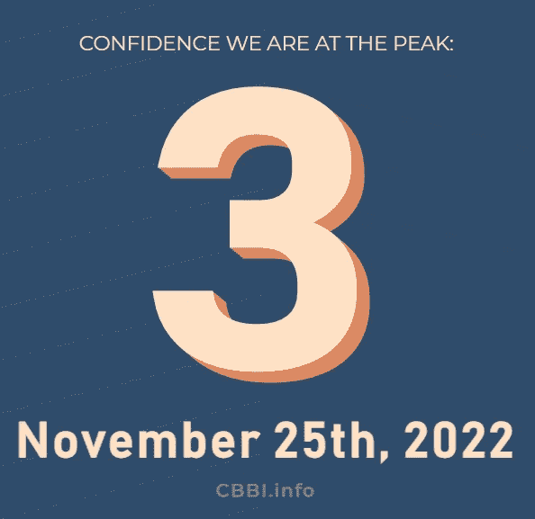

**什么是 Colin Talks 加密比特币牛市指数(CBBI)指标？**

综合 CBBI 分数是 9 个指标的平均值，这有助于理解我们正处于比特币牛市和熊市周期的哪个阶段。分数表明我们是否正在接近比特币井喷周期的顶部或底部。CBBI 不适合日间交易者。这是为长期投资者准备的。

较高的分数表明比特币井喷周期的潜在顶部，而较低的分数表明比特币井喷周期的潜在底部。CBBI 的目的是识别一个吹顶，因为它是在 2013 年和 2017 年的吹顶上训练的。

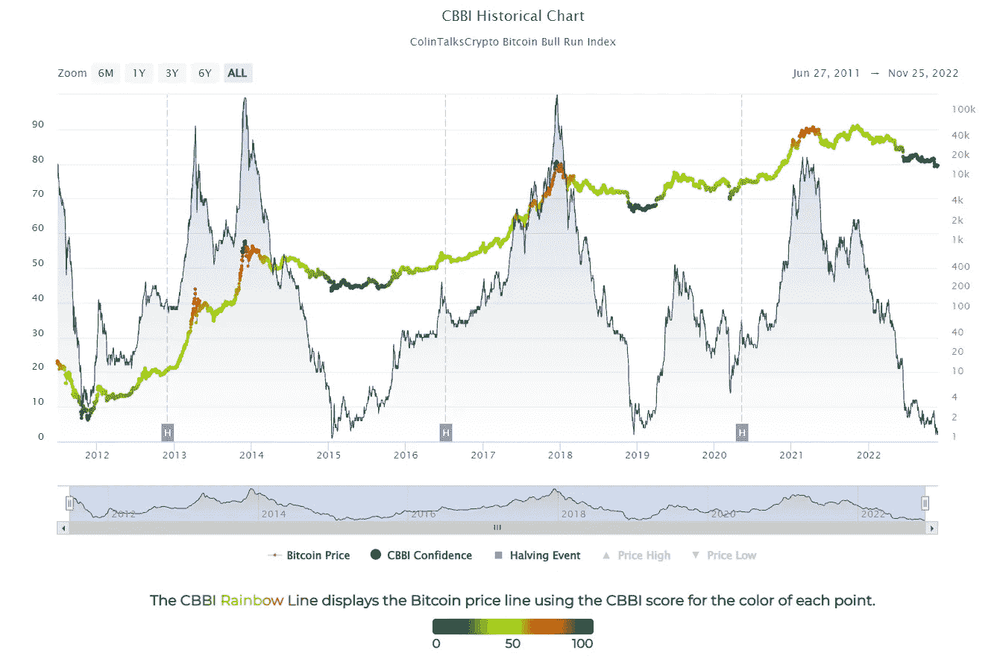

source: [CBBI](https://colintalkscrypto.com/cbbi/)

**什么是吹顶？**

CBBI 将井喷定义为价格和交易量的突然抛物线上升，短暂达到峰值，然后价格同样突然大幅下降。

CBBI 指标不能预测比特币周期顶部或底部的价格和日期。它是比特币周期顶部或底部的指标。

目前的 CBBI 指数由九个指标组成，

1.  Pi 周期顶部指示器
2.  未实现利润/亏损净额(NUPL)
3.  罗德比率
4.  普尔倍数
5.  2 年毫安乘数
6.  比特币彩虹图
7.  MVRV Z 分数
8.  储备风险
9.  Woobull Top Cap vs CVDD

**圆周率周期顶部指示器**

Pi 周期顶部指标预测比特币市场周期的周期顶部。它使用 111 天移动平均线(111 毫安)和新创建的 350 天移动平均线的倍数，350 毫安 x 2。

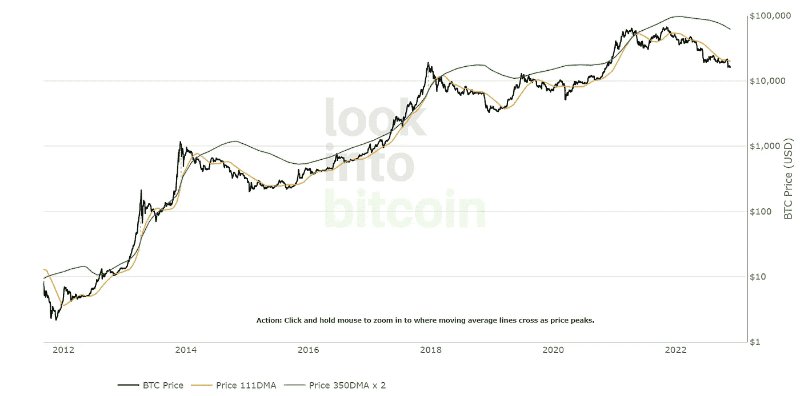

Source: lookintobitcoin.com

**未实现净损益(NUPL)**

市值是比特币的现价乘以流通中的硬币数量。变现价值是每个比特币最后一次从一个钱包发送到另一个钱包时的价格。

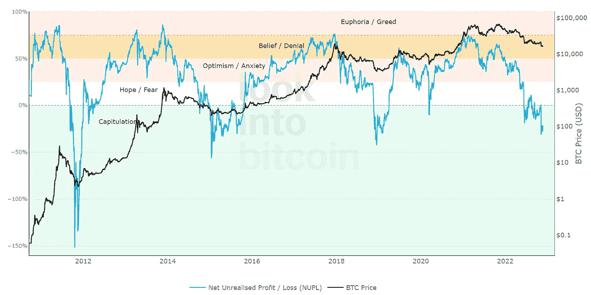

Source: [lookintobitcoin.com](https://www.lookintobitcoin.com/charts/relative-unrealized-profit--loss/)

**罗德比率**

该指标使用不同的硬币年龄层，按每个年龄层内硬币的实际价值进行加权。

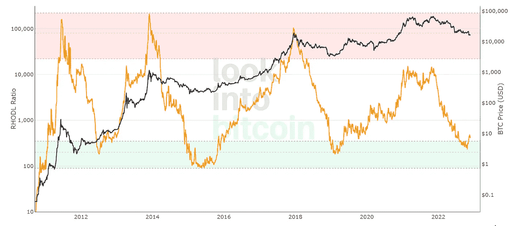

Source: [lookintobitcoin.com](https://www.lookintobitcoin.com/charts/rhodl-ratio/)

**普尔倍数**

随着时间的推移，比特币矿工产生的收入会影响比特币的价格。Puell 倍数的计算方法是将比特币的每日发行价值(以美元计)除以每日发行价值的 365 天移动平均值。

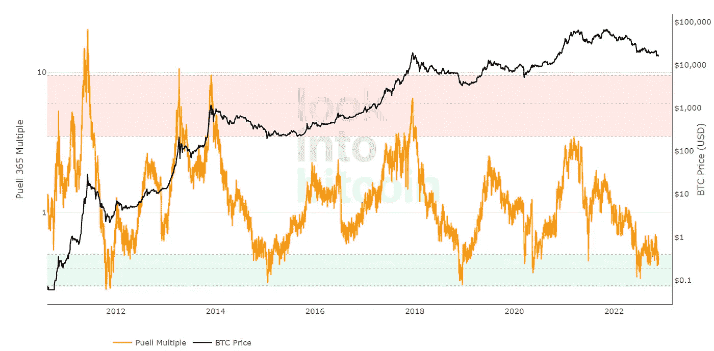

Source: [lookintobitcoin.com](https://www.lookintobitcoin.com/charts/puell-multiple/)

**2 年毫安乘数**

2 年移动平均乘数是一种长期投资工具。正是持续时间产生了巨大的回报。

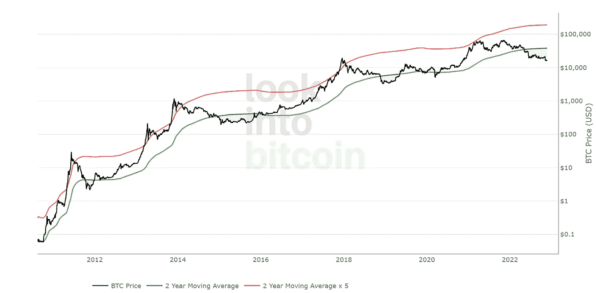

Source: [lookintobitcoin.com](https://www.lookintobitcoin.com/charts/bitcoin-investor-tool/)

**比特币彩虹图**

彩虹图通过在对数增长曲线通道顶部叠加彩虹色带来突出市场情绪，以预测比特币未来的潜在价格方向。

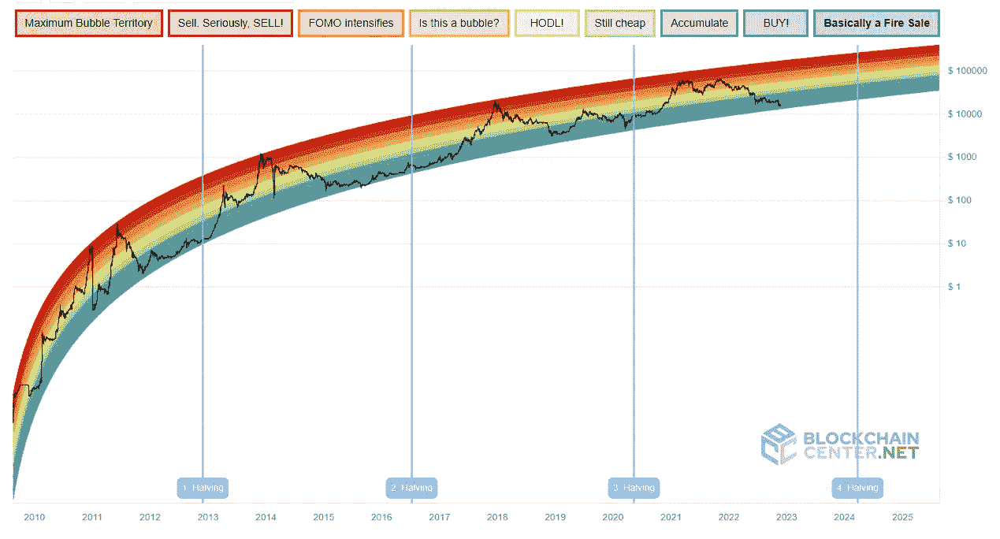

**Source:** [**Bitcoin Rainbow Chart**](https://www.blockchaincenter.net/en/bitcoin-rainbow-chart/)

**MVRV Z 值**

MVRV Z-Score 是一个比特币指标，用于确定比特币相对于其“公允价值”极度高估或低估的时期。这一分析是在区块链进行的。它使用三个指标，市场价值(蓝线)，实现价值(橙线)，Z 分数(红线)。

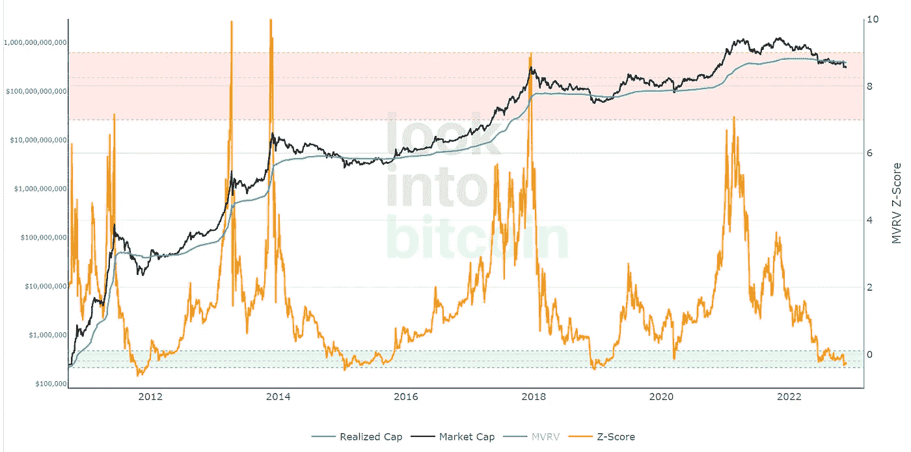

Source: [lookintobitcoin.com](https://www.lookintobitcoin.com/charts/mvrv-zscore/)

**准备金风险**

储备风险指标有助于可视化长期比特币持有者对特定时刻比特币价格的信心。当信心高而价格低时，这是一个有吸引力的风险/回报比率。当信心不足而价格高的时候，风险/回报比就没有吸引力了。

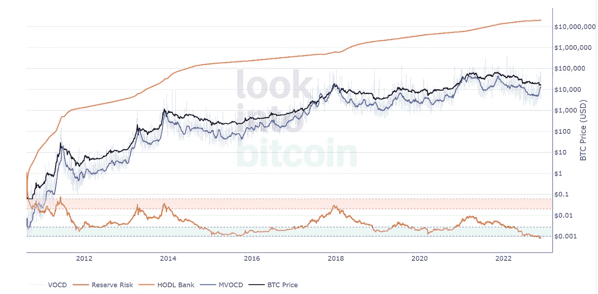

Source: [lookintobitcoin.com](https://www.lookintobitcoin.com/charts/reserve-risk/)

**伍布尔顶盖 vs CVDD**

虚线表示该模型仅使用市场价格作为其输入，而实线代表从区块链收集的投资者、网络和用户行为等指标。

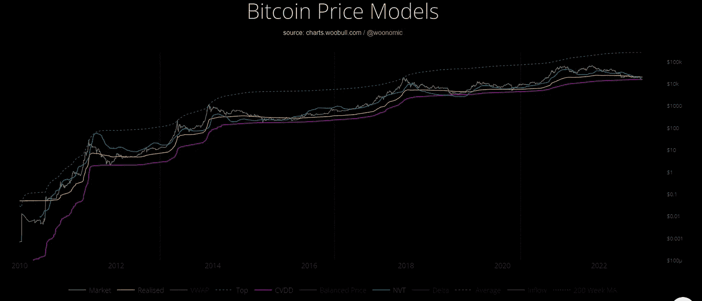

source: charts.woobull.com / [@woonomic](https://twitter.com/woonomic)

还有其他模型，如恐惧和贪婪指数等等。CBBI 应与其他指标结合使用。CBBI 不是做出买卖决定的灵丹妙药。在其生命周期中，它经历了许多变化，包括不同指标的删除和添加。

## 放弃

CBBI 不是投资建议。这是一种着眼于长期价格变动而忽略每日波动的方法。CBBI 是一个相对较新的指数，因此要谨慎使用。

> 交易新手？试试[密码交易机器人](/coinmonks/crypto-trading-bot-c2ffce8acb2a)或者[复制交易](/coinmonks/top-10-crypto-copy-trading-platforms-for-beginners-d0c37c7d698c)