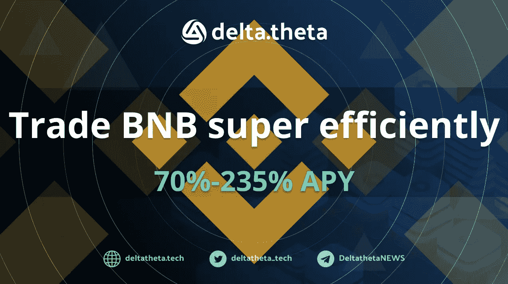

# 如何以最有效的方式用期权和流动性赌注交易 BNB？

> 原文：<https://medium.com/coinmonks/haw-trading-bnb-with-options-and-liquidity-staking-in-the-most-efficient-way-d23ebdb0a602?source=collection_archive---------13----------------------->

BNBx 交易理念

**资产简述:**BNB 区块链连锁店和世界上最大的加密货币交易所币安的公用令牌。使用代币的好处如下:在 BNB 连锁网络上支付佣金，在 BNB 连锁区块链内堆叠以确保转账验证，在币安 Launchpad 上访问 IEO，在币安交易所的交易上获得交易佣金折扣，等等。还有一个系统的季度焚烧 BNB，旨在减少总代币供应量到 100 00 万。

**现状:**代币价格的主要支撑来自交易所核心业务的发展及其区块链:
-总价值锁定(TVL)和 BNB 连锁用户数。区块链在 TVL(52.7 亿美元)方面仅次于以太坊和创，在区块链每日活跃地址(225 万)方面位居第一；

-业务的财务超级稳定性(由最近的 BNB 代币焚烧事件证明)；

-在不同辖区内积极发展。在过去的一年里，Binance.com 区块链的母公司已经做了大量的工作，从国家金融监管机构获得新的许可证(最近的是阿联酋，法国，哈萨克)，增加了新客户的潜在影响。

对于 BNB 代币来说，最近发生的 bep2/bep20 跨链桥被盗事件是一个相当敏感的时刻，在该事件中，200 多万 BNB 代币被盗。然而，该漏洞很快被本地化，最终损失不超过 1 亿美元。此外，币安资助埃隆马斯克收购 Twitter 的计划，以及拨款 10 亿美元用于该领域并购的意向，仍在讨论之中。

**什么是 BNBx:**Stader Labs 生成的代币，用来代替原来的 BNB。Stader Labs 通过向多个验证机分发一个公共令牌池，为 PoS 区块链提供了流动赌注服务。通过创建广泛的 DeFi 基础设施以供未来使用，这些解决方案比传统的下注方法显著提高了盈利能力。

**交易理念:**将 BNB 赌注的收益与期权交易的收益结合起来。进入市场有两种选择:

*   通过卖出看跌期权从区域 270 买入，如果行使则转换为 BNBx 卖出每周期权的大约盈利能力是 10 份合约 4 美元左右(=1BNB)，这对应于 77%的预期年回报率。
*   以当前价格(274 美元)直接购买，然后在 [StaderLabs](https://bnbchain.staderlabs.com/liquid-staking/bnbx) 平台上转换为 BNBx，并以 285 美元的执行价格和一周的到期时间出售看涨期权。预期收益将由赌注的收益(约 5.5%年率)加上卖出期权的收益 1.5 美元(约 29%年率)构成。如果期权被行使，购买价格和行使价格之间的差额 11 美元的额外回报将达到 201%的年率。

δθ终端—【https://deltatheta.tech/ 

斯塔德实验室打桩平台—【https://bnbchain.staderlabs.com/liquid-staking/bnbx 

请求选项报价—[https://t.me/deltatheta_TradingGroup](https://t.me/deltatheta_TradingGroup)

> 交易新手？尝试[加密交易机器人](/coinmonks/crypto-trading-bot-c2ffce8acb2a)或[复制交易](/coinmonks/top-10-crypto-copy-trading-platforms-for-beginners-d0c37c7d698c)