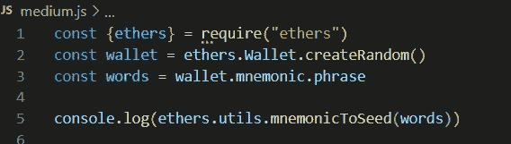
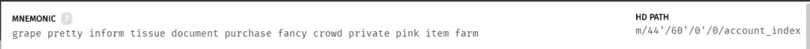
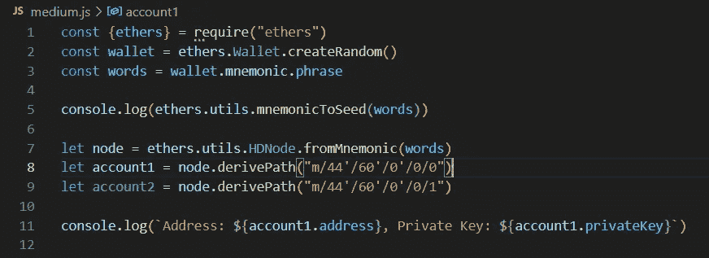
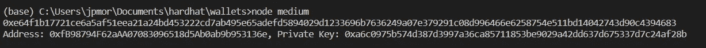

# ethers.js 中的高清钱包

> 原文：<https://medium.com/coinmonks/hd-wallets-in-ethers-js-e173190e4858?source=collection_archive---------0----------------------->


Photo by [Emil Kalibradov](https://unsplash.com/@emkal?utm_source=unsplash&utm_medium=referral&utm_content=creditCopyText) on [Unsplash](https://unsplash.com/s/photos/wallet?utm_source=unsplash&utm_medium=referral&utm_content=creditCopyText)

# 什么是高清钱包？

分层确定性钱包是很多区块链的钱包标准，如比特币、以太坊等。首先，让我们理解这些术语的含义，然后看看我们如何使用 **ethers.js** 库来创建和操作这些钱包。

钱包，在区块链，是一个相当模糊的术语。它通常用于指定管理公钥-私钥对的软件。一开始，钱包创建并管理一组不相关的密钥对。这种钱包被称为 JBOX(只是一串钥匙)。

不再推荐这种类型的钱包，因为用户必须备份一组私钥，每个地址(帐户)一个。几经提议，确定性钱包成为标准。他们能够从单个种子生成密钥对的集合。

使用确定性钱包，用户只需要保存种子，因为从那里钱包能够恢复所有账户的所有密钥。确定性钱包的密钥以分层的方式、以树状关系生成，被称为**分层确定性钱包**，或 HD 钱包。

另一个值得一提的重要标准是 **BIP-39** ，它从包含 2048 个单词的字典中选择 12 到 24 个单词来生成种子。这样，不用把种子记成一个 64 字节的数字，记住一个单词序列就够了。

> 交易新手？尝试[加密交易机器人](/coinmonks/crypto-trading-bot-c2ffce8acb2a)或[复制交易](/coinmonks/top-10-crypto-copy-trading-platforms-for-beginners-d0c37c7d698c)

# 使用 ethers.js

为了随机创建一个新的钱包，我们使用了 **ethers 的 **createRandom()** 函数。钱包**对象，如下:

```
const wallet = ethers.Wallet.createRandom()
```

12 个单词的集合也称为助记码，可以使用以下属性恢复:

```
const words = wallet.mnemonic.phrase
```

从这 12 个字中，可以通过应用哈希函数 PBKDF2 HMAC-SHA-512 来计算种子，从而生成一个 64 字节的数。没有必要保存种子，因为它来自助记码，但是为了完整起见，我们将在这里计算它并在控制台上显示它:

```
console.log(ethers.utils.mnemonicToSeed(words))
```

让我们看看目前为止的代码:



I’m using node.js in VS Code.

为了从种子中生成帐户集，我们使用了 **ethers.utils.HDNode** 对象。主节点按如下方式生成:

```
let node = ethers.utils.HDNode.fromMnemonic(words)
```

然而，这不是通常生成钱包中的第一个帐户的节点。我们需要在节点树中指出我们想要的路径。让我们快速看一下 Ganache 的主屏幕，这是以太坊网络的测试区块链。



A screenshot from Ganache.

你有没有注意到，在助记码的右边，有一个路径的指示？它是以太坊网络 HD 钱包的默认路径，其中的账户遵循一个数字索引，从“m/44'/60'/0'/0/0”的最后一个零开始。也就是说，第一个帐户的路径是“m/44'/60'/0'/0/0”。第二个账号有路径“m/44'/60'/0'/0/1”等。

要使用 ethers.js 生成这两个帐户，可以使用:

```
let account1 = node.derivePath("m/44'/60'/0'/0/0") 
let account2 = node.derivePath("m/44'/60'/0'/0/1")
```

我们刚刚在指定的路径中创建了两个帐户。通过修改路径，我们可以在树形结构中创建几个帐户。完整的代码可以在下图中看到:



代码生成的结果可以在下图中看到:



通过这种方式，我们看到了如何使用 ethers.js 来创建分层确定的钱包并使用它们生成帐户。

**感谢阅读！**