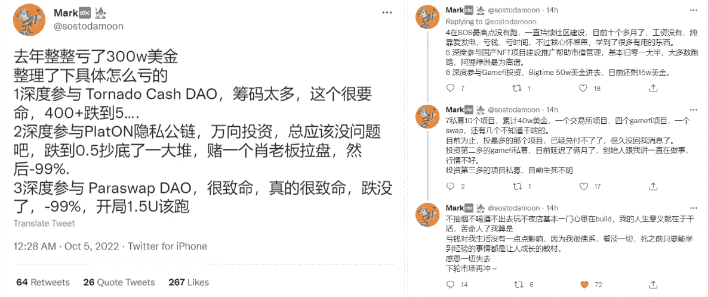
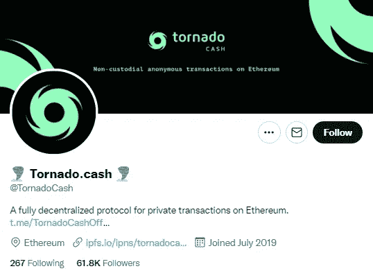
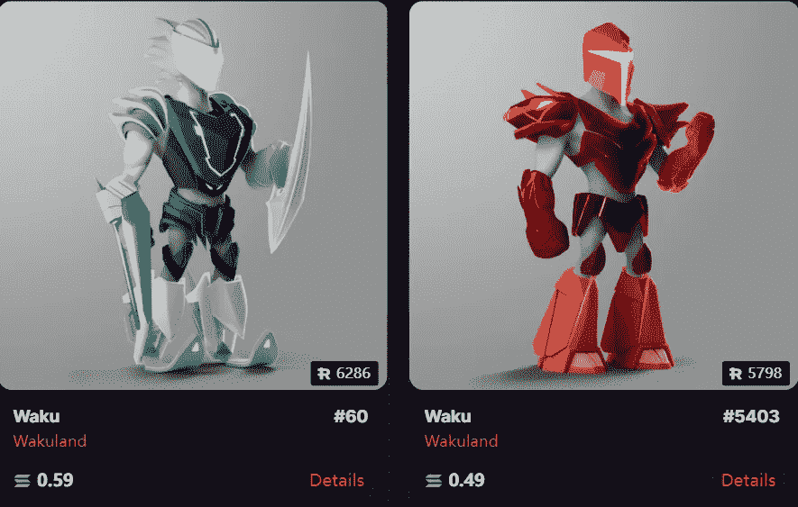
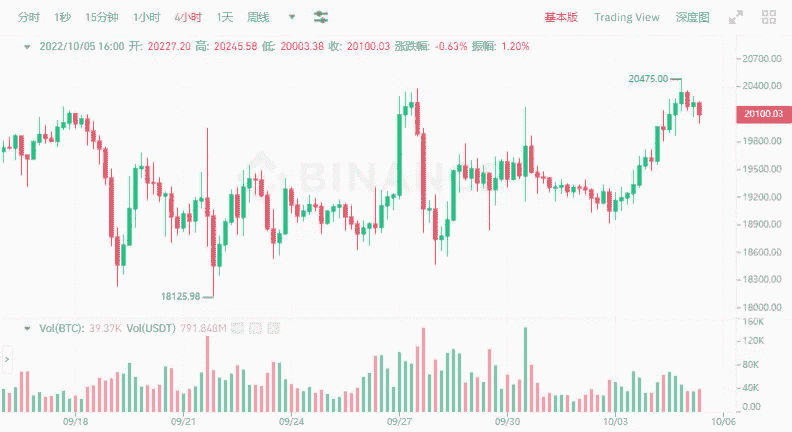
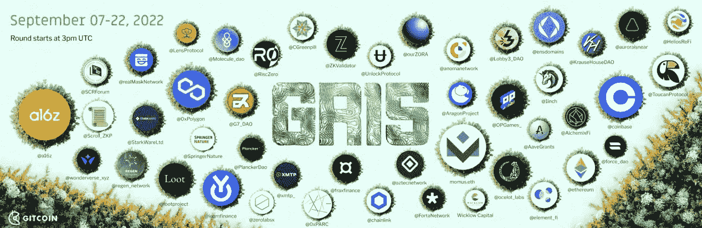

# 他去年在加密方面损失了 300 万美元

> 原文：<https://medium.com/coinmonks/he-lost-3-million-in-crypto-last-year-b1544c79fd64?source=collection_archive---------14----------------------->

看到 currencymarket 的一个玩家去年赔了 300 万美元也是很感慨的。在这个世界上，赔钱太容易了。

按照周期，去年 2021 年是牛市。从 defi 到 gamefi，有些人赚了不少钱，但是入行时间有点晚，参与的项目也不对。

这个朋友参与了各种山寨项目，妥妥的输了 300 万美金，押宝项目基本没用。

Lost $3M in 2021

这位朋友参与过龙卷风现金道、铂顿隐私公链、Paraswap 道、SOS 社区、国内 NFT 项目；他还大量参与了 bigtime 和 10 家私募基金。

不知道是因为他待遇不好，还是项目整体环境不好。反正现在差不多是零了。300 万美元的投资基本都打水漂了。

如果去年把这些金额投资在 BTC、ETH 或者其他项目上，会缩水很多，但不会归零，至少所持头寸还在。但是新的项目要么已经完成，要么只是被锁定。

比如这次龙卷风。自 8 月 10 日最后一条推文更新以来，Cash project 已经有近 2 个月没有更新了。这是一个建立在以太坊链上的 defi 去中心化协议平台。不再继续运行。

Tornado.Cash Project

仔细看看这位朋友投过的项目。除了 SOS 和 bigtime，楚小莲对其他项目都不了解。知道的越多，失去的就越多！

其他玩家调侃这个朋友，他投了哪些项目，及时分享，防止别人踩坑。

当然，这个朋友的损失可能是短期的，毕竟故事还没有结束。

更多正在看热闹的玩家想知道他是怎么积攒到这 300 万美元的。他能有这么多钱可以输。他也是一个强有力的角色。

Breaking Project Wakuland

在当今世界，投资目标非常重要。

各种项目 90%会归零，9%运营困难，只有剩下 1%的项目比较知名，继续发展。但这 1%，即使项目开发得再好，也有雷雨的风险。
比如 LUNA，谁也不会想到它能从 120 美元降到零，一个曾经那么辉煌的项目，短时间内就毁了。

比特币自 13 年前的 2009 年推出以来，持续波动，有几次几乎归零。新事物的发展充满了不确定性。

更多的其他项目出现了归零，不知道哪一个能确定成功。

Bitcoin current price action

最近楚小莲在看预定投的书，选好标的，继续长期投资可能最有可能成功。

大部分简单的东西，很多人都不信，总觉得复杂的玩法更有深度，更容易成功。

比如在很多分析中，选择了最不靠谱的项目进行投资，结果是亏损；或者在不断换轨的过程中，错过了项目低点的机会，追高亏损；或者是没有独立的玩法，在不断变化的策略中，继续交学费是亏损的。

Not sure which project will eventually succeed

就像上面的朋友一样，投入越多，损失越大。这个时候，没钱投资不是坏事。小资金谨慎投资，试错成本低，可以不断学习积累经验。

有时候不参与也是避风港，不参与就不亏；但不参与也意味着你将没有机会享受上升的利益。

比如今天 BTC 又回到了 20k 美元，前两天不加仓的人又要后悔了。如果 BTC 这次暴涨，一直涨到 4000 美元，那么会有更多的人摔断大腿。

当然，如果上面投资的项目成功了，至少几十倍或者上百倍的收益，才是人生赢家。

Beatles NFT

在加密市场，高风险就有高利润；有多少赚钱的方法，就有多少赔钱的方法。

只有提高认知，改进方法，才能在巨大的不确定性中找到自己的机会。

以上只是我个人的看法和总结，不含投资建议，读者的任何投资行为与作者无关。

我是褚小莲，我在学习区块链，关注元宇宙和 NFT，关注 web3。

> 交易新手？试试[加密交易机器人](/coinmonks/crypto-trading-bot-c2ffce8acb2a)或者[复制交易](/coinmonks/top-10-crypto-copy-trading-platforms-for-beginners-d0c37c7d698c)