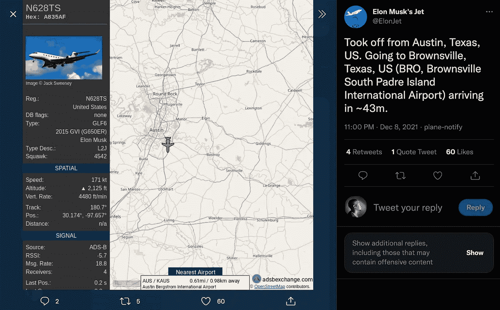
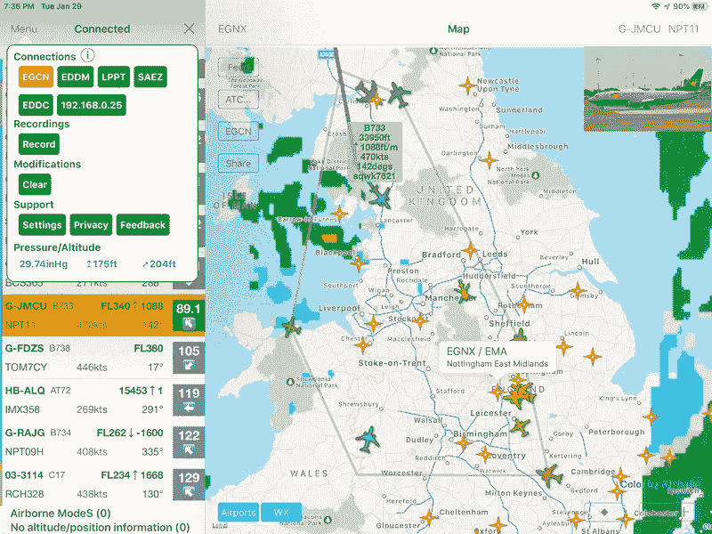

# 他想要一辆特斯拉去关闭一个追踪埃隆飞机的推特机器人

> 原文：<https://medium.com/coinmonks/he-wanted-a-tesla-to-shut-down-a-twitter-bot-tracking-elons-jet-814af2c83a99?source=collection_archive---------23----------------------->

Asking for a free Tesla to shut down the Twitter bot that tracks Elon’s jet?

杰克·斯威尼是追踪伊隆飞机的神童。

他从一个跟踪航班的公开网站上拼凑数据，并创建了一个 Twitter 机器人，报告埃隆的飞机每次起飞和降落。

简单，狡猾，非常聪明。

埃隆发现后，给了他 5000 美元让他关掉它。

杰克拒绝了，并要求 5 万美元或一辆新的特斯拉。

有种。

不确定这是不是正确的选择。

去和我们这一代最聪明的人之一，一个基本上是社交媒体霸主的人正面交锋。

ElonJet Twitter account tracks Elon’s private jet wherever it goes.

那个 ElonJet 账户现在有将近 50 万粉丝。

可以肯定地说，人们对这位在世的首富的旅行很感兴趣。

它甚至有一个后续的 tweet 来计算这一段飞行的二氧化碳排放量和燃料消耗。

多汁。

杰克从哪里得到的信息？

信不信由你，完全免费，随手可得。

ADS-B Exchange 是一个合法的网站，跟踪并汇总来自公众的航班数据。

你可以把它想象成一个众包信息板，上面写着谁要飞往哪里。

来自世界各地的成千上万的爱好者和贡献者使用专门的设备来跟踪和监控飞机的起飞和降落。

它遍布全球，在任何一个时间点都有成千上万的数据点，可以绘制出飞行路线和飞机行踪的良好模式。

**ADS-B Exchange is quite a treasure trove if you know how to use the data.**

所以现在，你大概知道美国总统(空军一号)在哪里了。

虽然 AF1 通常有两架飞机起飞，所以祝你猜总统在哪里。

知道一些爱好者如何将他们的兴趣转向数据挖掘和喷气式飞机跟踪信息的全球网络，真是令人惊讶。

但回到这个跟踪埃隆的飞机，然后冷落他的小天才。

他追踪埃隆的飞机有错吗？

他在用追踪飞机的推特机器人软勒索名人吗？

这符合道德吗？

严格来说，杰克没有犯任何罪，也没有违反任何法律。

他从一个允许免费使用他们数据的公共网站上获取数据。

他遵守了 Twitter 的规定，这个机器人也照章办事(否则 Twitter 早就把它撤下了)。

但是跟踪和发布名人和任何拥有私人飞机的人的飞行路线数据不是很好…对吗？

Mark Cuban gave Jack some favors and made him take down the Twitter account tracking his private jet.

杰克接受了马克·库班的一些帮助，并击落了马克的飞机。

他继续开发更多的喷气式追踪机器人。

有格兰特·卡尔多内、比尔·盖茨、杰夫·贝索斯、汤姆·克鲁斯和金·卡戴珊。

是的，名人喜欢他们的 Gulfstreams 和 G5，一直在他们的社交媒体上发布和吹嘘。

但这实质上意味着任何人都可以追踪富人和他们的家人去了哪里，这里有安全问题吗？

我发现像杰克这样的年轻男孩真的可以从这样的方式中获利，无论是在金钱上还是得到关注，这很有趣。

虽然我支持这种进取的心态，将技术和数据结合起来做生意，但当涉及到“勒索”和收受贿赂以关闭机器人时，我会划清界限。

为踢腿追踪飞行，酷。

勒索，不酷。

话又说回来，即使他关闭了它，外面的人会再次复制它。

我们今天生活在一个有趣的世界。

-

追踪名人的航班可以吗？

-

#创业#商业#创业#成长#成功#社交媒体#文化#创业#战略# elonjet # jacksweeney #轨道航班#喷气机#湾流#马克库班#名人

> 交易新手？试试[加密交易机器人](/coinmonks/crypto-trading-bot-c2ffce8acb2a)或者[复制交易](/coinmonks/top-10-crypto-copy-trading-platforms-for-beginners-d0c37c7d698c)