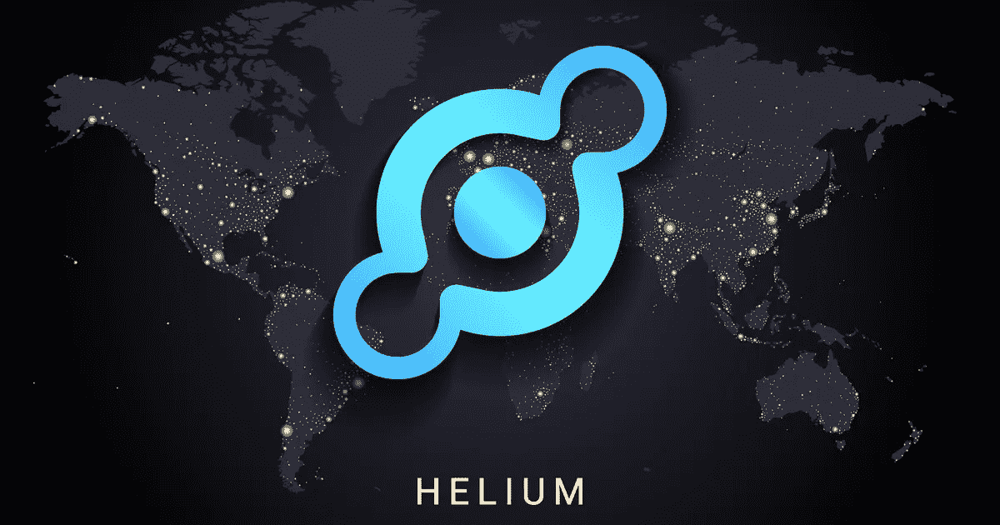

# 氦网，去中心化互联网？

> 原文：<https://medium.com/coinmonks/helium-network-decentralized-internet-8019bf072a88?source=collection_archive---------10----------------------->

电信公司一直在使用一种不再适合下一代无线网络的网络建设模式。新技术需要更多的无线电和天线，而电信公司负担不起。旧模式也没有优先考虑人口较少地区的覆盖，因此农村地区的许多人没有良好的覆盖。

> **德威是什么？**